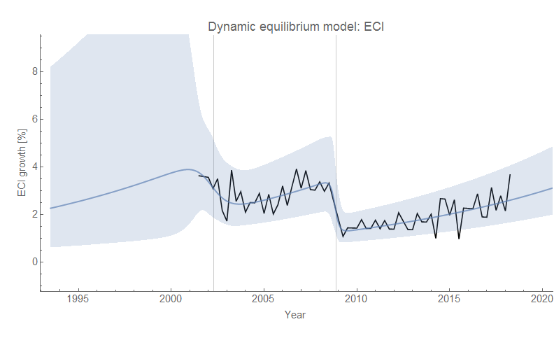
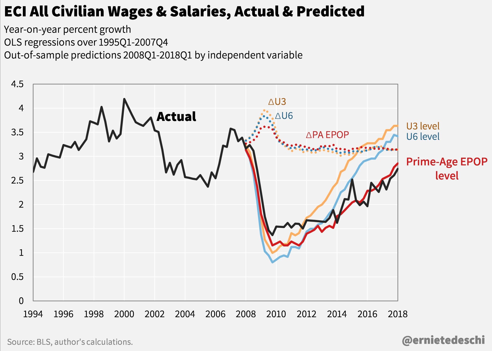
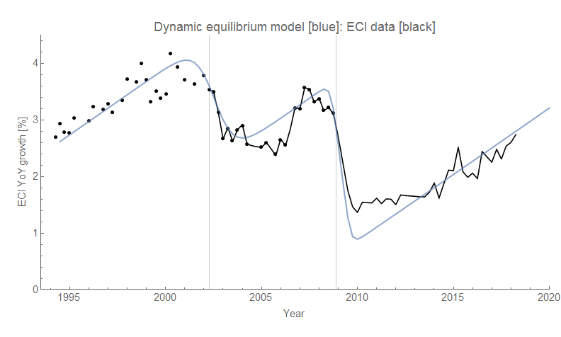

The latest wage growth data [from the Atlanta Fed](https://www.frbatlanta.org/chcs/wage-growth-tracker?panel=1) came out a few days ago, and [like the JOLTS data](https://informationtransfereconomics.blogspot.com/2018/06/jolts-data-and-2019-recession.html) is showing possible signs of a recession (or at least the undoing of the prior upward shock that might have been associated [with a post-Lilly Ledbetter decline in the gender pay gap](https://informationtransfereconomics.blogspot.com/2018/06/women-in-workforce-and-labor-share.html)). Here's the latest data on the original forecast:

Also, I looked into the Employment Cost Index (ECI) which is another measure of wages and compensation. First the original model of the log derivative:

And since I was comparing with this picture from Ernie Tedeschi:

... I reconstructed the year-over-year model adding the extra data from the previous graph by digitizing it (for some reason, it wasn't on FRED):

Because this data is noisier and less frequently updated (only quarterly, roughly a month after the quarter ends), we can't really see any sign of a recession yet even if there was one.
