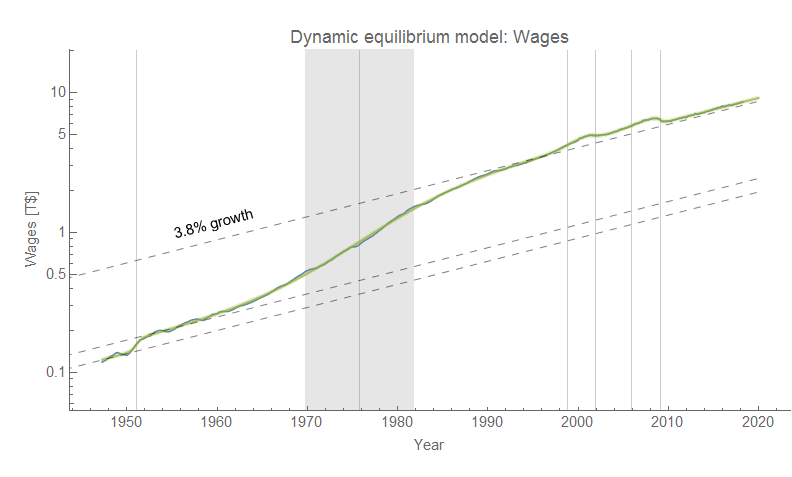
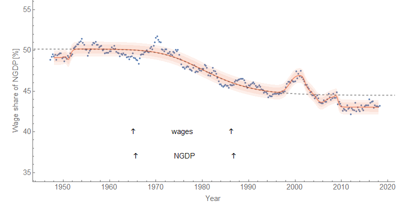
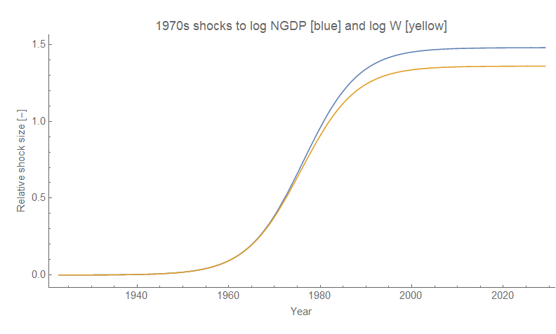
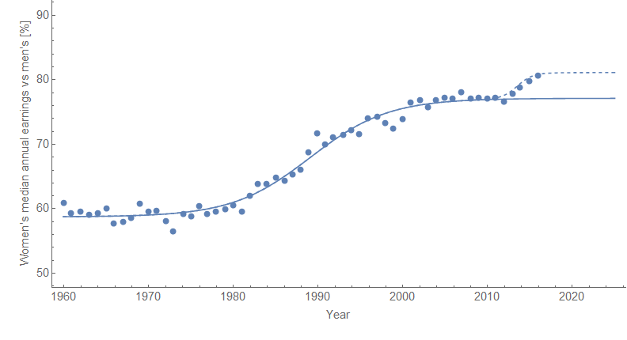

I saw a couple of graphs of labor share of GDP on Twitter yesterday and so I thought I'd look into it using the [dynamic equilibrium model](https://papers.ssrn.com/sol3/papers.cfm?abstract_id=3094757). The dynamic equilibrium model of wages has roughly similar structure [to that for NGDP](https://informationtransfereconomics.blogspot.com/2018/01/24-growth-forever.html); using that model \[1\] we can produce a description of [this measure of wages](https://fred.stlouisfed.org/series/A4102C1Q027SBEA) (W):

If we divide this by the NGDP model, we obtain a really nice description of _W/NGDP_:

While the shock structure is formally similar, the actual parameters differ — if they were the same, this would be a horizontal line. Shocks occur at slightly different times and have slightly different sizes. The main shock to wages in the 70s starts slightly earlier, but overall is almost identical to the shock to NGDP in every aspect except size:

How much of the deviation from a straight horizontal line is due to this difference? It is shown as the dashed line in the graph of _W/NGDP_. That's most of the difference. Pretty much when you're talking about declining labor share, it is due to the difference in the shock to wages and the shock to output.

Most stories told about this declining labor share of national income is about capital claiming it for themselves — and on the surface, that's essentially what is happening. A major surge in output in the 70s went disproportionately to capital instead of labor.

However, let's take a step back and think about the cause of that surge in output: women entering the workforce (see links [here](https://informationtransfereconomics.blogspot.com/2018/02/women-in-workforce-and-solow-paradox.html) or [here](https://informationtransfereconomics.blogspot.com/2018/03/trends-in-macro-observables-twitter.html)). If that's the cause, then the difference in the shock to NGDP and to wages could be almost entirely accounted for by the fact that women make on the order of 70% as much as men for the same job. As women entered the workforce, the same output growth would go towards more income for capital by pocketing that extra 30%. A back of the envelope calculation shows it's the correct order of magnitude (about 5 percentage points). It's not declining unions or deregulation, but rather simply adding more people that are paid less because of sexism behind the decline in labor share of national income. At least that's the hypothesis.

After women entered the workforce, the pay gap did drop from 40% to roughly 20% (I used 30% as an average above). Actually, [that data](https://www.aauw.org/research/the-simple-truth-about-the-gender-pay-gap/) can be modeled with the dynamic equilibrium model as well:

Interestingly a possible new post-[Lilly Ledbetter](https://en.wikipedia.org/wiki/Lilly_Ledbetter) shock (dashed line) appears roughly where the shock in wage growth (and drop in unemployment rate) appears in other data.

...

**Footnotes:**

\[1\] Within error, the estimate of the dynamic equilibrium rate is approximately the same for wages and NGDP (3.8% ± 0.1%).
