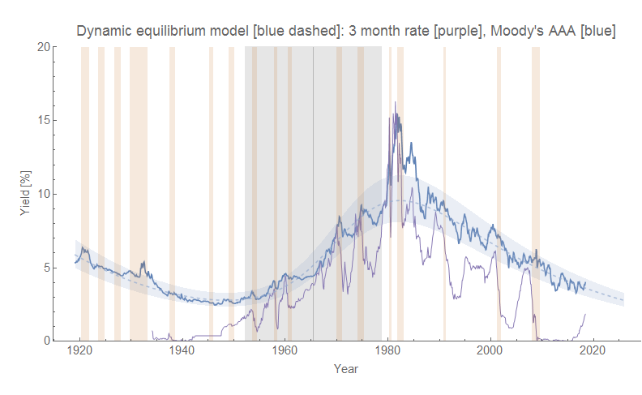
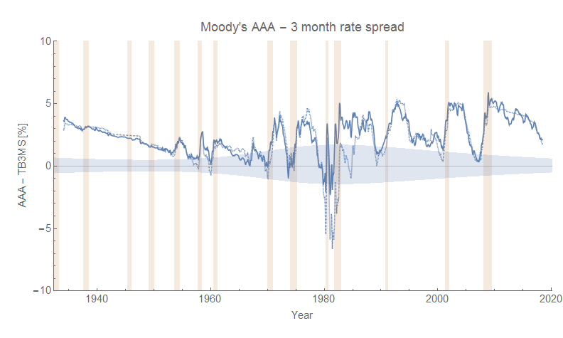
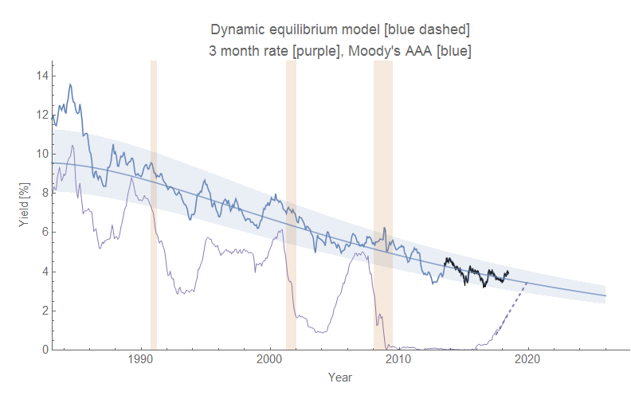
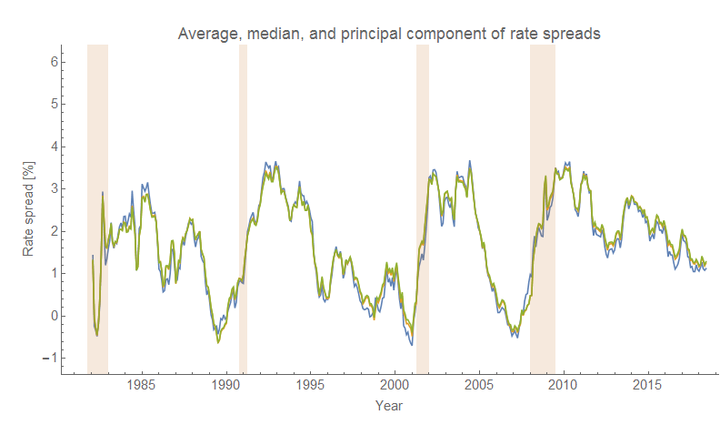
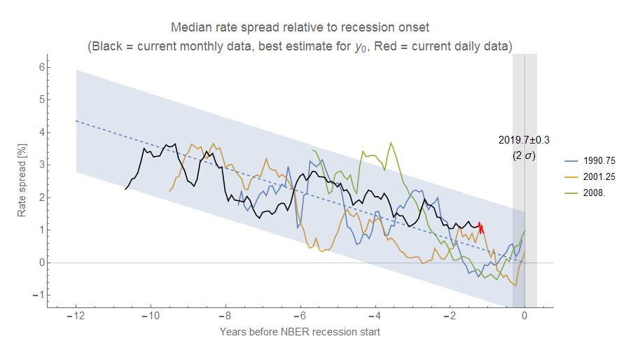

There was a recent article out on the internet about yield curve inversion. Using the spread between [Moody's AAA rate](https://informationtransfereconomics.blogspot.com/2018/06/rethinking-interest-rates.html) (blue, a decent proxy for the 10-year rate with less noise) and the 3-month secondary market rate (purple) we can see that from the 1950s until today, a low spread has been associated with recessions:

However, in the aftermath of the Great Depression, inversion of this measure wasn't a good indicator. It's only become an indicator since the 1950s. The past few recessions have all been preceded by a closing of this measure, but the degree of closing has gotten smaller since the 80s (actual inversion before the 90s has turned into just entering there error band):

Looking at the recent data and assuming the dynamic equilibrium model is correct along with a linear trend in rate increases, we see that the indicator will enter the error band sometime before 2020:

However, the period of time the spread spends inside that error band ranges from a few months to a year (yield curve inversion is usually described as being an indicator a recession will happen within a year). So unless we have other data, we won't be able to predict the timing of this future recession. [We do have other indicators](https://informationtransfereconomics.blogspot.com/2018/06/jolts-data-and-2019-recession.html), and this extrapolation is consistent with them.

...

**Update 26 June 2018**

I've done a better analysis of the estimate of the US recession onset via the yield curve inversion indicator by aggregating several different measures of the spread ([collected here](https://fred.stlouisfed.org/graph/?g=khj1)). I looked at the median (yellow), average (blue), and a [principal component analysis](https://en.wikipedia.org/wiki/Principal_component_analysis) (green). These gave nearly identical results:

Since those were practically identical, I used the mean median for the subsequent calculations. I then extracted the slope of the approach to the three previous recessions (early 1990s, early 2000s, and the "Great Recession" of 2008, dropping the first year after the start of the previous recession) using a linear model, and used that slope to estimate the most likely recession onset (first quarter of the NBER recession) for a future recession (assuming the current decline in spreads will eventually lead to a recession). That value is 2019.7 ± 0.3 (two standard deviation error). This is what the current approach to the recession looks like in that context (the previous three recessions are shown in blue, yellow, and green and labeled by the end of the NBER quarter — i.e. 0.5 is the end of calendar Q2):

The blue band represents the 90% confidence on the single prediction errors of the linear model (dashed line). Since the declaration of an NBER recession typically lags the first indications of a recession in [unemployment](https://informationtransfereconomics.blogspot.com/2017/04/determining-recessions-with-algorithm.html) and [JOLTS data](https://informationtransfereconomics.blogspot.com/2017/07/jolts-leading-indicators.html), we should be seeing the first signs in those data series in the next 6 months to a year. Since we are [already seeing some signs in the JOLTS data](https://informationtransfereconomics.blogspot.com/2018/06/jolts-data-and-2019-recession.html), these indicators all seem consistent.

Note that the above analysis in this update is "model agnostic" in the sense that it just relies on the empirical regularity of a trend towards yield curve inversion between recessions, but no specific model of how yield curve inversion works or which way causality goes. It does imply a certain inevitability of a recession. Since the mean spread rose to about 3 percentage points after each recession, and the slope is -0.36 percentage point per year, this implies about 8.3 years between recessions — which is [what a Poisson process estimate says](https://en.wikipedia.org/wiki/Poisson_point_process) based simply on the frequency of recessions (λ ~ 0.126/y, or an inter-arrival time of 7.9 years as mentioned [here](https://informationtransfereconomics.blogspot.com/2017/01/unemployment-forecasts.html)).

...

**Update 3 July 2018**

Apparently I mislabeled the variables **medianData** and **meanData** in my code, switching them up. Anyway, the above result uses the **_median_**, not the mean (average). I also added post-forecast daily data in red, which is more rapidly updated than the monthly data time series.
