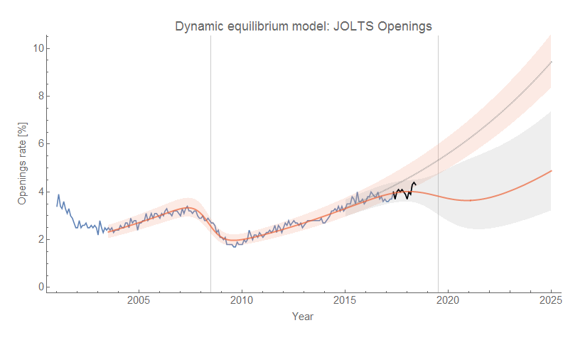
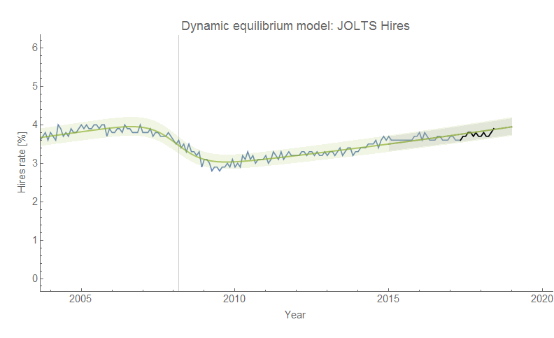
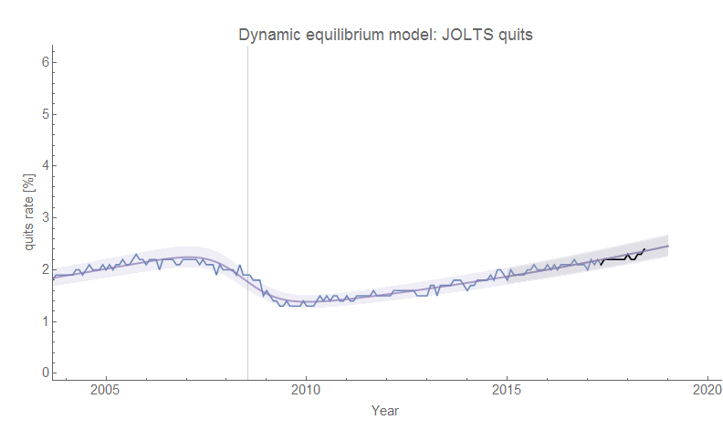
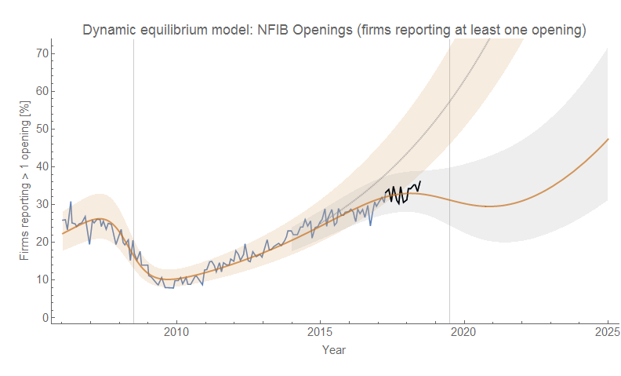
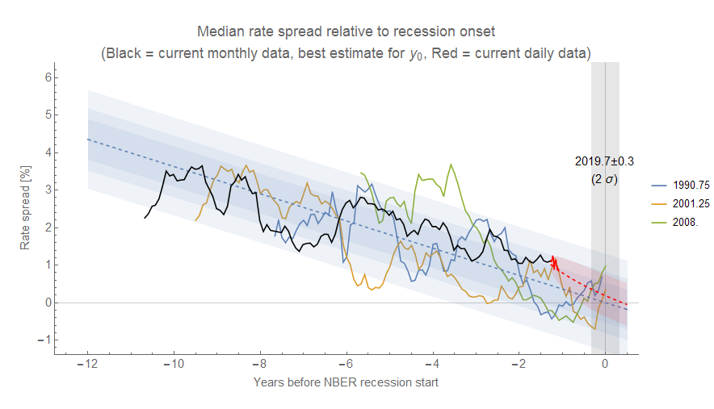
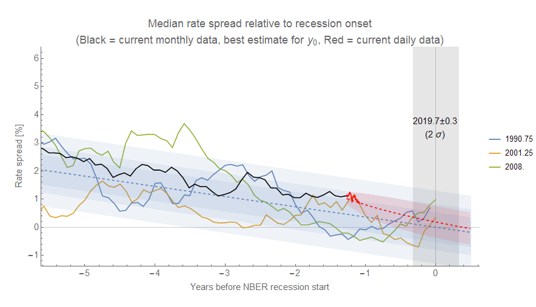
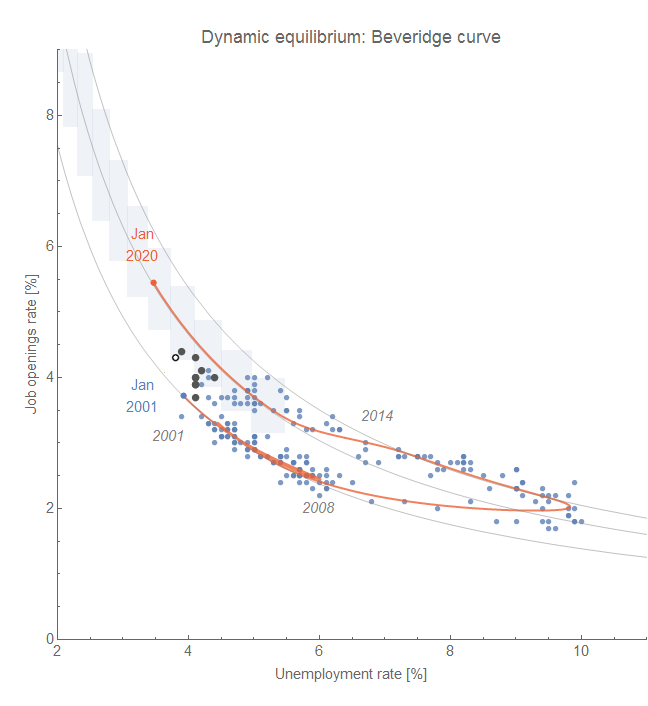

Unfortunately the latest data from JOLTS isn't that informative — we're effectively in the same place we were last month with a continued correlated deviation from the dynamic information equilibrium model "no recession" counterfactual for JOLTS job openings. Here are the counterfactual forecasts updated with the latest data:

A correspondent on Twitter did point me to [NFIB data](https://www.nfib.com/foundations/research-center/monthly-reports/jobs-report/) as an additional source — it tells a similar story to the JOLTS data with somewhat higher uncertainty:

The median interest rate spread among several measures continue to decline. I added an AR process estimate of the future median monthly rate spread based on the linear model. It seems to show yield curve inversion is unlikely before the recession hits this pseudo-cycle:

PS Here's the updated JOLTS opening animation showing different counterfactual recession centers from 2018.5 to 2019.5:

As well as the Beveridge curve (latest point is the white dot with black outline):

