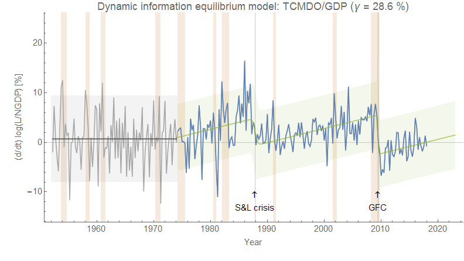
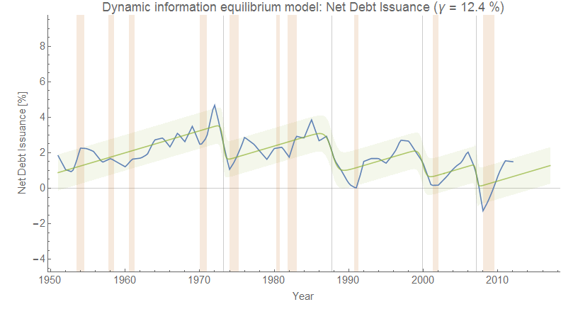

As I mentioned in [my views on the DSGE model debate](https://informationtransfereconomics.blogspot.com/2018/07/dsge-battle-royale-christiano-v-stiglitz.html) (as well as [my more general macro critique](https://informationtransfereconomics.blogspot.com/2018/05/macro-criticism-but-not-that-kind.html)), I have an issue with what I consider to be a logical leap in the discussion of recessions. Noah Smith writes about this "emerging post-crisis wisdom" in [his latest Bloomberg View article](https://www.bloomberg.com/view/articles/2018-07-29/what-economists-still-don-t-get-about-2008-crisis):

> _All of these papers have one thing in common — they use debt to predict recessions years in advance. That fits with the emerging post-crisis wisdom that problems in credit markets are the source of both financial crashes and the ensuing economic slowdowns._

While I have no problem studying these particular models of macroeconomies, the evidence provided largely seems to suffer from [_post hoc ergo propter hoc_ reasoning](https://en.wikipedia.org/wiki/Post_hoc_ergo_propter_hoc) ("after this, therefore because of this"). The presentation from Gennaioli and Shleifer that Noah is discussing (that cites these papers) notes that "\[r\]apid credit growth is associated with higher risk of a financial crisis" based on Schularick and Taylor (2012). It shows a graph that growth in credit normalized by GDP grows increasingly quickly (accelerates) in the run-up to a financial crisis. In fact, I see a similar effect in the debt data (below). However, [consider wage growth](https://informationtransfereconomics.blogspot.com/2018/02/dynamic-equilibrium-in-wage-growth.html) — it also accelerates in advance of a recession:

You could possibly think of a model where wage growth causes recession because e.g. the Fed reacts to wage growth with higher interest rates that eventually bring on a recession. However this data also supports the hypothesis that wages just naturally accelerate, but that acceleration is cut off by a recession. A similar view works just as well for debt (FRED series [TCMDO](https://fred.stlouisfed.org/series/TCMDO#0) = All Sectors; Debt Securities and Loans; Liability, Level, previously called Total Credit Market Debt Owed, hence the label):

Until the 1970s, the acceleration in debt to GDP (and even its growth rate) was consistent with zero. Various de-regulatory policies lead to our more modern system of credit as well as dynamics similar to wage growth: acceleration in debt to GDP growth cut off by financial crises. The model shows two major events: the S&L crisis of the late 80s and the Global Financial Crisis (GFC). The former was a slow rolling crisis that began in the mid-80s, but wasn't associated with a recession until years later. The latter debt growth rate collapse actually **_follows_** the Global Financial Crisis (lending more credence to the hypothesis that the recent growth in credit was cut off by the recession.

Regardless of the specific model, the idea that increasing credit growth causes recessions is not robustly supported by the data. In the case of the GFC it seems that it's possible debt growth was cut off by the crisis, much like how accelerating wage growth is cut off by recessions. If that hypothesis is true, then per the graph in the presentation we'd also see an increase in the rate of credit growth — and concluding that the rise in credit growth caused the crisis would be an example of _post hoc ergo propter hoc_ reasoning gone awry. Just because B comes after A does not mean A caused B \[1\].

I don't have any particular issue with the Minksy-like view of asset bubbles leading to recessions — [I have speculated myself](https://informationtransfereconomics.blogspot.com/2018/01/24-growth-forever.html) that we might be in an "asset bubble era" where recessions are caused by deflating bubbles (dot com, housing). But that picture also sees the recessions before the 2000s as "Phillips curve" recessions more closely related to the labor market. What might be confounding for any theory is [the possible recession in the 2019-2020 time-frame](https://informationtransfereconomics.blogspot.com/2018/06/jolts-data-and-2019-recession.html): there appears to be no asset bubble in GDP growth (latest bump in Q2 notwithstanding), and labor markets appear healthy. This may even explain a bit of why everyone seems to think we're in an economic boom with no signs of recession despite a flattening yield curve. In the end, I am open to any possible explanation here as I think this area (recessions, financial crises) is not well-understood by anyone. I just feel there is a lot of jumping to insufficiently supported (not necessarily _un_supported) conclusions that is rooted in our human bias toward our own agency as well as moral biases about "debt".

...

**Update**

Here is the dynamic information equilibrium model of the data from _Credit-Market Sentiment and the Business Cycle_ by David Lopez-Salido, Jeremy C. Stein, and Egon Zakrajsek (2015) that claims to get a two year drop on downturns:

It is plausible this gives us advanced warning about the 1974, 1991, 2000 and 2008 recessions (it misses the 1980s recessions and every recession before '74). Given the uncertainty, we can't be conclusive about the 2000 or 2008 recession (the data doesn't drop by more than the uncertainty band until roughly simultaneously with the recession indicator). The data is noisy (and annual) making any precise determination of timing uncertain. But again, plausible. But also consistent with the hypothesis that increasing debt growth is sometimes cut off by recessions.

**Footnotes:**

\[1\] Although you can make a good case that if A comes before B, then B is unlikely to have caused A.
