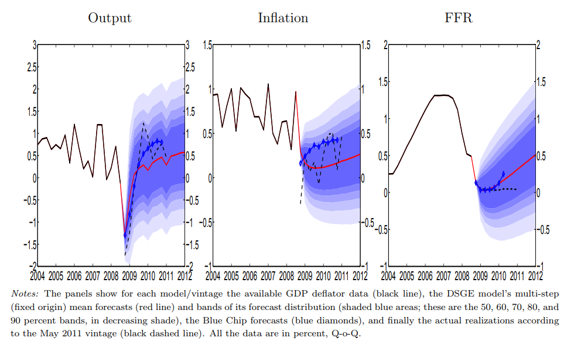
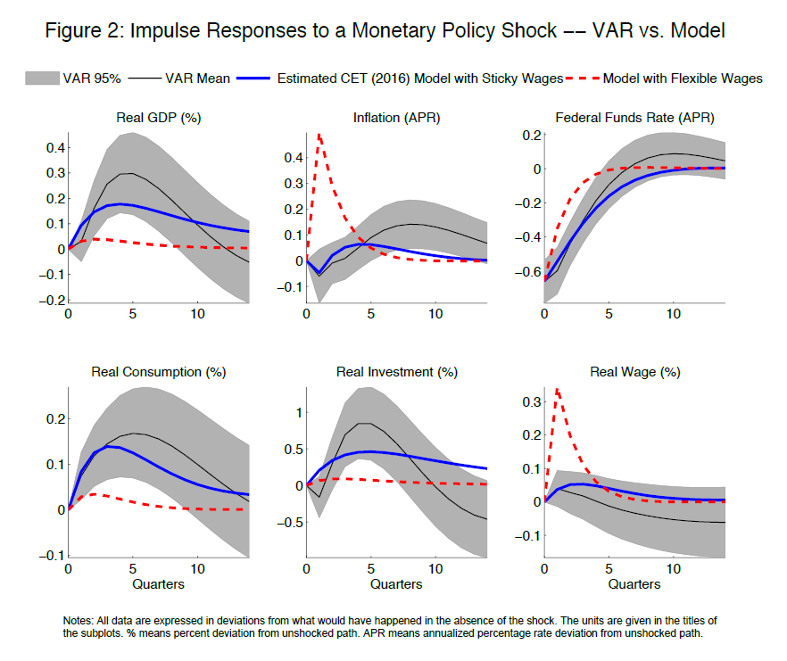
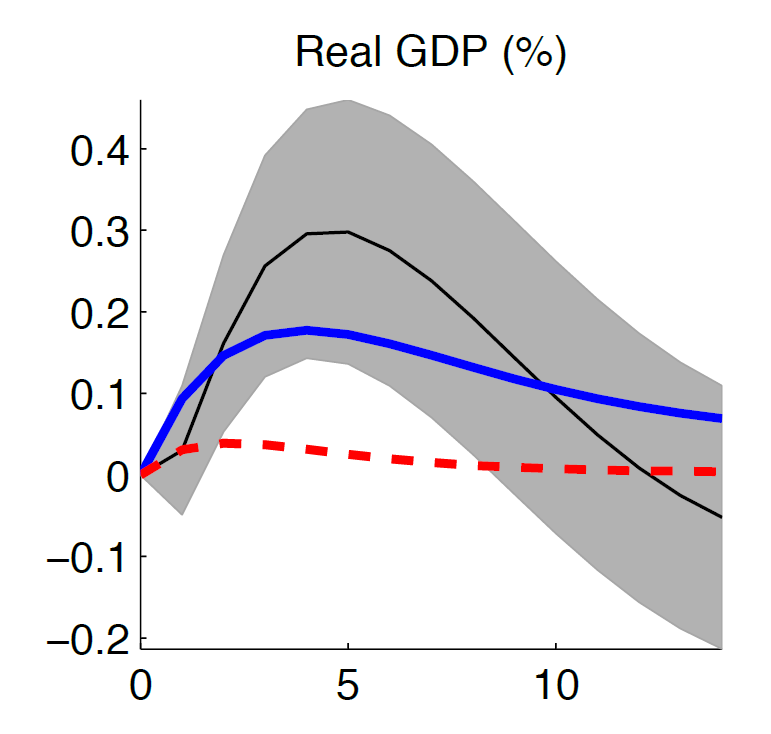
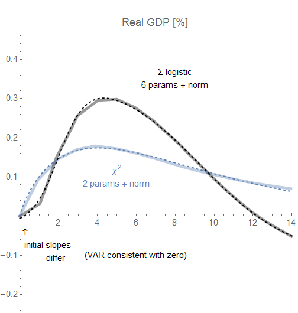

Lawrence Christiano, Martin Eichenbaum, and Mathias Trabandt have written (or I guess re-written) a review article of sorts on DSGE models titled _On DSGE Models_. Gone is the "dilettantes" language of the previous incarnation with the same title (see e.g. [Jo Michell here](https://criticalfinance.org/2017/11/19/dilettantes-shouldnt-get-excited/), or [Noah Smith here](http://noahpinionblog.blogspot.com/2017/11/the-cackling-cartoon-villain-defense-of.html); the [link to the original](http://faculty.wcas.northwestern.edu/~lchrist/research/JEP_2017/DSGE_final.pdf) \[pdf\] now seems to point to a different version). While there was lots of criticism of the original, I actually [came to the defense of the idea](https://informationtransfereconomics.blogspot.com/2017/11/numerical-experiments-and-paths-to.html) of numerical experiments in that previous paper (which was also removed). In the new version, it still seems they were "triggered" by Stiglitz's paper _Where Macroeconomics Went Wrong_ (and the [2017 NBER working paper version](http://www.nber.org/papers/w23795) _Where Modern Macroeconomics Went Wrong_) — declaring Stiglitz to be representative of criticism and then declaring his criticism as "not informed". 

I don't really have any skin in this particular game: I haven't invested a career in DSGE models, nor are the existence of DSGE models a barrier or threat to acceptance of my own weird ideas ([e.g.](https://papers.ssrn.com/sol3/papers.cfm?abstract_id=3094757)) — the far larger barrier is not being an economist. I've used DSGE models as benchmarks for the performance of my own models. In fact, awhile ago I took the time [to build the basic three equation "New Keynesian" DSGE model](https://informationtransfereconomics.blogspot.com/2016/08/dsge-part-5-summary.html) in terms of the information-theoretic approach I've been working on. I've both criticized and defended DSGE — likely because much of the commentary seems either hyperbolic or irrelevant.

While that hopefully covers my biases, there's the additional issue of a physicist making declarations about social sciences that often irritates their practitioners. However, in this particular case I am really only leveraging my long experience with mathematical modeling of systems where the data about the macro observables as well as the underlying degrees of freedom is unclear and there is no established tractable theory to answer all the questions. I've also been studying economics for about 6 years now \[1\] — not just reading blogs, but e.g. keeping up with (some of!) the literature, and working the exercises in textbooks \[2\]. But I do think an outsider perspective here is useful, not as some impartial judge but rather to break down the _us vs. them_/DSGE-as-a-four-letter-word status quo that's developed post-Great Recession.

**\*  \*  \***

With all of that out of the way, the "debate" over DSGE models is, in a word, maddening. A concise encapsulation is readily available in the two papers' Christiano _et al_ (2018) and Stiglitz (2017) discussion of financial frictions. From Stiglitz's abstract we find he believes:

> _**Inadequate** modelling of the financial sector meant \[DSGE models\] were ill-suited for predicting or responding to a financial crisis ..._

Emphasis mine. Christiano _et al_ characterizes this as:

> _Stiglitz (2017) asserts that pre-crisis DSGE models **did not allow** for financial frictions or liquidity-constrained consumers._

Again, emphasis mine; "did not allow" and "inadequate" do not mean the same thing so this isn't a charitable reading from Christiano _et al_. The argument is then made that DSGE models did allow for financial frictions:

> _Carlstrom and Fuerst (1997) and Bernanke et al. (1999) develop DSGE models that incorporate credit market frictions which give rise a “financial accelerator” in which credit markets work to amplify and propagate shocks to the macroeconomy._

But the maddening part is that earlier in their paper Christiano _et al_ make a similar point to Stiglitz:

> _At the same time, the financial frictions that were included in DSGE models did not seem to have very big effects. Consider, for example, Bernanke et al. (1999)’s influential model of the financial accelerator. That model is arguably the most influential pre-crisis DSGE model with financial frictions. It turns out that the financial accelerator has only a modest quantitative effect on the way the model economy responds to shocks, see e.g. Lindé et al. (2016). ... Their key finding is that neither \[financial friction\] model substantially improves on the performance of the benchmark model, either in terms of marginal likelihoods or impulse response functions. So, guided by the post-war data from the U.S. and Western Europe, and experience with existing models of financial frictions, DSGE modelers emphasized other frictions._

Financial frictions didn't seem to have much of an effect, so other frictions were "emphasized". This isn't so much of a challenge to Stiglitz's criticism as an explanation of it. The "influential" way to incorporate financial frictions in DSGE models didn't produce large effects, so they were de-emphasized in the years before the biggest financial crisis and recession in recent years struck. This is effectively what Stiglitz says:

> _Assumptions matter. All models make simplifications. The question is, as we have said, what simplifications are appropriate for asking what questions. The danger is that the simplifications **bias** the answers, sometimes in ways that we are not aware of. The DSGE model ignored issues that turned out to be key in the 2008 crisis ..._

Emphasis in the original.

However.

I am not sure we have sufficiently convincing evidence that financial frictions are the key to the 2008 financial crisis and recession. This is one of those things that I get lots of grief on the internet for saying because everyone seems to think it's obvious that the financial crisis (housing bubble, shadow banks, over-leverage, the Fed) led to the Great Recession — that the problem of 2008 is trivially solved by inspection.

This is where I am with Christiano _et al_: more research needs to be done here and the mechanisms are not cut and dried. But while DSGE models might be such an avenue, the financial friction models (e.g. [Del Negro _et al_](https://www8.gsb.columbia.edu/rtfiles/finance/Macro%20Workshop/fall%202013/Marc%20Giannoni.pdf) \[pdf\]) don't seem to be empirically very accurate either for how complex they are:

Going beyond financial frictions to the general performance of DSGE macro modeling, the model results \[3\] of [Christiano _et al_ (2016)](http://faculty.wcas.northwestern.edu/~yona/research/ChristianoEichenbaumTrabandt.pdf) \[pdf\] shown in the paper aren't very good either for how many parameters the model has (the blue curve in Figure 2 reproduced below has 26). Since Christiano _et al_ are reporting this as a decent enough explanation of the (VAR) data to support the conclusion that sticky wages are necessary, we can surmise they think their model (CET 2016) is qualitatively reasonable. In the original paper, the model is presented as a "good description of the data" \[4\] in its own right.

Aside from the issue in footnote \[3\] with "VAR data", the blue curves are not even a qualitatively accurate model of the black curves even accounting for the gray bands. On a scale from 1 ([Steve Keen](https://informationtransfereconomics.blogspot.com/2017/02/qualitative-economics-done-right-part-2.html)) to 10 ([Max Planck](https://en.wikipedia.org/wiki/Planck%27s_law)), I give this qualitative agreement a 2 or a 3. Let's focus on the real GDP impulse response:

I show the original alongside my function fits (using a χ² distribution function and a sum of logistic functions) to the curves. These fits help get an estimate of the number of scales involved in describing the data. The DSGE output basically has 2: the slope at zero and the length of the approach to zero at infinity. The VAR has **_at least_** two more: the length of the approach to zero, and the frequency of the oscillation as the function (eventually) returns to zero. I couldn't figure out a description that took fewer than six parameters (a sum of logistic functions, like I use in [the dynamic information equilibrium models](https://papers.ssrn.com/sol3/papers.cfm?abstract_id=3094757)). The DSGE output is qualitatively less complex — it could be captured with two degrees of freedom, which makes sense as the model has 26 parameters with 12 observables implying about 2 degrees of freedom per observable. The boundary condition at zero does not seem to be the same: the DSGE output obeys _f_(0) = 0, while the VAR seems consistent with _f_(0) = 0 plus _f'_(0)= 0. This may not seem like much, but it is a major indicator. While the model may look qualitatively like the VAR using the naive approach of "hey, it goes up then comes down", there's a lot more to it than that \[5\]. Except for the inflation curve (which just seems to get the scale wrong), none of the DSGE model observables look even qualitatively like the data.

And this is the main issue with DSGE models for me: they are incredibly complex for how poorly they even qualitatively describe the data. Unfortunately, this is an issue that not only Stiglitz but the entire edifice of mainstream and heterodox economics taken together seem ill-suited to address. Stiglitz (2017) and via citation Korinek (2017) seem to cede that these DSGE models match moments, but not the right ones and not in the right way (sorry for the long quotes, but wanted to get full context because I am drawing a conclusion that isn't explicitly stated).

Stiglitz (2017)

> _In the end, all models, no matter how theoretical, are tested in one way or the other, against observations. Their components—like the consumption behavior—are tested with a variety of micro- and macro-data. But deep downturns, like the 2008 crisis, occur sufficiently rarely that we cannot use the usual econometric techniques for assessing how well our model does in explaining/predicting these events—the things we really care about. That’s why, as I have suggested, simply using a least-squares fit won’t do. One needs a Bayesian approach—with heavier weight associated with predictions when we care about the answer. Comparing certain co-variances in calibrated models is even less helpful. There are so many assumptions and so many parameters you can choose for your model, many more than the number of moments you can get from the data; so being able to match all moments in the data does not tell you that your assumptions were correct, and thus does not provide much confidence that forecasts or policies based on that model will be accurate._

Korinek (2017)

> _Second, for given detrended time series, the set of moments chosen to evaluate the model and compare it to the data is largely arbitrary—there is no strong scientific basis for one particular set of moments over another. The macro profession has developed certain conventions, focusing largely on second moments, i.e. variances and covariances. However, this is problematic for some of the most important macroeconomic events, such as financial crises, which are not well captured by second moments. Financial crises are rare tail events that introduce a lot of skewness and fat tails into time series. As a result, a good model of financial crises may well distinguish itself by not matching the traditional second moments used to evaluate regular business cycle models, which are driven by a different set of shocks. In such instances, the criterion of matching traditional moments may even be a dangerous guide for how useful a model is for the real world. For example, matching the variance of output during the 2000s does not generally imply that a model is a good description of output dynamics over the decade._

Both of these criticisms essentially say outside big shocks like the 2008 crisis the DSGE models match the data. It's possible the reason Stiglitz and other economists can't set the bar higher for matching the data is because no one has models that match the data better. As far as I can tell, that seems to be true: no other modelling paradigm in macroeconomics produces anything as empirically accurate as DSGE models outside of major shocks. Well, except [AR processes](https://www.federalreserve.gov/pubs/feds/2011/201111/201111pap.pdf) \[pdf\] (sVARs) — but that's basically giving up and saying it's random.

Now I've often heard the counterargument that economic systems are social systems, so we can't expect strong agreement with the data (often characterized as "physics-level" or "hard science" agreement with the data). But I'm not arguing for precision economics here (qualitative agreement with the basic functional forms of the data would be great!), and the existence of VARs that do better are an immediate counterexample. A model that led to the VAR parameters would be a massive improvement in the agreement with the data. Otherwise we should really abandon research for nihilism and just go with the VARs. 

This creates an unfortunate state of affairs where the one true way to judge a model (asking how well it describes data) isn't being fully employed. It's like Christiano is trying to sell Stiglitz a 1972 Ford Pinto and Stiglitz is complaining that Ford Pintos don't come standard with electronic fuel injection. Christiano retorts that he changed out the entire engine after an accident in 2008, but no one is talking about the fact that the car doesn't even run despite Christiano's assurance that it does using some blurry photographs that may or may not be this specific Ford Pinto (or even a Ford Pinto at all). But Stiglitz took the bus to get here, so can't even ask whether it runs better than his current car \[6\].

The various other issues all seem to be outgrowths of this basic problem. Do you include _X_ or not? Does including _X_ improve agreement with the data? Do we even have agreement with the data without _X_?

The truth is that a large enough system of linear equations could easily describe macro data to a given level of accuracy. At their hearts, that's all DSGE models really are. It's a sufficiently general framework that it is not inconceivable that it could describe a series of macro observables. I don't think Stiglitz's "not even a starting point" (burn it all down) view is constructive; however I do think there's a need to get much more creative with the elements. The lack of agreement with the empirical data is so persistent, it leads me to suspect there are one or more core assumptions that might be fruitfully replaced (the Euler equation seems to be a good candidate) \[7\]. However, if practitioners like Christiano _et al_ fail to look beyond specific critics like Stiglitz (taking him as representative), and continue to believe the output of DSGE models is qualitatively reasonable, it's going to be a long time before those core assumptions get questioned.

**\*  \*  \***

There are a few other things I wanted to mention that didn't fit in the main narrative above. First, Christiano _et al_ (2018) seems to ignore the criticism that the ubiquitous modeling elements (Euler equation, Phillips curve) aren't supported empirically. To be fair, Stiglitz (2017) also seems to ignore this.

There was discussion of nonlinearities in both papers, but this one is called entirely for Christiano _et al_ because there is zero evidence that log-linearizing DSGE models has a strong effect ([actually evidence to the contrary](http://www.nber.org/papers/w22784)) or that nonlinear dynamics has any observable impact on macro observables that differs from a linear system with stochastic shocks ([see here for an extended discussion](https://informationtransfereconomics.blogspot.com/2016/10/keen-chaos-and-equilibrium.html)).

Regarding unemployment, Stiglitz repeats a refrain I frequently see in Op-Eds, blogs, and academic work referring to unemployment that stays high (or even at a specific level, such as Mortensen and Pissarides (1994) [as discussed here](https://informationtransfereconomics.blogspot.com/2017/09/search-and-matching-ii-theory.html)). I've never understood this; casual inspection of the [unemployment rate data for the US](https://fred.stlouisfed.org/series/UNRATE) shows no level at which the unemployment rate remains for very long, and the entire post-2008 period shows a nearly constant rate of decline. Yet Stiglitz makes calls in the aftermath of 2008 for models that answer "why the effects of the shocks persist, with say high levels of unemployment long after the initial shock" and sees "simple models \[that\] have been constructed investigating how structural transformation can lead to a persistent high level of unemployment" as an improvement in the understanding of economic systems despite "persistent high level\[s\] of unemployment" being empirically false. We definitely would want the rate to fall faster, but a model that says unemployment can stay high is clearly rejected by the data (or at best is a hypothetical macroeconomic scenario we haven't encountered yet). It's another case where I get a lot of grief on the internet when I point this out, and it makes no sense to me why people strongly believe something that is clearly at odds with the data ... _oh, right_.

**\*  \*  \***

**Update 20 July 2018**

**Footnotes:**

\[1\] My introduction to economic theory [was through prediction markets](https://en.wikipedia.org/wiki/Aggregative_Contingent_Estimation_\(ACE\)_Program). I used information theory to derive some potential metrics for their efficacy. However, the tools proved to be substantially richer than just applications to prediction markets. Since then, I've been exploring the usefulness of the approach to more general micro- and macro-economic questions on this blog.

\[2\] It feels a bit like being a grad student again, which I find fun because I am weird. I've actually been considering going back to grad school for Phd in Econ.

\[3\] They're compared to "VAR data" ("We re-estimated the model using a Bayesian procedure that treats the VAR-based impulse responses to a monetary policy shock as data.") that I want to discuss in a future post because one is not comparing to the actual data but rather a different model of the data that constrains the output to be similar to DSGE models. And they're still not getting very close.

\[4\] The model shown in the "general wage rule" variant in Christiano _et al_ (2016). The "simple wage rule" is considered to capture "the key features of the general wage rule". In the next paragraph, the simple wage rule is considered "a good description of the data".

\[5\] I sometimes feel I might know how a birder feels when they hear someone say those two seagulls are the same. No, that's _L. a. megalopterus_ and that's _L. delawarensis_. To me, these DSGE model outputs look entirely unlike the "VAR" data as to be separate species of curves.

\[6\] Stiglitz does point to a model in his paper, but there does not appear to be any empirical work associated with it at all. Happy to be corrected, but it just looks like a statement of a bunch of assumptions.

\[7\] Has anyone done a term-by-term analysis of e.g. VARs and DSGE models? A common technique in physics is to write down a general model with unknown coefficients (analogous to the VAR) and then compare that term by term to some theory-based model (analogous to the DSGE) to see how the coefficients and terms match up (and their values, if available). For example, a general linear equation (no lags for simplicity) with three variables would look like:

(1) _a x_ + _b y_ + _c z_ + _d_ \= 0

Let's say some theory says

(2) (1/α) _x_ + σ² = _k_

This tells us that _a_ \= 1/α, _b_ \= 0, _c_ \= 0 and _d_ \= σ² − _k_. If e.g. the fit of (1) to the data says _c_ ≠ 0, or that _a ≈_ 2/α, you have some specific directions your research can go. I've never seen this in DSGE models, but that could be my own finite exploration of the literature. Hypothetically, if your VAR says current inflation has zero dependence on the lagged interest rate (i.e. the coefficient of _r_(_t_\-1) is unnaturally small) while it is theoretically supposed to be large (i.e. order 1) in your DSGE model, that would point to the core assumption of monetary policy controlling inflation through interest rates being questionable.

I actually think this might be a major benefit of machine learning in econ. While it is true that some modelling priors enter into how you set up your machine learning problem (i.e. [implicit theory](https://informationtransfereconomics.blogspot.com/2015/09/machine-learning-and-implicit-theorizing.html)), machine learning works reasonably well to drop the irrelevant degrees of freedom you chose to add based on your biases and implicit theorizing. Machine learning tends to find a low dimensional representation of your data, which sometimes means elimination of degrees of freedom. If short term interest rates are irrelevant to understanding the macroeconomy (again, hypothetically, as an example of a core assumption in DSGE modeling), a machine learning approach will more readily throw it out than simple regression (at least in my experience — this isn't a robust theory result).
