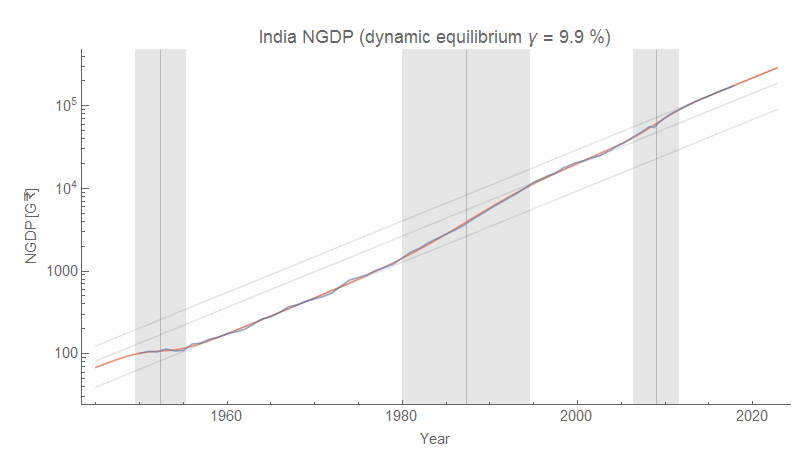

Via DM, I was asked about the path of India's GDP in the [dynamic information equilibrium model](https://papers.ssrn.com/sol3/papers.cfm?abstract_id=3094757) (DIEM). The result is in the graph above. I had to cobble together some annual data from the [Reserve Bank of India's statistics page](https://dbie.rbi.org.in/DBIE/dbie.rbi?site=statistics) along side the [quarterly data available on FRED](https://fred.stlouisfed.org/series/INDGDPNQDSMEI). What is interesting is that India shows a different pattern of DIEM "shocks" from Anglophone and European countries. The first shock is a negative one centered in 1952, spanning the years 1949 to 1955; the likely "cause" is India's independence in 1947. Some may want to attribute this to India adopting a socialist system, but its first five year plan doesn't happen until 1951 — halfway through this shock. Plus, the following period shows roughly constant growth. At any rate, more study is needed.

The DIEM description of the data shows a period of "equilibrium" growth between 1960 and 1980 that would match up with Raj Krishna's "[Hindu rate of \[real\] growth](https://en.wikipedia.org/wiki/Raj_Krishna)" of [about 3.5%](https://en.wikipedia.org/wiki/Hindu_rate_of_growth).  The 9.9% nominal GDP per annum would have to have inflation of about 6.4% during that period ([which is about right](https://fred.stlouisfed.org/graph/?g=klNP): log CPI from 0.9 in 1960 to 2.2 in 1980 would be 0.065 = 6.5%) to produce 3.5% real growth.

The period from 1980 to 1995 was a large positive shock. It could be attributed to the sixth five year plan and its economic liberalization, however in most of the rest of the economies I've looked at the major factor is demographic. This could be e.g. people leaving agriculture for industry. It could also be the surge in deficit spending around the same time (slightly before). Again, I have to look more closely at other time series to understand what is happening here.

Finally, there's another surge that occurs from 2006 to 2012 (with the global financial crisis appearing as a blip in the middle). This neatly corresponds to the eleventh five year plan (2007-2012), and overlaps with the construction of the "[Golden Quadrilateral](https://en.wikipedia.org/wiki/Golden_Quadrilateral)" road system.

Since 2012, India appears to be back on its equilibrium growth path of 9.9% per year (nominal GDP), which is expected to continue into the future.

I always like looking at the data for other countries than the US — laziness and the ease of accessing FRED data are big reasons for most of the models being tested on US data. Additionally, the political economy of the US tends to bring up more US-centric questions.

I'm also not very well informed about a lot of the political economy and economic history of other countries. This is both good and bad. It's good because it means I don't go modeling the data with a preconceived economic history; it's bad because I don't necessarily have decent intuitive explanations for what the models uncover. I'd be appreciative for any information about the economic history of India beyond my rudimentary knowledge above in comments.
