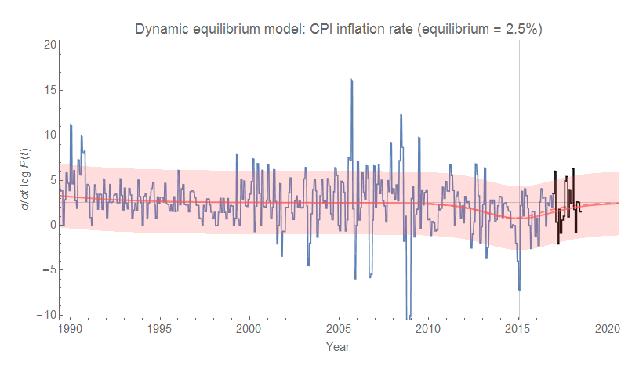
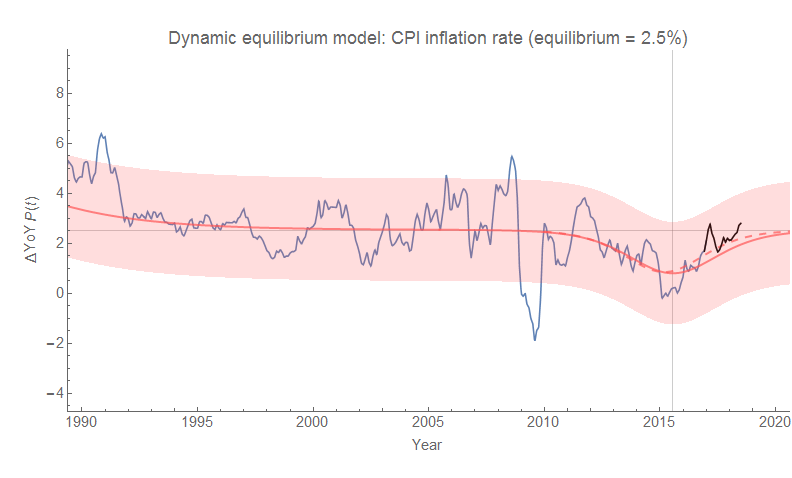
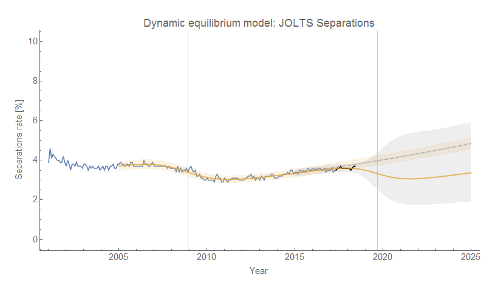
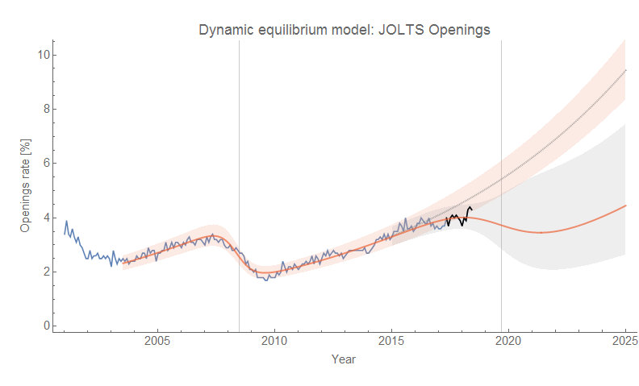

The [latest CPI data](https://fred.stlouisfed.org/series/CPIAUCSL) is out today, and we see the continued end of the "[lowflation](https://informationtransfereconomics.blogspot.com/2018/03/cpi-data-and-end-of-lowflation.html)" period in the US that trailed the 2008 recession and the global financial crisis. Overall, there's not of news here so I'll just post the graphs with the latest post-forecast data (black) compared to the forecast/model (red) for both continuously compounded annual rate of change and year-over-year change (as always, click to enlarge):

The errors bands are the standard deviation (~70%) of the model errors on the fit data (blue). The dashed red line is the (minimally) [revised estimate](https://informationtransfereconomics.blogspot.com/2018/03/cpi-data-and-end-of-lowflation.html) of the post-recession shock parameters.

PS I forgot to include separations in the [JOLTs data release earlier this week](https://informationtransfereconomics.blogspot.com/2018/07/counterfactual-2019-recession-update.html), so I'm posting it now. Also, I decided to use the [interest rate spread estimate](https://informationtransfereconomics.blogspot.com/2018/06/yield-curve-inversion-and-future.html) for the counterfactual recession timing (2019.7) in the static graphs instead of the previous arbitrary one (2019.5). The animations still show the effect of changing that timing on the counterfactual forecast. I'll also show the JOLTS openings rate with this updated timing guess:

