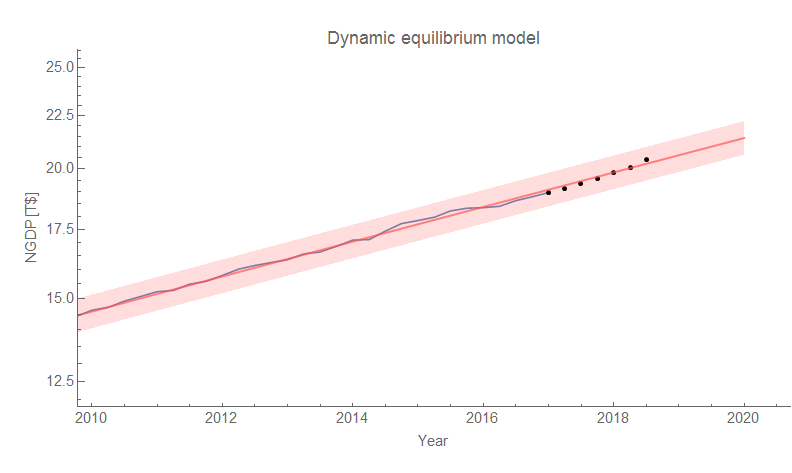
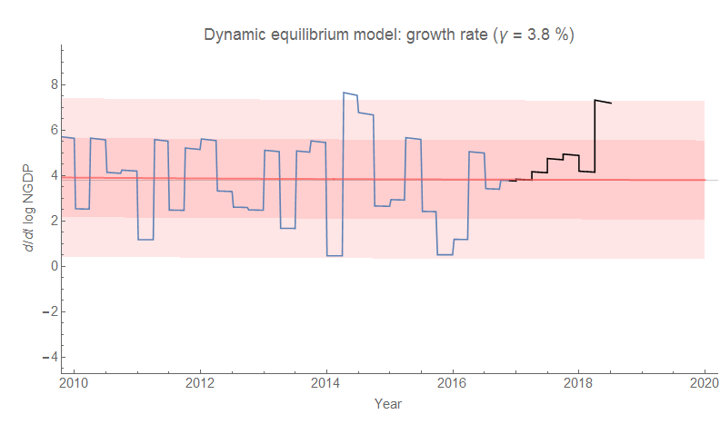
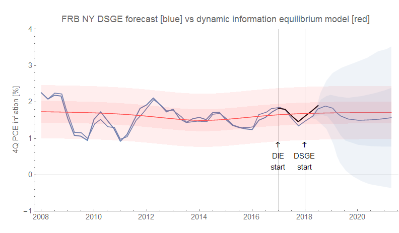
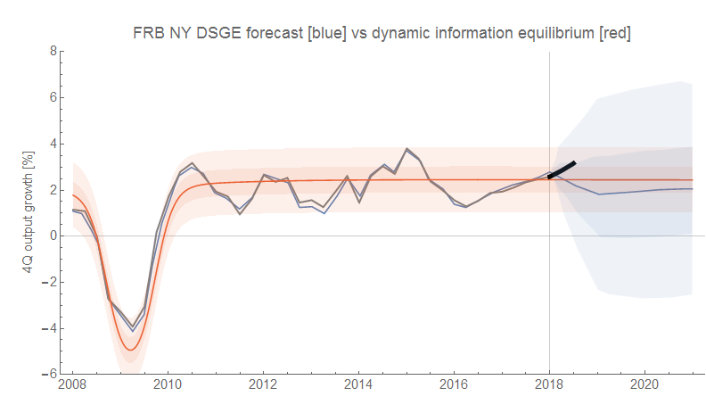
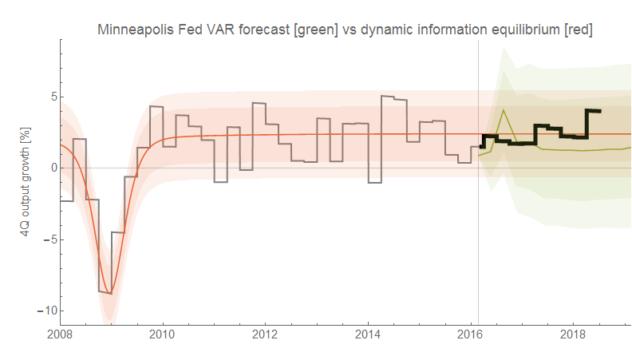
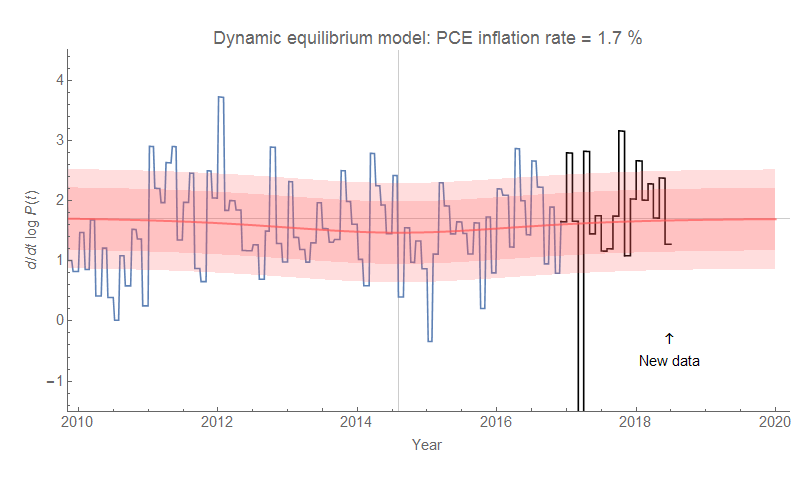
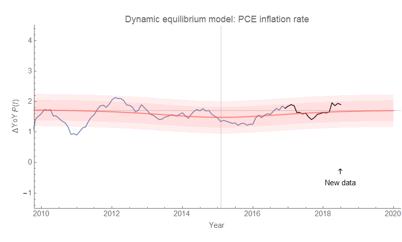

The [GDP numbers](https://fred.stlouisfed.org/series/GDP) for Q2 came out last week and everyone seemed to be making a big deal about 4% real GDP growth — it was basically within the error. The same could be said of the 5% real GDP growth back in 2014 Q2 and Q3. I guess the HP filter in my head smooths out most of the quarter to quarter fluctuations as noise.

Anyway, I have several forecasts that made claims about future GDP measurements and it's time once again to mark to market. First is NGDP level and growth rate (click to enlarge):

Next are a couple of head-to-head comparisons of the Dynamic Information Equilibrium Model (DIE model, or DIEM) with [NY Fed DSGE model](https://informationtransfereconomics.blogspot.com/2018/03/new-forecast-comparisons-to-track-us.html) and a [VAR from the Minneapolis Fed](https://informationtransfereconomics.blogspot.com/2018/04/comparing-my-forecasts-to-vars.html). There's not much conclusive with the DSGE comparison that's just gotten underway:

However, while the data is consistent with both the VAR forecast and the DIEM, due to the lower error the DIEM is technically winning this contest ([see the footnote here](https://informationtransfereconomics.blogspot.com/2018/04/comparing-my-forecasts-to-vars.html) for a note about short term forecasting based on a recent data point):

[quantity theory of labor](https://informationtransfereconomics.blogspot.com/2017/03/the-quantity-theory-of-labor-and.html)[here](https://informationtransfereconomics.blogspot.com/2018/03/okuns-law-and-labor-force.html)

**Update**

[Monthly (core) PCE inflation data](https://fred.stlouisfed.org/series/PCEPILFE#0) came out today and here are the forecasts (red) compared to the post-forecast data (black) for continuously compounded annual rate of change (log derivative) and year-over-year change:

