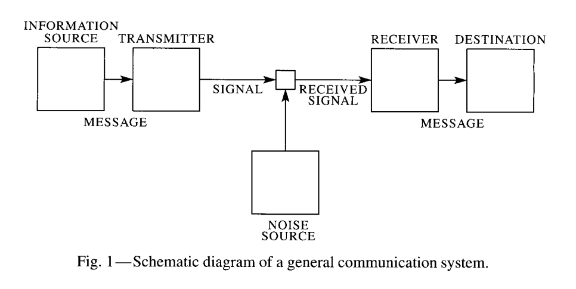

Information theory turns 70 this year (this month!); Claude Shannon's famous paper [_A Mathematical Theory of Communication_](https://culturemath.ens.fr/sites/default/files/p3-shannon.pdf) \[pdf\] was published in 1948 and has been lauded as [one of the foundations of the "digital age"](https://www.technologyreview.com/s/401112/claude-shannon-reluctant-father-of-the-digital-age/). One of the first things it did was allow engineers to design communication networks that worked in the presence of noise. As a subject, it's far more general, though.

Unfortunately, Shannon's _entropy_, often referred to as _information entropy_, and then shortened to just _information_, is often confused with the colloquial term "information". This brings connotations of data, of knowledge, of specific sets of symbols with specific meaning (the letters C A T representing the label of an animal in English). But as Shannon and Weaver said in their book from a year later, we must not confuse information theory information with meaning. This collision of terminology is amplified when it encounters economics, where information economics deals specifically with the economic value of meaningful information.

I believe the best way to understand this difference is to understand what information theory illuminates. Information theory gives us a way to quantify concepts when we have limited knowledge about what underlies those concepts. For example, information theory is essentially a more general framework that encompasses thermodynamics in physics — thermodynamics is the science of how collections of atoms behave despite not having remotely enough knowledge about the trillions upon trillions of atoms to make a model. We give up talking about what a single atom in a gas is doing for what an atom could be doing and with what probability. We cease talking about atoms are doing and instead talk about the realm of possibilities (the state space) and the most likely states.

Now thermodynamics is a much more specific discipline than information theory, not in the least because it specifies a particular relationship between energy and the (log of the) size of the state space through the Boltzmann constant _k_ (where thermodynamic entropy _S_ is related to the state space via _S_ \= _k_ log _W_ where _W_ counts the size of that state space). But the basis of thermodynamics is the ability to plead ignorance about the atoms formalized and generalized by information theory.

Information theory helps us build efficient communications systems because it allows us to plead ignorance about the messages that will be sent with it. I have no idea which sequence of 280 characters you are going to tweet, but information theory assures us they will be faithfully transmitted over fiber optic cables or radio waves. And if I am ignorant of the message you send, how can its meaning be important — at least in terms of information theory.

[Maximum entropy methods in e.g. earth science](http://www.mdpi.com/1099-4300/11/4/931) let us plead ignorance about the exact set of chemical and physical processes involved in the carbon or water cycles to estimate the total flux of thermodynamic energy in the Earth-Sun system. Maximum entropy lets us program a neural network to identify pictures of cats without knowing (i.e. setting) the specific connections of the hundreds of individual nodes in the hidden layer — I mean, it's hidden! In a similar fashion, [I've been trying to use information theory](https://papers.ssrn.com/sol3/papers.cfm?abstract_id=3094757) to allow me to plead ignorance about how humans behave but still come up with quantitative descriptions of macroeconomic systems \[1\].

But that's why the information in information theory isn't about meaning. One purpose of information theory is to give us a handle on things we don't have complete knowledge of (so _a fortiori_ can't know the meaning of): the motions of individual atoms, the thousands of node connections in a neural network, the billions of messages sent over the internet, or (maybe) the decisions of millions of humans in a national economy. If we're pleading ignorance, we can't be talking about meaning.

...

**Update 13 July 2018**

First, let me say this blog post was inspired by [this Twitter thread with Lionel Yelibi](https://twitter.com/TehRaio/status/1017611372086071296). And second, [there's a related post](https://informationtransfereconomics.blogspot.com/2016/05/where-is-information-encoded.html) about Cesar Hidalgo's book _Why Information Grows_ and his "crystals of imagination". Hidalgo has a parable about a wrecked Bugatti Veyron that tries to get the point across that the value of objects is related to the arrangement of atoms (i.e. specific realizations of state space). However, in that particular case the value information is not entirely encoded in the atoms but also (and maybe even primarily) in human heads: someone who didn't know what a Bugatti was would not value it in the millions. They might still value a car closer to tens of thousands of dollars (although even that is also based on my own experience and memory of prices).

...

**Footnotes:**

\[1\] In a sense, information equilibrium could be seen as the missing concept for economic applications because it gives a possible way to [connect the information in two different state spaces](https://informationtransfereconomics.blogspot.com/2016/11/how-do-maximum-entropy-and-information.html) which is critical for economics (connecting supply and demand, jobs with vacancies, or output with input).
