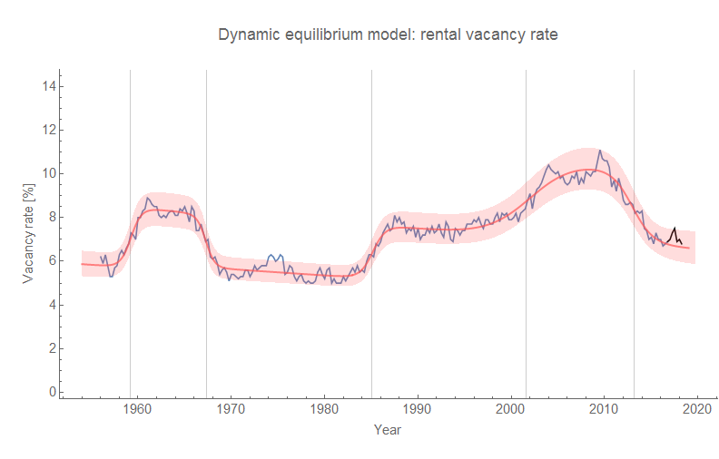
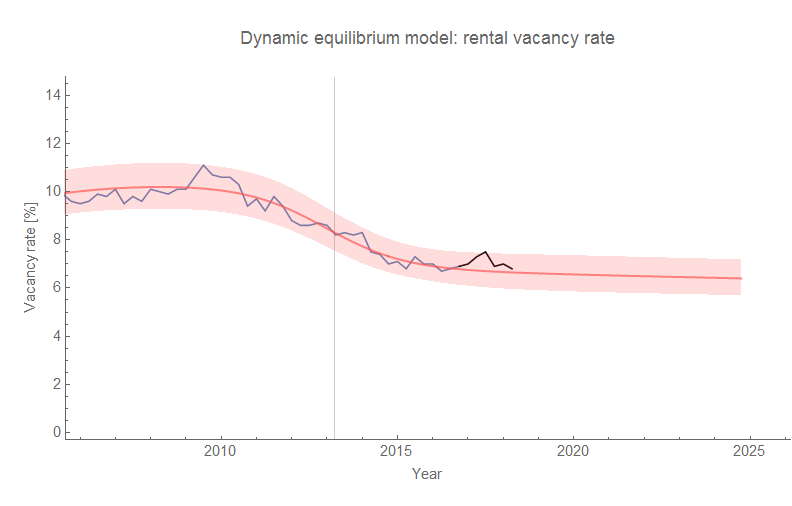

I put together a [dynamic information equilibrium model](https://papers.ssrn.com/sol3/papers.cfm?abstract_id=3094757) of [rental vacancy rates over a year ago](https://informationtransfereconomics.blogspot.com/2017/04/dynamic-equilibrium-rental-vacancy-rate.html) (you can think of it as an "unemployment rate" for rental housing). I haven't updated it in awhile, so here's the [latest post-forecast data](https://fred.stlouisfed.org/series/RRVRUSQ156N) (black):

Although it is within error, this does show a bit of the "overshooting" that happens when you estimate the shock parameters for an incomplete shock (I talk about it [here](https://informationtransfereconomics.blogspot.com/2018/04/overshooting-bitcoin-case-study.html), another example is [here](https://informationtransfereconomics.blogspot.com/2018/05/validating-my-cpi-inflation-forecast.html)). Here's a zoomed-in version with an extended forecast horizon (in the absence of a shock):

