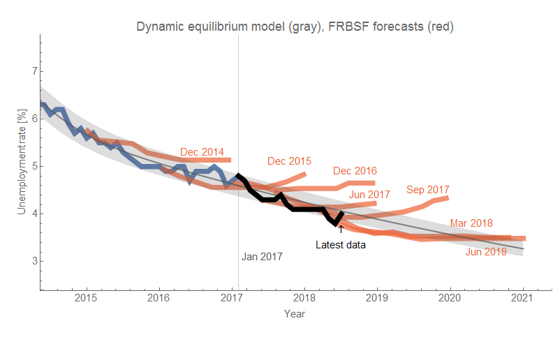
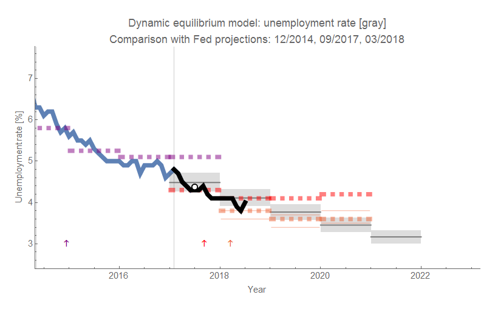

The dynamic information equilibrium model (DIEM) forecast ([the model is detailed in my paper](https://papers.ssrn.com/sol3/papers.cfm?abstract_id=3094757)) is still going strong since it was made back in January of 2017 (1.5 years). [Last month's data](https://informationtransfereconomics.blogspot.com/2018/06/unemployment-rate-time-series-is-on.html) was outside the 90% confidence intervals, but this month has us back up to 4.0% as a bit of mean reversion \[1\]. Here's the comparison with the FRBSF forecasts as well as the Fed's (annual average) forecasts:

The color-coded arrows in the second graph show when the Fed forecasts were made.

Note that if there is going to be a recession in 2019 (via [JOLTS data](https://informationtransfereconomics.blogspot.com/2018/06/jolts-data-and-2019-recession.html) indicator, via [yield curve](https://informationtransfereconomics.blogspot.com/2018/06/yield-curve-inversion-and-future.html) indicator), we'd expect the path of the unemployment rate to follow something like the September 2017 forecast from the FRBSF and the Fed — the unemployment rate will be significantly above the DIEM forecast error allowing e.g. [this "recession detection" algorithm](https://informationtransfereconomics.blogspot.com/2017/04/determining-recessions-with-algorithm.html) to posit a recession.

These kinds of forecasts always fill me with conflict. A recession is a terrible hardship for many people. However, I'm also excited to see if the model works. I tend to rationalize it by saying that forecasting recessions is a bit like forecasting earthquakes or volcanic eruptions — it can help people prepare — but we should always remember that economic time series are metrics for real world hardship.

**Footnotes:**

\[1\] I heard the news on NPR, and I found the "very serious" talk by economic journalists and economists about the "meaning" of the jump as if something had changed or that it was due to various factors ... hilarious. Even without the dynamic equilibrium model, this increase was well within the random fluctuations/measurement error.
