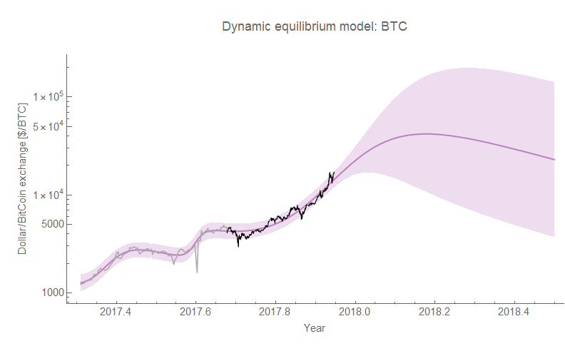
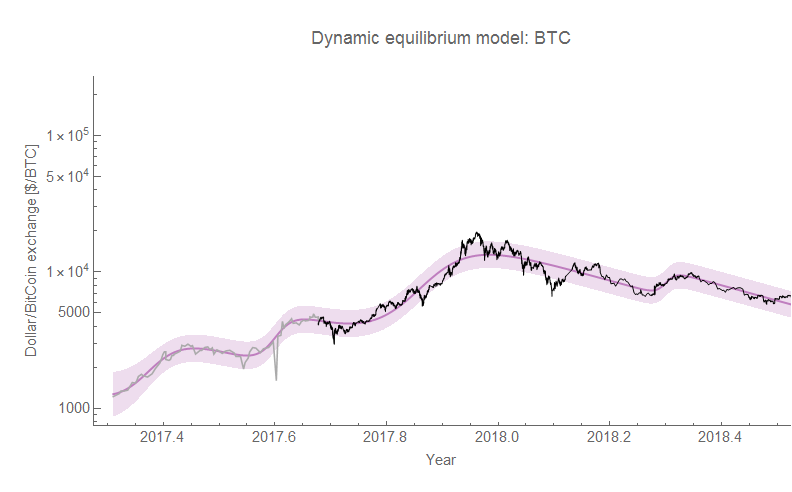
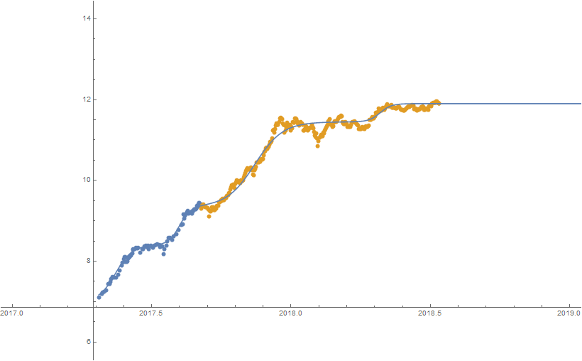

The Atlanta Fed wage growth data has been updated for June 2018, and is pretty much in line with the dynamic information equilibrium model I've been [tracking since February](https://informationtransfereconomics.blogspot.com/2018/02/dynamic-equilibrium-in-wage-growth.html):

**Post script/post mortem**

Also, [while not useful for forecasting](https://informationtransfereconomics.blogspot.com/2017/10/bitcoin-model-fails-usefulness-criterion.html), the bitcoin exchange rate model did provide a decent _post hoc_ description of the data over the past several months but getting [the average rate of decline](https://informationtransfereconomics.blogspot.com/2017/05/dynamic-equilibrium-and-bitcoin.html) a little high (using about −2.6/y, almost exactly 100 times the dynamic equilibrium depreciation rate of gold of −0.027/y when the actual empirical decline from the 18 December 2017 peak to the most recent 11 July 2018 measurement [here](https://fred.stlouisfed.org/series/CBCCIND#0) was only −1.8/y):

It's possible there's another shock in the data \[1\] earlier this year, [but as I said in this blog](https://informationtransfereconomics.blogspot.com/2017/10/bitcoin-model-fails-usefulness-criterion.html) constantly adding shocks (even if they're really there) doesn't really validate the model. We'd need to validate the framework on other data and use that validity to motivate an unstable bitcoin exchange rate with tons of shocks.

**Update**

Here's what happens when you include that shock:

Note that in the "proper" frame (a log-linear transform that removes the dynamic equilibrium decline), the stair-step appearance (noted [here](https://informationtransfereconomics.blogspot.com/2017/09/dynamic-equilibrium-versus-federal.html) and [in my paper](https://papers.ssrn.com/sol3/papers.cfm?abstract_id=3094757)) is more obvious:

...

**Footnotes:**

\[1\] We could motivate this shock centered in April 2018 further by noting that the rate of decline from the 5 May 2018 peak to 11 July 2018 was −2.8/y and the rate of decline from 18 December 2017 to 18 March 2018 was −3.2/y meaning the lower rate of decline of −1.8/y from December to July was mostly due to the bump in April of 2018.
