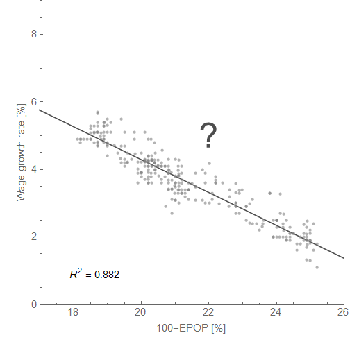
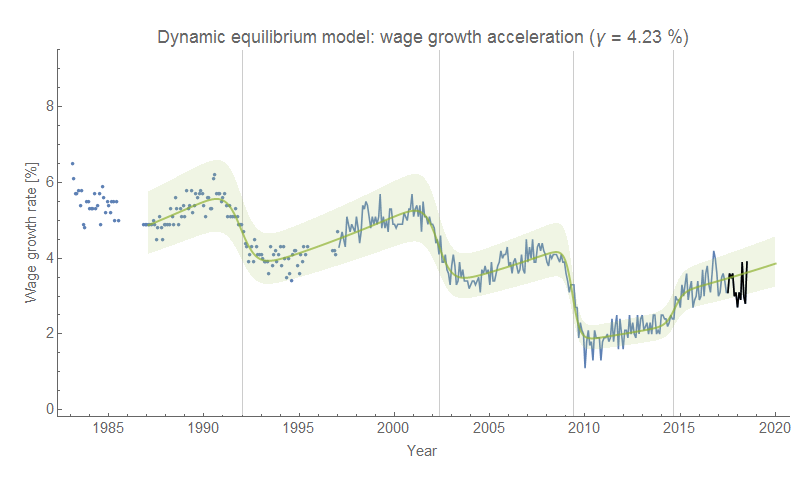
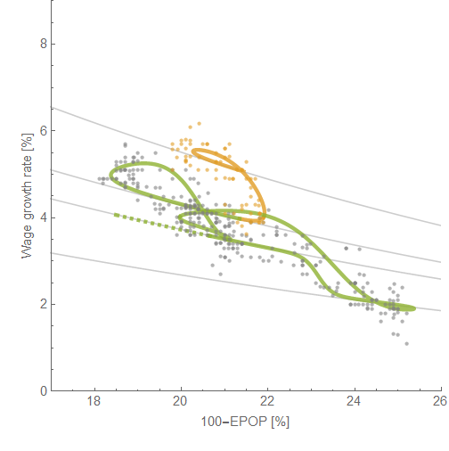
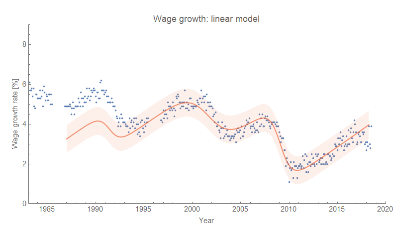
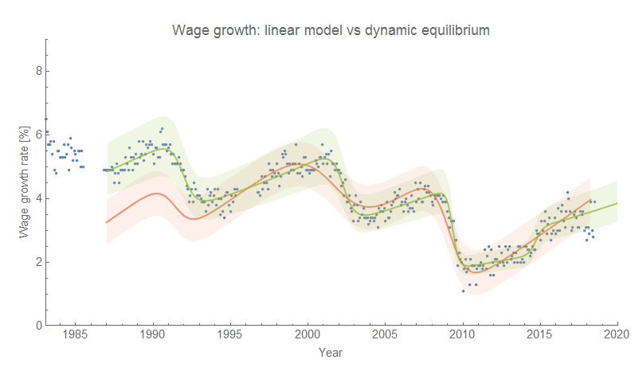

I saw a graph from [Adam Ozimek](https://twitter.com/ModeledBehavior/status/1024280989156159489) via [Brad DeLong today](http://www.bradford-delong.com/2018/07/if-you-take-the-appropriate-measure-of-labor-market-tightness-to-be-the-prime-age-employment-rate-there-is-no-wage-growth-pu.html). I effectively reproduced it above using the Atlanta Fed's wage growth tracker data from 1994-present instead of ECI \[1\] because I have a [dynamic information equilibrium model of that measure](https://informationtransfereconomics.blogspot.com/2018/02/dynamic-equilibrium-in-wage-growth.html) that I've been tracking since the beginning of the year. Actually, it ends up having a better _R²_ because the ECI data is noisier and less frequently updated.

It looks remarkably like a stable relationship, right? However, I also have a dynamic information equilibrium model of the ["prime age" employment-population ratio](https://informationtransfereconomics.blogspot.com/2018/03/employment-growth-and-wages.html) (EPOP). If you combine them, you get a Beveridge curve like relationship as discussed [in my paper](https://papers.ssrn.com/sol3/papers.cfm?abstract_id=3094757) (and [here](https://informationtransfereconomics.blogspot.com/2017/10/the-beveridge-curve.html)). First, here are the models of wages and EPOP separately (click to enlarge):

And here's the graph that combines the models — and adds in data from 1988 to 1994 from the Atlanta Fed not in the first graph (yellow):

The gray grid lines show the behavior we'd expect in the absence shocks. The DIEM essentially predicts a much lower slope without shocks (mostly recessions, but wage growth saw a positive shock begin in 2014) and tells us the linear relationship observed at the top of this post is largely spurious. Regardless of which model is correct, this is a great example where the conclusions depend on the way you frame the data.

...

**Update 6 August 2018**

I thought I'd show what Ozimek's linear model would imply for wage growth given the prime age employment population ratio data. Here it is on it's own (red vs data in blue):

As you can see, it's reasonable but falls apart as you go further back. The dynamic information equilibrium model (green) is an improvement:

**Footnotes:**

\[1\] I have [looked at both measures](https://informationtransfereconomics.blogspot.com/2018/06/wage-growth-showing-signs-of-downward.html).
