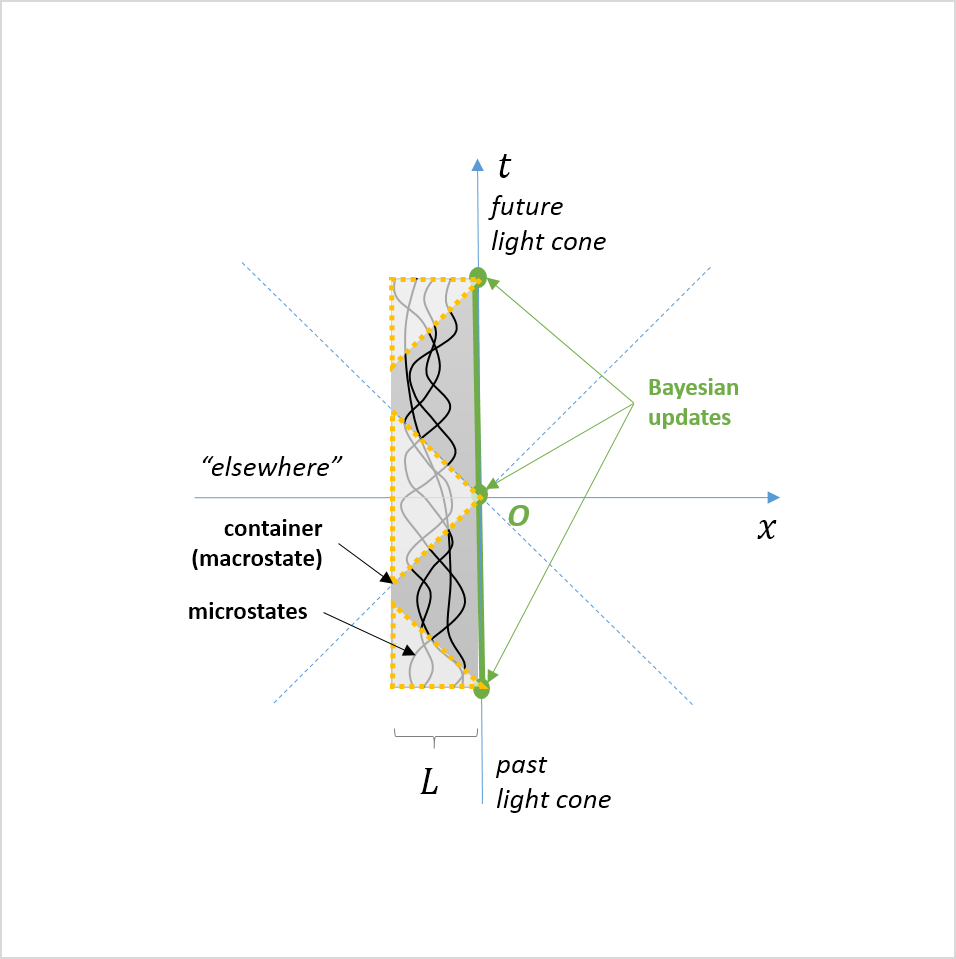

Because I was in a sense challenged to read _Quantum Economics: The New Science of Money_ by David Orrell (see below), I bought the book and read it. A review of sorts appears below. However, a reference in it lead me to a paper by [Linden _et al_ (2008)](https://arxiv.org/abs/0812.2385) that I had not seen about quantum entanglement being a source of entropy increase. This made me realize that we need to think about what we mean by ignorance of the micro state (i.e. agents) in information equilibrium. Let me begin by setting up the issue in physics.

There is a camp of physicists as well as a sect of popular understanding \[0\] that equates entropy with a **_subjective_** ignorance of the micro state. Because _we observers_ do not know the location and momentum of every molecule in a cup of coffee, we posit the principle of indifference as a kind of Bayesian prior. As they put it in Linden _et al_: 

> _Leave your hot cup of coffee or cold beer alone for a while and they soon lose their appeal - the coffee cools down and the beer warms up and they both reach room temperature. And it is not only coffee and beer - reaching thermal equilibrium is a ubiquitous phenomenon: everything does it. Thermalization is one of the most fundamental facts of nature._

> _But how exactly does thermalization occur? How can one derive the existence of this phenomenon from the basic dynamical laws of nature (such as Newton’s or Schrodinger’s equations)? These have been open questions since the very beginning of statistical mechanics more than a century and a half ago._

> _One - but by no means the only - stumbling block has been the fact that the basic postulates of statistical mechanics rely on subjective lack of knowledge and ensemble averages, which is very controversial as a physical principle. ..._

They then proceed to show that a subsystem eventually becomes entangled with the rest of the system resulting in fundamental (i.e. quantum) ignorance (i.e. probabilistic knowledge) of the subsystem rather than subjective (i.e. our) ignorance. [Here's another paper](https://arxiv.org/abs/0810.3092) that shows effectively the same thing by Peter Riemann, he being somewhat more agnostic about the underlying probabilistic physical principle (ignorance, indifference, ergodic, whatever).

However, [Cosma Shalizi has a paper from several years ago](https://arxiv.org/abs/cond-mat/0410063) that states the subjective ignorance (i.e. maximum entropy as a logical inference method) is a fundamentally incoherent approach that actually leads to a reversal of the arrow of time because of some basic properties of information theory. Briefly, your Bayesian updating can only increase your subjective knowledge of the microstate so you either have to a) have a weird form of Bayesian updating that forgets its past or b) give up the assumption that entropy represents subjective ignorance. But there may be a hole in this argument that I'll discuss below (because I found it entertaining).

My personal approach is to see maximum entropy and statistical mechanics as _[effective theories](https://en.wikipedia.org/wiki/Effective_theory)_. Where many effective theories are appropriate at one physical scale (say, at short distances, or high energy), we can see statistical mechanics as an effective theory when _N_ \>> 1 where _N_ is the number of subunits (agents, microstates, etc). That said, whatever its assumptions about the microstates (e.g. subjective ignorance, ergodicity), those assumptions do not necessarily apply to the microstates. In economics language, statistical mechanics is an "as if" theory: ensembles of molecules behave _as if_ our subjective ignorance of the microstate is physically relevant (or as if the system is ergodic, etc).

That's why I think of information equilibrium as an effective description of economic systems. However, there are also some really important distinctions regarding the thermodynamic issues above. For one, there is no economic "arrow of time". We do not require _ΔS_ \> 0, and in fact many economically relevant phenomena may well be due to [violations of "economic entropy" increasing](https://informationtransfereconomics.blogspot.com/2015/11/internal-devaluation-and-fluctuation.html) ([see also the last sections of my older paper](https://papers.ssrn.com/sol3/papers.cfm?abstract_id=2894072)). While the molecules in a cup of coffee can't decide to try and enter a correlated momentum state (i.e. your coffee suddenly moves up and out of the cup), humans can and will enter a correlated economic state (e.g. selling off shares in a panic). In the information equilibrium approach, this is called [non-ideal information transfer](http://informationtransfereconomics.blogspot.com/2016/09/basic-definitions-in-information.html).

It's not our subjective ignorance of the employment states of people in the labor force that leads to the description of the unemployment rate ([as described in my more recent paper](https://papers.ssrn.com/sol3/papers.cfm?abstract_id=3094757)), but rather our fundamental ignorance (i.e. probabilistic knowledge) of what human beings think, how they interact, and how they reach decisions. I frequently put the postulate as a translation of the ergodic hypothesis: agents fully explore the opportunity set (state space), but that's simply [an equivalent postulate](https://en.wikipedia.org/wiki/Statistical_mechanics#Fundamental_postulate) that leads to the same effective economic theory.

**\* \* \***

I was thinking about Cosma Shalizi's argument, and realized that it's a Newtonian argument because it does not account for causality. In fact, it gives an additional way out of Shalizi's trilemma because Bayesian updating must be causal (i.e. you cannot update faster than _L/c_ if _L_ is the size of your thermodynamic system). Large segments of time evolution of phase space are inaccessible to the Bayesian updater because they exist "elsewhere" in a space-time diagram \[1\]:

For system a foot across (30 cm), this minimum update time is about a nanosecond. The average air molecule travels about 500 m/s at room temperature and atmospheric pressure. It will travel about 0.5 μm in a nanosecond. However, the average spacing between air molecules at standard temperature and pressure is a few nanometers, meaning during that minimum update time you will have an uncertain volume containing on the order of 10^7 other molecules (each with their own uncertainty volume). That's plenty of opportunity to increase any observers subjective ignorance more than the Bayesian updates can reduce it. Interestingly, the speed of the molecules only drops as √_T_, so going to one-quarter the temperature only reduces the speed by half (so the volume goes as √_T_³) while the volume of a gas drops as _T_ (ideal gas law). This means your uncertain volume will actually increase relative to the volume per molecule, so the Bayesian updating gets worse at low temperature — and eventually you'll have quantum effects described above kick in!

**\*  \*  \***

> **Jason Smith:** The galling thing is that Orrell starts with a quote about making predictions and saying economics is bad science, but then closes promoting a book that (based on the source material [in his papers](http://www.postpythagorean.com/book_quantumeconomics.html)) won't make any predictions or engage with empirical data either. 

> **David Orrell:** That sounds like a prediction based on little data, given that you haven’t read the book. 

> **Jason Smith:** My hunch is based on ... papers listed [on a promo site for the book](http://www.postpythagorean.com/book_quantumeconomics.html). If the book is wildly different from the way it is presented there, then maybe it will engage with data.

\[[See here](https://informationtransfereconomics.blogspot.com/2018/05/making-friends-david-orrell.html).\]

Well, [I went and bought this book](https://www.amazon.com/Quantum-Economics-New-Science-Money/dp/1785783998/ref=as_li_ss_tl?ie=UTF8&linkCode=ll1&tag=arandomphysic-20&linkId=5ce24d6e9f503998901800826e8cccc2) and read it — sure enough it doesn't really engage with data or make predictions (there is no economic data the "quantum economics" explains, much less explains better than other approaches). It's essentially what you'd expect from the material on the promotional site linked above.

I will be extremely charitable and say that if you think of "quantum economics" as an extended metaphor bringing together disparate but common misconceptions of the economic world around us into one "quantum" mnemonic, then this book might interest you (I like the metaphor of wave function collapse for pricing assets, i.e. the price your house doesn't really exist until a transaction, i.e. until you sell it). Generally economists will sigh at the kind of macro criticism you can find in many places for free on the internet. Physicists will quickly become exasperated at the fragile quantum metaphors (e.g. the word "entanglement" can seem to mean quantum entanglement, quasi-particles like Cooper pairs, or simply strongly interacting in the space of a single paragraph). Scientists in general will balk at the elements that border on new age-y mysticism.

But generally, it's good to get the idea across that it's kind of a [Sorites paradox](https://en.wikipedia.org/wiki/Sorites_paradox) when an aggregation of individual people becomes "an economy" for which a possible solution is that you kind of have to take everyone as part of a single emergent "wavefunction". I personally tend to think of it in the same way a small number of molecules doesn't really have a temperature (i.e. macro observables are weakly emergent), but (since I am not omniscient) simply starting with a strongly interacting ("entangled") state could be the basis of a future theory.

The "weird" aspects of quantum theory (entanglement, fundamental uncertainty and measurement, non-commutative operators, discrete jumps) are tied to economic concepts (debts and credits/spending and income, measuring an asset's price requires you to interact with it, non-commutative decision-making, purchases come in discrete lumps). Now, you don't need to use quantum mechanics to use these metaphors (all either can be made without references to quantum systems or are non-specific \[2\]), but the extended quantum metaphor does lump them all together. This may or may not be useful depending on whether you're convinced these specific economic elements with quantum metaphors are in fact the key economic elements that will lead to eventual understanding (I think there are more basic issues with what passes for empirical approaches to macro coupled with a relative over-emphasis on money and under-emphasis on labor). There is some mention of using quantum mechanics-style computations in quantitative finance (I personally studied some path integral computations in this vein when I considered becoming a 'quant' on Wall Street).

In the end, the book (obvious in its subtitle "The New Science of Money") is a small-m monetarist view that drops in some MMT shibboleths. I've expressed my general negative view on this kind of "money is all-important to understanding economics" view [before](https://informationtransfereconomics.blogspot.com/2018/01/money-is-aether-of-macroeconomics.html) (maybe "quantum economics" could become a new "halfway house" for recovering Austrians [per Noah Smith](http://noahpinionblog.blogspot.com/2014/03/the-finance-macro-canon.html)). I have no significant disagreements with any of the political sentiments expressed (I mean, the reason I was reminded to read this book was [a tweet from UnlearningEcon](https://twitter.com/UnlearningEcon/status/1021334447738716163)), and if you want to read some long-form bashing of some choice targets you'll probably get a kick out of this book.

**\*  \*  \***

**Footnotes:**

\[0\] I really don't know how widespread these ideas are, but I feel like I might have seen them on the internet and their existence is implied (I mean, for there to be papers on this someone has to be positing the subjective view even as a hypothesis to be rejected). As I don't really care to do a literature search to find defenses of the subjective view, I'll just leave it at that.

\[1\] I've often speculated that the lack of causal information about the region outside the observer's light cone is connected to the probabilistic nature of quantum mechanics. Most quantum systems (double slit interference, Hydrogen atom) involve accelerations that would put the system not only in the "elsewhere" section of a space time diagram but also crossing a "[Rindler horizon](https://en.wikipedia.org/wiki/Rindler_coordinates)" and exposure to a non-trivial [Unruh effect](https://en.wikipedia.org/wiki/Unruh_effect). If we think of causal information being encoded on horizons ([holographic principle](https://en.wikipedia.org/wiki/Holographic_principle)), we might lose information not related to conservation laws. All of this smacks of black hole thermodynamics. What if the information loss ("thermalization" by Unruh temperature) crossing these horizons in quantum systems is effectively measured by the information loss between the input distribution and the output distribution? That is to say quantum wavefunctions represent the information loss in the distribution of the final states measured with something like the [KL-divergence](https://en.wikipedia.org/wiki/Kullback%E2%80%93Leibler_divergence)? I've been distracting myself with these questions lately, but I'm nowhere closer to an answer than I have been for years.

\[2\] As mentioned earlier, the entanglement metaphor is the least convincing in terms of what it means in physics. The metaphor really doesn't require the non-locality that is central to what entanglement it. Without non-locality, entanglement is just quasi-particle formation (e.g. Cooper pairs) or other strongly interacting an/or non-perturbative dynamics.

Discrete jumps happen in the energy of classically vibrating strings (that's one reason Schrodinger's equation was more rapidly accepted than Heisenberg's more earlier but more abstract matrix mechanics — they're actually equivalent).

The uncertainty principle is nothing more complicated than a short wave train (pulse) has a definite location but uncertain wavelength (i.e. momentum), while a long continuous wave has a more definite wavelength but uncertain position. It's because the momentum and position operators are conjugate variables in the Hilbert space in the same way frequency and time are conjugate variables for Fourier transforms.

Non-commutative operators can be demonstrated with ordinary objects. If _Z_ is up-down and _Y_ is left-right, hold your phone out with the screen facing you. Rotate 90° around the _Z_\-axis and then 90° around the _Y_\-axis (you'd be looking a the bottom of your phone). Start over. Now, rotate 90° around the _Y_\-axis and then the _Z_\-axis (you'd be looking at the side of your phone). These are two different states (and represent the non-commutativity of the group _SO_(3)).

Wavefunction collapse is really more of a model for undergraduates; the practitioners who actually study this area are more likely to think in terms of decoherence — but the basis of the Born rule and its connection of the wavefunction to probability are an unresolved question in fundamental physics. This is to say the metaphor imports a mystery to try and explain economics. Usually, the point of a metaphor with physics is that you are importing a resolved and well-defined (and empirically validated)

Feynman said that everything about quantum mechanics is in the [double slit experiment](https://en.wikipedia.org/wiki/Double-slit_experiment) ([there are entanglement experiments using interference](https://en.wikipedia.org/wiki/Quantum_eraser_experiment)), and as such there is no real use of quantum interference in Orrell's book. You can easily adapt the machinery of quantum physics to economics (I applied some quantum field theory to [this discussion with Jo Michell](https://informationtransfereconomics.blogspot.com/2016/11/integrating-out.html)). As a grad student, the rule of thumb was that quantum effects came with loops in your Feynman diagrams (the double slit experiment is the simplest coordinate space Feynman diagram with a loop (the famous Feynman diagrams you're likely familiar with are thought of in momentum space)).

Now Orrell goes to great lengths to pre-but (as opposed to rebut) physicists "policing" their "turf", but if you're going to use the terms and cite physicists about their meaning _**and still get it wrong**_ I feel it is part of my public duty (having received my Phd on public funds) to point out or correct inaccuracies. I get the impression he gets a lot of physicists complaining about these metaphors, but maybe he should consider the reason is that the metaphors are inaccurate or misleading.
