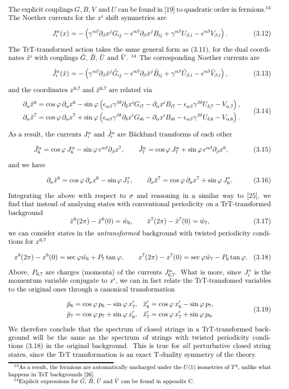
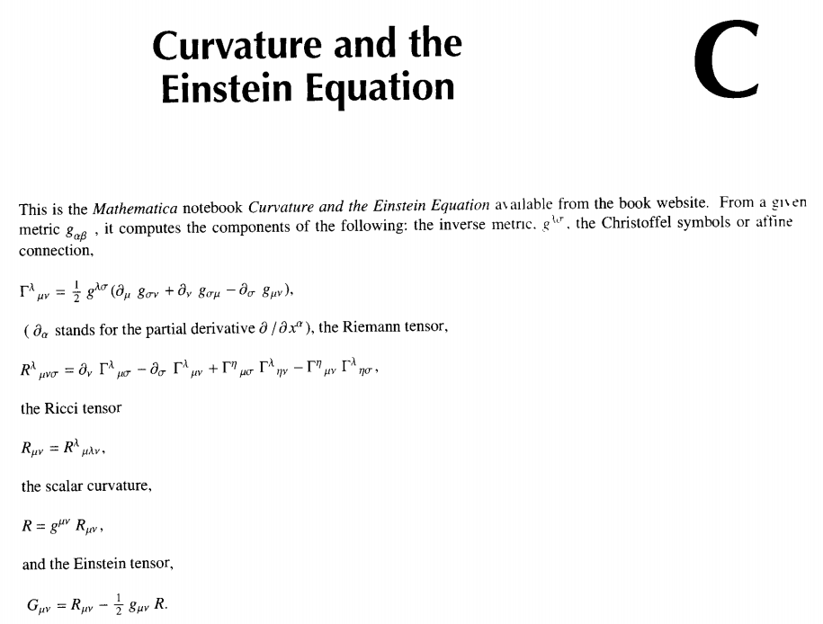

I've seeing the media surrounding the release of Sabine Hossenfelder's new book [_Lost in Math: How Beauty Leads Physics Astray_](https://www.amazon.com/Lost-Math-Beauty-Physics-Astray/dp/0465094252/ref=as_li_ss_tl?&linkCode=ll1&tag=arandomphysic-20&linkId=be18dd42de5852c1aba654cce6a4f78f) and I think we now have a physics example of the econ critique trope. I tweeted about it the other day:

> _I'd almost put this as directly analogous to an econ-critical economist saying economists are too enamored with beautiful theories when cursory inspection of your average DSGE model would generate almost any adjective except beautiful._

At the time I had read [Hossenfelder's blog post](http://backreaction.blogspot.com/2018/05/what-do-physicists-mean-when-they-say.html) about "beauty" in physics, but I just found the link to [Andrew Gelman's blog about it](http://andrewgelman.com/2018/06/20/quest-beauty-lead-science-astray/) and it's seems to have picked up sufficient steam that I really think I need to say that Hossenfelder is mis-characterizing physics — in much the same way econ-critical economists tend to mis-characterize economics in their criticism by playing on public perceptions of the field.

Hossenfelder defines beauty in physics as "simplicity, naturalness, and elegance" and proceeds to discuss each in turn; I will do the same.

**Simplicity**

I think Hossenfelder is playing on the prejudices of a general audience here. If people know any "simple" theoretical physics models, they probably are aware of Maxwell's equations or Einstein's general relativity. Actually, [Andrew Gelman](http://andrewgelman.com/2018/06/20/quest-beauty-lead-science-astray/) gives the list the typical member of the target audience might give:

> _Newton’s laws, relativity theory, quantum mechanics, classical electromagnetism \[i.e. Maxwell's equations\], the second law of thermodynamics, the ideal gas law: these all do seem beautiful to me._

People have tattoos of some of these equations! I knew someone (not a physicist) who had a Schrodinger equation tattoo. They make several [Maxwell's equations T-shirts](https://www.amazon.com/Maxwells-Equations-T-Shirt-Large-Asphalt/dp/B07475VJPP/ref=as_li_ss_tl?ie=UTF8&qid=1530068685&sr=8-8&keywords=maxwell%27s+equations&linkCode=ll1&tag=arandomphysic-20&linkId=03dac6d0c40e70918f91cfe56023c7e2). I always thought they should write ℒ = tr _F_ ∧ ★_F_ using differential forms instead of the 19th century vector form people are most familiar with. The thing is that nearly all of those theories were known by the first half of the 20th century. The most recent one on the list is quantum mechanics, and quantum mechanics is over 100 years old (the Schrodinger equation itself turned 90 a couple years ago). These are **_not_** recent theories. Yet, I think Hossenfelder is playing on the fact that her audience has these examples on the tip of their tongue ([availability heuristic](https://en.wikipedia.org/wiki/Availability_heuristic)).

Of course, missing from that list is quantum field theory, the content-less method [for maintaining](http://www.sbfisica.org.br/~evjaspc/xviii/images/Burgess/Jan29/Aditional/Phenomenological-Lagrangians-Weinberg.pdf) \[pdf\] "analyticity, unitarity, cluster decomposition, and symmetry". But quantum Yang-Mills theory and examples of it like [QED](https://en.wikipedia.org/wiki/Quantum_electrodynamics) and [QCD](https://en.wikipedia.org/wiki/Quantum_chromodynamics) have a kind of beautiful simplicity. At least when you write them down as a Lagrangian (they're both described by the classical Yang-Mills Lagrangian in the previous paragraph, but QCD has additional non-commutative matrix indices). Computing 600 diagrams to get a few more decimal places in the calculation of the magnetic moment isn't really "simple", and there's nothing "simple" about non-perturbative QCD for which one of the major approaches ([lattice QCD](https://en.wikipedia.org/wiki/Lattice_QCD)) has all the beauty and simplicity of your undergrad implementation of [Runge-Kutta integration](https://en.wikipedia.org/wiki/Runge%E2%80%93Kutta_methods).

The underlying jab, of course, is at string theory. Hossenfelder studies quantum gravity, for which there are few candidate theories that make sense. String theory requires six or seven additional unobserved dimensions, and loop quantum gravity violates Einstein's special relativity (Lorentz invariance). I personally like Verlinde's wisecrack \[1\] — [his paper](https://arxiv.org/abs/1001.0785) about [entropic gravity](https://en.wikipedia.org/wiki/Entropic_gravity) that in a sense says quantum gravity doesn't exist.

But as anyone who has actually studied string theory would know (the UW introduced its first string theory class while I was there) the string theories aren't exactly "simple" — much like how the simplicity of the Yang-Mills Lagrangian hides complex non-perturbative physics, string theories are incredibly complicated to actually write down and perform calculations with. Sometimes a "simple" idea comes up ([T-duality](https://en.wikipedia.org/wiki/T-duality), [AdS/CFT correspondence](https://en.wikipedia.org/wiki/AdS/CFT_correspondence)), but the preponderance of papers in purportedly simple string theory [look like this](https://arxiv.org/pdf/1804.02023.pdf) \[pdf\]:

This is not simple in any way that would be considered "beautiful" (I'm not knocking this paper!), so obviously beauty as "simplicity" is not _always_ a driving factor in research. [And most string theory looks like this](https://arxiv.org/search/?query=string+theory&searchtype=all&source=header)! It makes me wonder if Hossenfelder is playing on the fact that very few people reading her book have ever actually done a calculation with a [Virasoro algebra](https://en.wikipedia.org/wiki/Virasoro_algebra) — even among physicists. 

**Naturalness**

Hossenfelder's technical description of naturalness is fine (dimensionless parameters being of order 1), but the direction of inferences from naturalness is wrong. A lack of naturalness is usually a sign of a puzzle, but if a theory describes empirical data well enough _no one rejects the theory_. An example: QCD. The QCD Lagrangian, from a theoretical perspective (based on Weinberg's paper I used as a citation for the content-less-ness of quantum field theory above), should have another term that allows QCD to violate CP symmetry (charge-parity symmetry, the conjugate of time-reversal symmetry). This is called the [strong CP problem](https://en.wikipedia.org/wiki/Strong_CP_problem). For some reason, the coefficient of that term, if it's not zero, is _really_ small. _Unnaturally_ small. It's small enough that the [axion](https://en.wikipedia.org/wiki/Axion) was proposed as a possible solution. A similar consideration happens in general relativity which should have a cosmological constant; however that constant is _unnaturally_ small (at least from the scale we think should set it — which likely means it should be some other scale). 

But in no way is this lack of naturalness cause to reject general relativity or QCD (which are both wildly empirically successful in other areas), or consider either any less "beautiful". At least I thought the theory was 'beautiful'; [my thesis](http://inspirehep.net/record/690305) was about a potential approach to non-perturbative QCD that could be measured in nuclear physics experiments. Naturalness as beauty has not led physics astray in its study of QCD or general relativity.

In fact, if you had some new theory of quantum gravity and the _only_ thing in your way is a lack of naturalness in your parameter values that fit empirical data well, then that would be a major breakthrough. I can't imagine any physicist that would reject it. The issue is that there's no theory that predicts new effects that have been (or could be) measured to make any kind of naturalness consideration at all of the parameters that fit that non-existent data.

**Elegance**

Hossenfelder's definition of elegance seems to be a redundant restatement of the other aspects of beauty ("Elegance is the fuzziest aspect of beauty. ... By no way do I mean to propose \[elegance\] as a definition of beauty; it is merely a summary of what physicists mean when they say a theory is beautiful." — beautiful via the other two criteria, I guess?)

I'd agree her example of general relativity is elegant. It's also simple from a certain perspective. In fact, going by the [effective theory](https://en.wikipedia.org/wiki/Effective_theory) approach, general relativity is the simplest non-trivial curved space-time theory we could write down:

_G_μν + Λ _g_μν = α _T_μν

That basically says _space-time curvature_ + _cosmological constant_ = _energy-momentum_. Of course, there's a big naturalness problem right there in that cosmological constant: Why is it so small? But we don't reject the theory. Einstein thought the Λ = 0 version was more elegant. However, Einstein also thought the equations were so _complicated_ (And they are! The notation above hides so much! \[2\]) that it would be difficult to find any closed form solutions. (Schwarzchild did [find such a solution](https://en.wikipedia.org/wiki/Schwarzschild_metric) a few years later.) As with a century of quantum mechanics, time can alter our perspective. Once thought hopelessly complex, people now routinely solve Einstein's field equations and make [precision measurements](https://en.wikipedia.org/wiki/LIGO) of its novel effects.

Hossenfelder also mentions grand unification as elegant, but grand unification is more a set of circumstantial evidence than a "theory". The charges of the various quantum field theories in the standard model change with energy in such a way that they almost coincide at a huge energy called the [Grand Unified Theory (GUT) scale](https://en.wikipedia.org/wiki/Grand_unification_energy). Adding supersymmetry (which is mentioned as a separate case of elegance) makes them coincide much better, and there are [a variety of "grand unified theories" (really, various models)](https://en.wikipedia.org/wiki/Grand_Unified_Theory#Unification_of_matter_particles). Of course, most of them are untestable at current energies and many predict the same observable things at energies we can reach. I guess it's elegant that the supersymmetry that's required to make string theories consistent also makes the GUT scale work out better! But then, supersymmetry has never been observed. The only real parameter it has is the number of supersymmetries, so you could maybe say _N_ \= 50 would an unnatural number of supersymmetries. But then 26 dimensions falls naturally out of bosonic string theory \[3\], so who's to really say? Having fewer supersymmetries would fall more under Occam's razor (which Hossenfelder mentions) than simplicity and naturalness as metrics of beauty getting in the way.

As mentioned above, sting theory (her other example of "elegance") isn't really "simple" if you're actually trying to work with it. It's really neat that e.g. the string boundary conditions become real dynamical objects ("branes") in string theory, but that weirdness is more why some physicists say that string theory is actually 23rd century alien math we discovered accidentally in the 20th century (that's a vaguely remembered comment that I forget the source of). Essentially, string theories are theories of more than just strings, and we do not fully know how much more yet.

**Conclusion**

The subtitle of Hossenfelder's book is "_How Beauty Leads Physics Astray_", and the implicit judgment is on string theory. Much like how hating on DSGE models \[4\] is popular in pop-econ, it seems hating on string theory is popular in pop-physics. Hossenfelder along with [Peter Woit](https://en.wikipedia.org/wiki/Peter_Woit) are well-known bloggers who frequently critique string theory (I think there might be a connection between blog popularity and critique). Hossenfelder's thesis is that too many resources are devoted to it. In a world with limited resources, this is definitely good to question. Woit just seems to think that it is too popular in pop-physics for how little he thinks it seems to have accomplished (I think, I'm not sure as his various writings come across as just pessimism rather than criticism; he mostly seems like that cranky grad student that finds the pessimism in any discussion).

I don't really get Hossenfelder's and Woit's impatience. _It's been 40 years!_ they cry. Is the critique of too much emphasis on "beauty" just masking impatience? (Actually, one of the blurbs on the Amazon site says "Sabine Hossenfelder is impatient for new waves of discovery.") Did you think we'd go from the Standard Model to a theory of everything in your lifetime? It was **_200 years_** before we started to upend Newtonian physics with quantum mechanics. Again, string theory is 23rd century alien math. 

The lack of empirical confirmation of anything specific to string theory is actually more a reason not to devote resources to _any kind_ of high energy fundamental physics _at all_. There are no plans for dramatically larger accelerators than the LHC, so if you think there isn't going to be confirmation or rejection of string theory that means it's unlikely there will be any confirmation of **_any_** theory at the same scale.

In the end, criticism like this is the kind I dislike. _We should do something different!_ Ok, what? _Um, I don't know._ Don't tell us we are on the wrong path, _show it_ by finding a more fruitful path. Hossenfelder addresses this in [a separate blog post](http://backreaction.blogspot.com/2016/06/dear-dr-b-why-not-string-theory.html):

> _As far as quantum gravity is concerned, string theorist’s main argument seems to be “Well, can you come up with something better?” Then of course if someone answers this question with “Yes” they would never agree that something else might possibly be better. And why would they – there’s no evidence forcing them one way or the other._

This seems an odd retort to the expectation to show something different is useful — a kind of tu quoque where something purportedly better has no evidence either. It's also a bit disingenuous because [a string theory calculation](https://arxiv.org/abs/hep-th/9601029) did come up with the Hawking-Bekenstein area law. And even if there are some possible issues with that ([firewalls](https://en.wikipedia.org/wiki/Firewall_\(physics\))), string theory still unifies all the forces and gravity into a single framework. Let's go back to [Hossenfelder's own blog](http://backreaction.blogspot.com/2015/12/dear-dr-b-is-string-theory-science.html):

> _String theory arguably has empirical evidence speaking for it because it is compatible with the theories that we know, the standard model and general relativity. The problem is though that, for what the evidence is concerned, string theory so far isn’t any better than the existing theories. There isn’t a single piece of data that string theory explains which the standard model or general relativity doesn’t explain._
>
>
>
> __The reason many theoretical physicists prefer string theory over the existing theories are purely non-empirical. They consider it a better theory because it unifies all known interactions in a common framework and is believed to solve consistency problems in the existing theories, like the black hole information loss problem and the formation of singularities in general relativity. Whether it is actually correct as a unified theory of all interactions is still unknown. And short of a uniqueness proof, no non-empirical argument will change anything about this.__

I would say this — being compatible with all the empirical successful theories while unifying them, but just not giving anything extra — is a remarkable feather in string theory's cap. In a sense, Maxwell's equations unified a bunch of known electromagnetic forces into a single framework in this same way. Later it was discovered to have some issues that Einstein solved with his 1905 special relativity paper (note that those issues were in fact [the impetus for Einstein's paper](https://informationtransfereconomics.blogspot.com/2018/02/some-historical-myths-about-einstein.html) and why it's titled "_On the Electrodynamics of Moving Bodies_").

Also, don't tell me that better path is loop quantum gravity because it violates Lorentz invariance. For all the failings of string theory, at least is doesn't violate one of the most empirically successful theories to come out of physics. In fact, if string theory was languishing and all the resources were going to loop quantum gravity, I'd be totally on-board with Hossenfelder/Woit style criticism of loops and calls for redirection of resources to other areas.

But then, who's to say resources are being misdirected? I don't know about Hossenfelder or Woit, but even when I was studying boring (to quantum gravity people, at least) QCD I frequently wrote down attempts to come up with pieces of a possible final "theory of everything". [I speculated](https://informationtransfereconomics.blogspot.com/2016/11/never-underestimate-power-of-abstract.html) about the common coefficients in quantum field theory calculations being related to to Galois groups — something that is currently being studied. I had a wild idea to re-make the idea of [smooth manifolds in mathematics](https://en.wikipedia.org/wiki/Differentiable_manifold) as essentially leading approximations to some new underlying space and tried to understand its topology (I think I just re-invented [fractional derivatives](https://en.wikipedia.org/wiki/Fractional_calculus), though). I was always messing around with possibilities — random ideas that were essentially funded by my nuclear theory research position. I imagine most string theory practitioners do the same thing. Einstein did his work while being "funded" by the patent office. Heck, some string theory concepts like holography may be illuminated by [incredibly simple models](https://arxiv.org/abs/1601.06768) that seem to have started out as just messing around. I could imagine training in string theory would be decent background for understanding a final theory, whatever it turns out to be.

The trick is to keep new students funded and engaged. I don't think the specific projects that get funded are necessarily that important. Can you imagine? A big government agency picking research projects and their choice is what ends up as the final "theory of everything"? Not to go all libertarian on you, but that kind of top-down direction seems unlikely to generate breakthroughs. Breakthroughs often come while you were studying something else \[5\]. String theory itself started as essentially a side project looking at the details of [a simple model of mesons](https://en.wikipedia.org/wiki/Regge_theory) (that was later rejected for the better QCD). Who knew funding _that_ would lead to a string theory-industrial complex that Hossenfelder claims is eating all the resources?

I guess I'm saying: who really knows where innovation comes from? Why is motivation through beauty not a source of innovation? Why is wasting resources on string theory not a source of innovation? Maybe even writing books about wasting resources on string theory is a source of innovation to those that read them.

In the end, any final "theory of everything" that describes all matter, energy, space, and time is going to be beautiful regardless of what it looks like _because it describes all matter, energy, space, and time_.

...

**Footnotes:**

\[1\] This is an insider joke; a reference to "[Witten's wisecrack](https://books.google.com/books?id=PX2Al8LE9FkC&lpg=PA351&ots=6FMCbL7UM_&dq=witten%27s%20wisecrack&pg=PA351#v=onepage&q=witten's%20wisecrack&f=false)" (as described by Sidney Coleman) that said in natural units, the perturbative expansion of QED in the coupling constant of about _e_ ~ 1/3 was no worse than the large-_Nc_ expansion of QCD with _Nc_ = 3.

\[2\] Expanding a bit:

\[3\] It's weird, but the [Zeta-regularized sum of natural numbers](https://en.wikipedia.org/wiki/1_%2B_2_%2B_3_%2B_4_%2B_%E2%8B%AF) is ζ(−1) = −1/12, and in order to make a cancellation, you end up with 2 − 1/ζ(−1)  = 26 (if I remember correctly). Also, the Casimir force is attractive because this number is negative.

\[4\] DSGE models are actually pretty general — just a few canonical elements seem to be included out of inertia (Phillips curves, Euler equation).

\[5\] Not to say information equilibrium should be hailed as a "breakthrough" (yet!), but it came about from studying [compressed sensing](https://en.wikipedia.org/wiki/Compressed_sensing).
