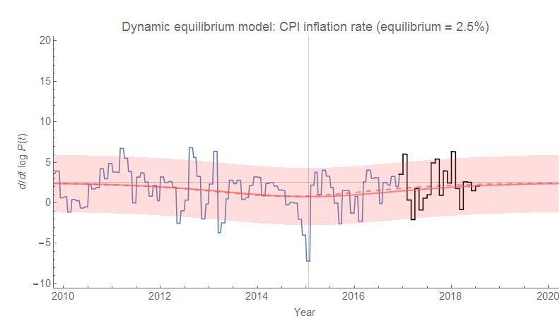
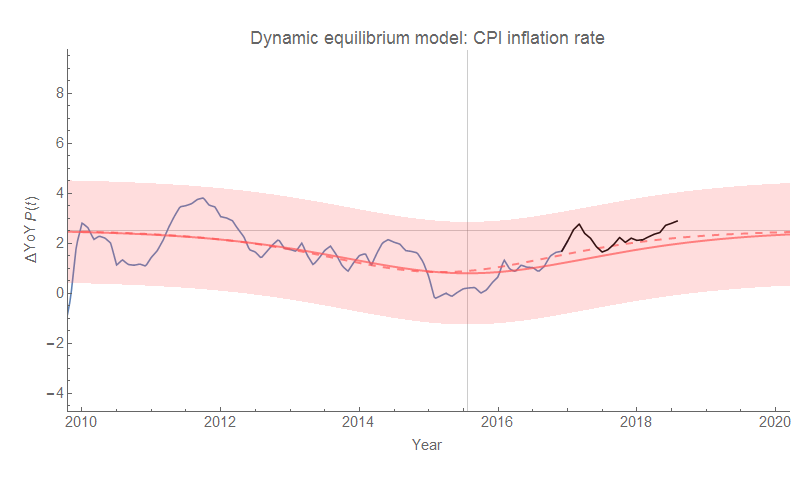
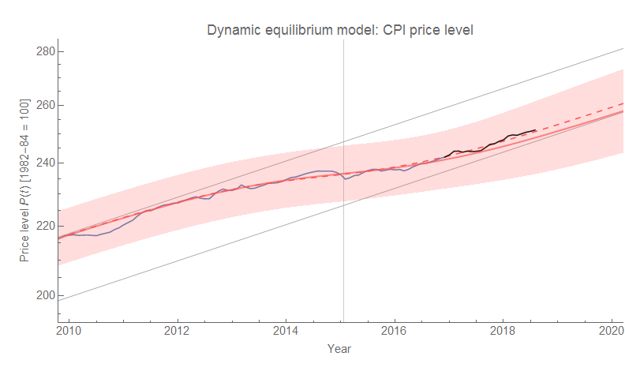

The inflation data has continued to be consistent with the forecast confidence limits [since 2017](https://informationtransfereconomics.blogspot.com/2017/07/dynamic-equilibrium-model-cpi-all-items.html), and the latest data out over a week ago is no different. It's true these confidence limits are pretty wide. Year over year inflation should've been between −0.1 and +4.0% last month according to the model (the value was 2.9%). Next month, the model says it should be between 0.0% and 4.1%. But this spread is comparable to the [NY Fed's DSGE model for PCE inflation](http://libertystreeteconomics.newyorkfed.org/2018/03/the-new-york-fed-dsge-model-forecast-march-2018.html) nearly two years out (which is a more stable measure than CPI). And the dynamic equilibrium model only has four parameters \[1\]!

The solid red line is the original forecast and the dashed line shows an update of the shock parameters I made [in March of this year](https://informationtransfereconomics.blogspot.com/2018/03/cpi-data-and-end-of-lowflation.html) (after the "lowflation" shock ended). As the change was negligible (i.e. well inside the confidence bands), it's shown for informational purposes. Below, I show continuously compounded (i.e. log derivative) and year over year changes in CPI (all items) along with the CPI level. (Click to enlarge.)

**Update 18 September 2018**

I didn't think there was any real need to write an entirely new post for the data that came out in September, so here's the graph with the latest post-forecast data:

**Footnotes:**

\[1\] Over the period from 2010 to 2020. If we include the data back to the 1960s, there is another shock adding three more parameters — but the contribution of those additional parameters has been exponentially suppressed since the 1990s.
