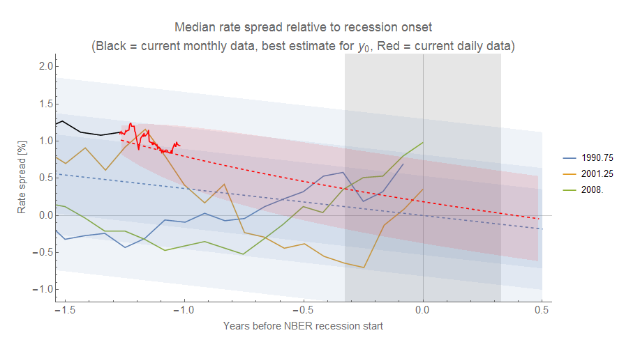
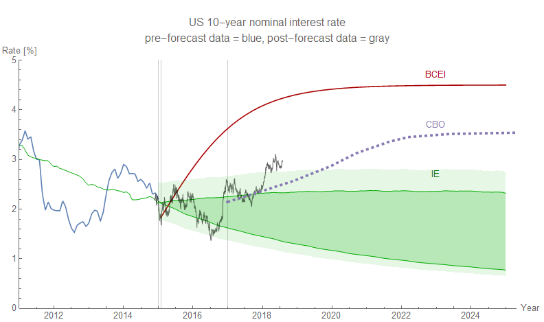

This represents a speculative synthesis of some analysis I've done using the [dynamic information equilibrium model](https://papers.ssrn.com/sol3/papers.cfm?abstract_id=3094757) on [\[1\] debt growth](https://informationtransfereconomics.blogspot.com/2018/07/does-accelerating-debt-growth-cause.html), [\[2\] yield curve inversion](https://informationtransfereconomics.blogspot.com/2018/06/yield-curve-inversion-and-future.html), [\[3\] higher than "expected" interest rates](https://informationtransfereconomics.blogspot.com/2014/08/are-interest-rates-good-indicator-of.html), and [\[4\] the possibility of coming recession](https://informationtransfereconomics.blogspot.com/2018/06/jolts-data-and-2019-recession.html). In particular, I noticed that the shocks to the debt growth indicator (green) — net debt issuance relative to assets — in _Credit-Market Sentiment and the Business Cycle_ by David Lopez-Salido, Jeremy C. Stein, and Egon Zakrajsek (2015) I looked at in \[1\] seemed to match up with cases where the flattening AAA - 3 month spread fell within the error of the Moody's AAA model (blue):

Click to enlarge for all graphs. That is to say: is the debt growth indicator another measure of the yield curve indicator? When e.g. the 3-month rate becomes comparable to the AAA rate, does debt growth suddenly slow? Unfortunately the data from Lopez-Salido et al (2015) was too coarse to get a firm estimate of the timing (uncertainty in the location of the "shocks" to debt growth is shown as green bands). Here's a zoom in on the more recent data with the simple linear extrapolation of the 3 month rate:

Latest daily AAA data is in black. This is effectively the same picture I've been showing looking at all the interest rate spreads in \[2\]:

Latest (daily) data is in red this time. There's also the "above expected" interest rate indicator in \[3\]; [current 10-year rates are above](https://informationtransfereconomics.blogspot.com/2018/05/three-sigma-deviation-in-10-year-rate.html) the "expected" (i.e. information equilibrium) value:

This indicator doesn't really get us any timing information, though. Recessions have rarely occured when the rate was below the expected value, but when rates are over the value there is variable amount of time before the recession hits. I've made [a speculative analogy with avalanches before](https://informationtransfereconomics.blogspot.com/2014/03/the-monetary-base-as-sand-pile.html) — above expected rates are like snow building up on a mountain, and it likely takes some trigger to set off the avalanche (i.e. recession). In general, all of these measures point to a recession in the 2019-2020 time frame that is consistent with the labor market data (JOLTS) in \[4\].
