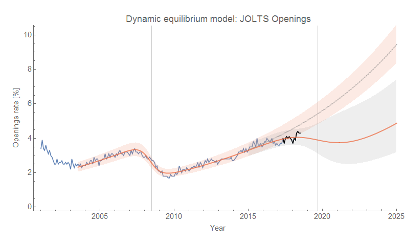
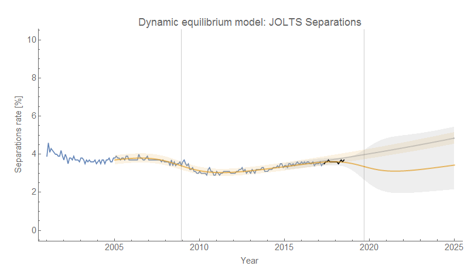
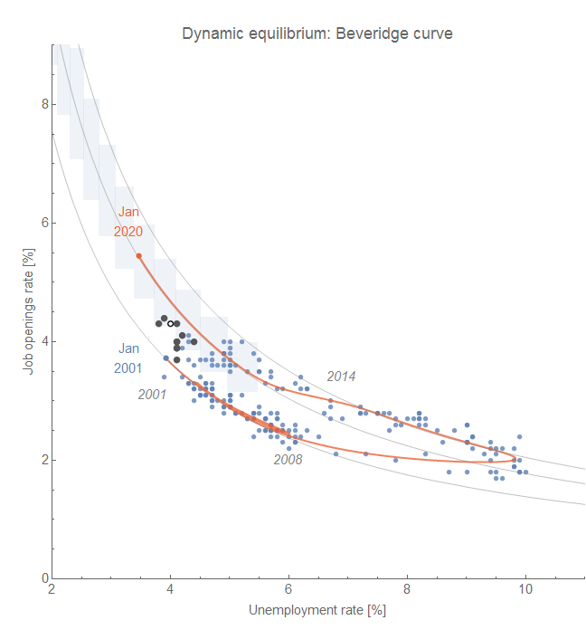
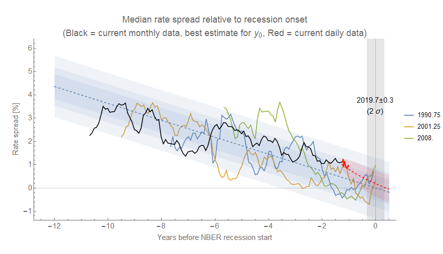
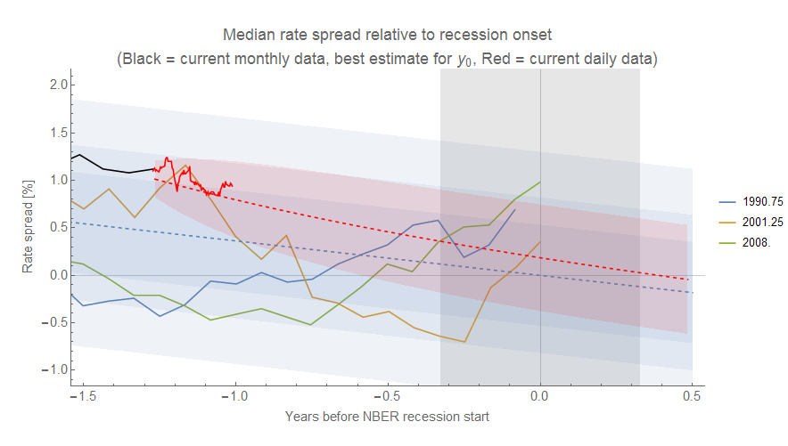

The latest [JOLTS data](https://fred.stlouisfed.org/release?rid=192) was released today for the US labor market; the last time I updated the forecasts/recession counterfactuals was [here](https://informationtransfereconomics.blogspot.com/2018/07/counterfactual-2019-recession-update.html). There's not much to say except that the flattening of the job openings rate continues along with the correlated deviations from the model in the other measures (hires, quits, separations) indicating the start of a possible recession. Here are the graphs (post-forecast data in black) showing both the no-shock and recession shock counterfactuals. Click for the full resolution versions.

The model is described [in my paper](https://papers.ssrn.com/sol3/papers.cfm?abstract_id=3094757). Some extended discussion of this analysis (in response to comments) is [here](https://informationtransfereconomics.blogspot.com/2018/06/measuring-labor-demand.html).

The counterfactual recession date is set for 2019.7 above per the [yield curve analysis here](https://informationtransfereconomics.blogspot.com/2018/06/yield-curve-inversion-and-future.html) based on [multiple interest rate spreads](https://fred.stlouisfed.org/graph/?g=kNbi). This early in the (hypothetical!) downturn, the shock fits are unstable and fixing the time improves the convergence. [In previous analysis](https://informationtransfereconomics.blogspot.com/2018/06/jolts-data-and-2019-recession.html), I showed the result for multiple shock timings and presented it as an animation. However I think those animations can be a bit confusing — easily misinterpreted as a progression in time rather than a progression in parameter space that has units of time.

Here's the latest look at those interest rate spreads (recent data in red, with an AR process estimate of the deviation from the linear model). The second graph shows a zoomed-in version.

