As a follow up to [my post on long term unemployment](https://informationtransfereconomics.blogspot.com/2018/08/something-has-changed-in-long-term.html), I wanted to discuss the Beveridge curve. Gabriel Mathy discusses changes to it in his paper ([ungated version here](http://gabrielmathy.weebly.com/uploads/7/3/2/2/7322439/hysteresis_ltu_gd_516.pdf)). He shows how there are differences in shifts in the Beveridge curve for short and long term unemployment (click to enlarge):

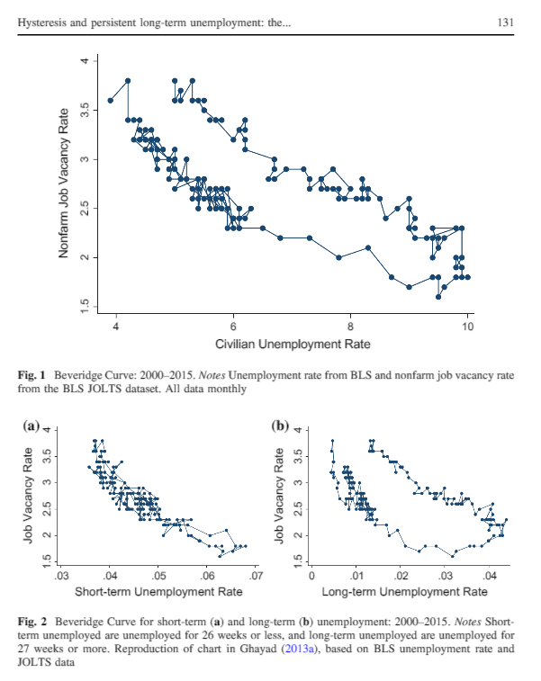
[earlier version of the paper](https://papers.ssrn.com/sol3/papers.cfm?abstract_id=2574850)

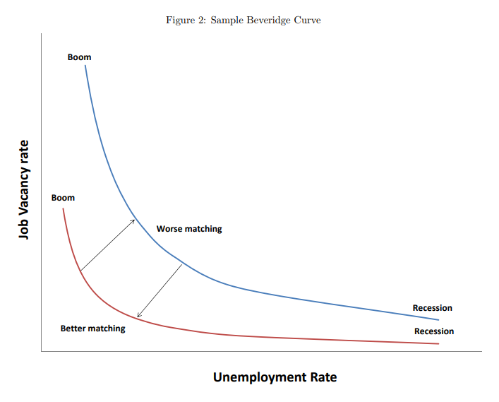

The dynamic information equilibrium approach also describes the Beveridge curve with a formally similar "matching" framework [described in my paper](https://papers.ssrn.com/sol3/papers.cfm?abstract_id=3094757). However, one of the primary mechanisms for shifts of the Beveridge curve is actually just a mis-match in the (absolute value of the) dynamic equilibria, i.e.

with $\alpha, \beta &gt; 0$ — the difference in sign means you get a hyperbola. I can illustrate this using an idealized model with several shocks $\sigma_{i}(t)$. Let's keep $U$ constant, but change the relative parameters of $V$ (altering the dynamic equilibrium $\Delta \alpha$, the timing of the shocks $\Delta t$ and the amplitude of the shocks $\Delta t$). Here are $U(t)$ and $V(t)$ (click to enlarge):

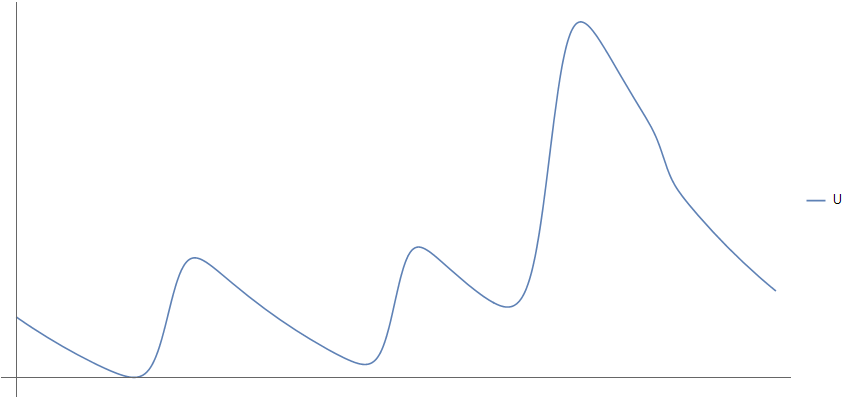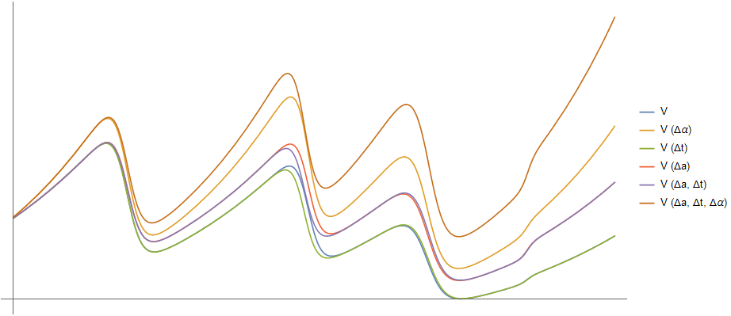

If everything is the same ($\alpha = \beta$, $\Delta t = \Delta a = \Delta b = 0$), then you get the traditional Beveridge curve that doesn't shift:

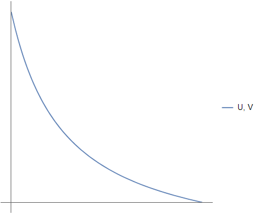

Changing the dynamic equilibrium ($\alpha \neq \beta$) gives you the drift we see in the data:

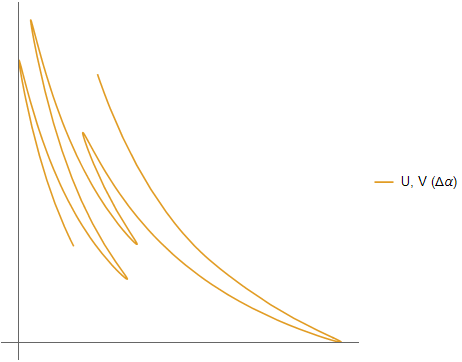

This means the drift is due to the fact that (in the regular model) $\alpha$ = 0.084 and $\beta$ = 0.098 (vacancy rate increases at a faster rate than the unemployment rate falls). If we look at changes to the timing $\Delta t$ and amplitude $\Delta a$ of the shocks, we get some deviation but it is not as large as the change in dynamic equilibrium rate:

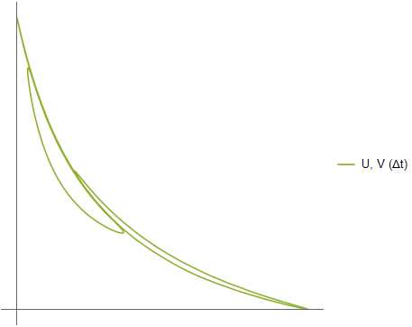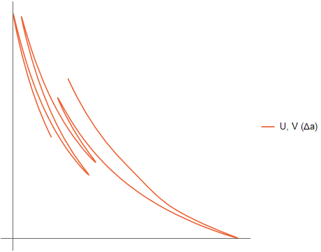

Combining the changes to the amplitude and timing also isn't as strong as changing the dynamic equilibrium ($\Delta \alpha$):

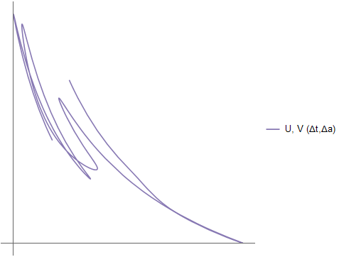

But if we do all of the changes, we get the mess of spaghetti we're used to:

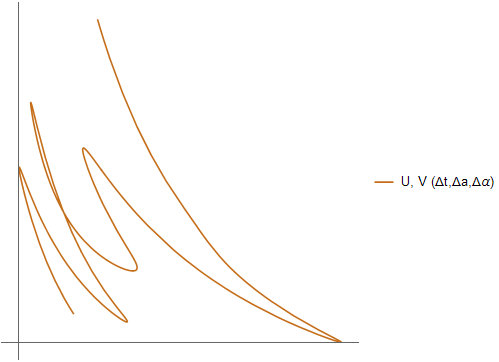

...

PS I didn't change the widths of the shocks ($\Delta b$) because ... I forgot. I will update this later showing the effects of changing the widths. Or maybe I will remember to do it before this scheduled post auto-publishes (unlikely).

...

**Update**

The $\Delta b$'s add adorable little curlicues (click to enlarge):

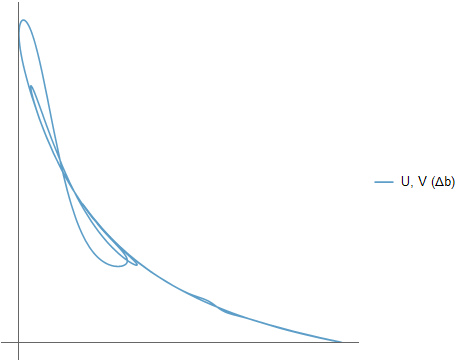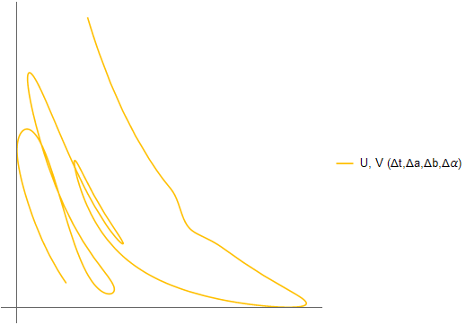
