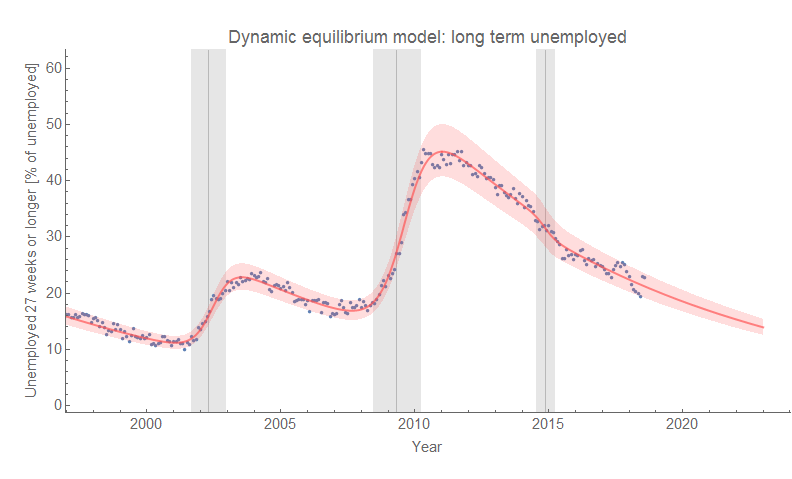
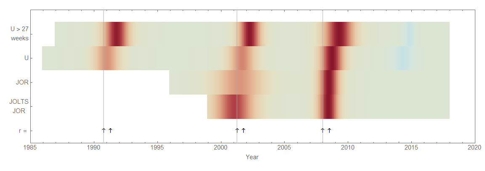
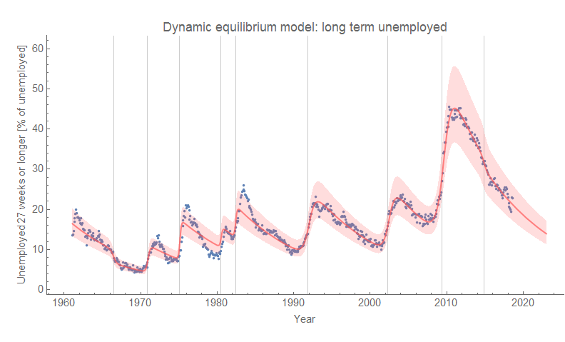
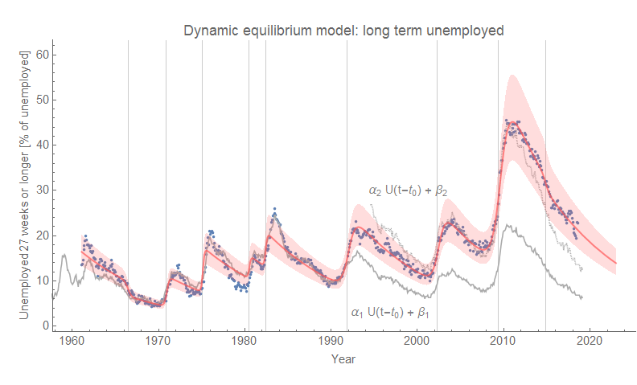
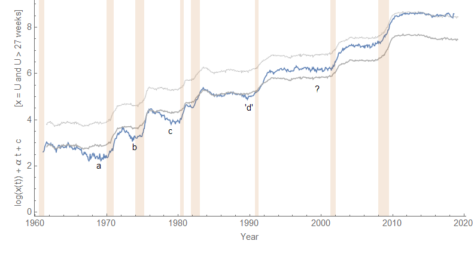
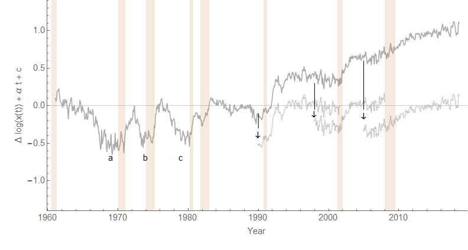

I read a paper by Gabriel Mathy today ([an earlier version appears here](https://papers.ssrn.com/sol3/papers.cfm?abstract_id=2574850)) about long term unemployment. We'll use the BLS definition of being unemployed 27 weeks or more, [available from FRED here](https://fred.stlouisfed.org/series/LNS13025703). Mathy notes that in the aftermath of the Great Depression, long term unemployment decreased (relative to unemployment) — and that this hasn't happened in the aftermath of the Great Recession. It's referred to as "[hysteresis](https://en.wikipedia.org/wiki/Hysteresis_\(economics\))" in economics, [borrowing a term in physics](https://en.wikipedia.org/wiki/Magnetic_hysteresis) ([coined by Ewing](https://en.wikipedia.org/wiki/James_Alfred_Ewing) in [the late 1800s](https://books.google.com/ngrams/graph?year_start=1800&year_end=2008&corpus=15&smoothing=7&case_insensitive=on&content=hysteresis&direct_url=t4%3B%2Chysteresis%3B%2Cc0%3B%2Cs0%3B%3Bhysteresis%3B%2Cc0%3B%3BHysteresis%3B%2Cc0%3B%3BHYSTERESIS%3B%2Cc0)) used to describe e.g. a history dependence in magnetization.

I looked into it using the dynamic information equilibrium model ([my paper describing the approach is here](https://papers.ssrn.com/sol3/papers.cfm?abstract_id=3094757)), and sure enough it seems something has changed in long term unemployment. Here's the basic model description of the data since the mid-1990s

We find the structure is similar to the unemployment rate. If we look at an "[economic seismograph](https://informationtransfereconomics.blogspot.com/2018/03/shock-cluster-analysis-and-some-new.html)" (which represents the shocks) with various other labor market measures including job openings from JOLTS and Barnichon, we can see the overall structure is similar:

As expected, the shocks to unemployment longer than 27 weeks appear about 27 weeks after the shocks to unemployment (the arrows show the recession as well as 27 weeks later). However, we can see one other difference between the unemployment rate _U_ and the long term measure in the relative size of the shocks (i.e. relative magnitude of the colors). The shocks to long term unemployment are comparable, while the shocks to unemployment show smaller shocks for the recessions prior to  the Great Recession. However, eyeballing this diagram isn't the best way to compare them — a small narrow shock can appear darker than a wider larger shock (it's the integrated color density that matters).

Here we can see an effect that looks like the same "[step response](https://informationtransfereconomics.blogspot.com/2017/11/unemployment-rate-step-response-over.html)" (overshooting +  oscillations) we see in the unemployment rate, except a bit stronger. It also decreases over time, just like it does for the unemployment rate. But the big difference is that the size of the earlier shocks for long term unemployment are very different from the size of the shocks to the unemployment rate. A good way to see this by scaling the unemployment rate to match long term unemployment; to match the data before the 1990s, you need a scale factor of about α₁ = 2.6, but after the 90s you need one more than twice as big — α₂ = 5.3:

A 1 percentage point increase in unemployment in the 1960s and 70s led to a 2.6 percentage point increase in the fraction of long term unemployment 27 weeks later. In the Great Recession, that same increase in unemployment rate led to a 5.3 percentage point increase in the fraction of long term unemployment 27 weeks later.

Somthing happened between the 70s and the 90s to cause long term unemployment to become cumulatively worse relative to total unemployment.

The "proper frame" in the dynamic equilibrium approach is a log-linear transformation such that the constant rate of relative decline (i.e. the "dynamic equilibrium") is subtracted leaving a series of steps (which represent the "shocks"). We look at 

_U(t)_ → log _U(t)_ + _α t_ + _c_

I also lagged unemployment by 27 weeks to match up the shock locations. If we do the transformation for both measures, we can see how long term unemployment declined relative to unemployment before the 1990s (labelled _a_, _b_, and _c_) in the graph.

However, the decline was tiny going into the 1990s recession (labeled _'d'_), and non-existent afterwards (the _?_). The 90s recession was also when the level of long term unemployment started to increase relative unemployment. Looking at the difference between these curves, we can see that starting in the 90s the recession shocks started to accumulate long term unemployment:

In order to keep them at roughly zero difference (i.e. the same scale) in equilibrium (i.e. after recessions), we have to subtract _**cumulative**_ shocks (arrows). In the figure, I subtracted 0.37, then 0.37 + 0.25 = 0.62, then 0.37 + 0.25 + 0.35 = 0.97.

What is happening here? It seems in the past there used to be a point when labor became scarce enough that employers started hiring the long term unemployed at a faster rate. At some point, e.g. experience outweighs the negative effect of being unemployed for over 6 months. That's just a story, but it's one way to think about it. One possibility to explain the change is that it takes longer for that faster decline in long term unemployment to kick in such that another recession hits before it can happen. Another possibility is that there's just no pick-up in hiring the long term unemployed — employers see no real difference between an experienced worker who has been unemployed for 27 weeks and a worker without experience.

But the data is clear — the past few recessions just add to the fraction of long term unemployed relative to total unemployment and there hasn't been any subsequent recovery.
