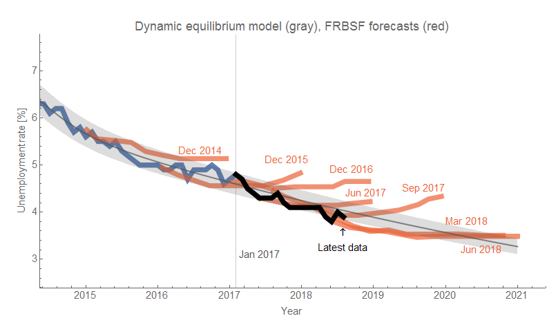
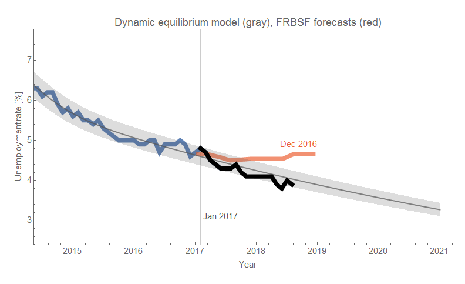
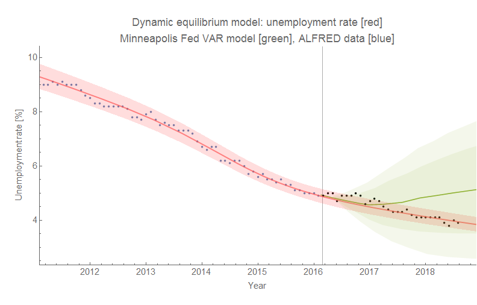
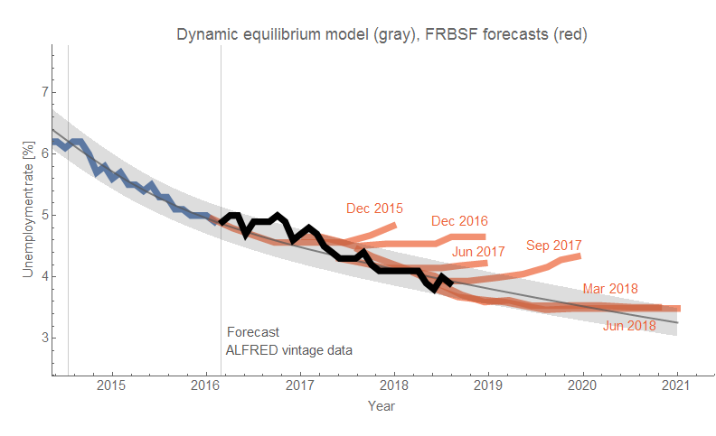

[Unemployment rate data](https://fred.stlouisfed.org/series/UNRATE)[in my paper](https://papers.ssrn.com/sol3/papers.cfm?abstract_id=3094757)[tweeted on July 31](https://twitter.com/infotranecon/status/1024430231044542465)[I didn't put too much weight on it](https://informationtransfereconomics.blogspot.com/2018/06/unemployment-rate-time-series-is-on.html)[a needed article](https://www.bloomberg.com/view/articles/2018-08-06/how-economics-numbers-can-lead-you-and-me-astray)[FedViews publications](https://www.frbsf.org/economic-research/publications/fedviews/#2017)

However, since I've been tracking this forecast for awhile now, we can probably say with confidence that the FRBSF [forecast with December 2016 data](https://www.frbsf.org/economic-research/publications/fedviews/2017/january/january-12-2017/) from 12 January 2017 (red) was outperformed by the [DIEM of comparable vintage](https://informationtransfereconomics.blogspot.com/2017/01/unemployment-forecasts.html) made 18 January 2017 (gray). Even if the data was inside the (unknown) error bands of the FRBSF model, those error bands would have to be larger than the error bands of the DIEM meaning it was a measurable improvement (two predictions that predict the same thing with one being more precise — as long as it isn't a single data point — implies the more precise one is the better model). Here's that forecast on its own:

**Update 7 August 2018**

One of the great things about the St. Louis Fed FRED data portal is that it has a related site for vintage time series called ALFRED (for ArchivaL FRED). We can see how the dynamic information equilibrium model would have performed using [data available at the time](https://alfred.stlouisfed.org/graph/?g=kNgs) (pre-revisions). Using the data from early 2016, I can show the apples-to-apples performance of the DIEM against [a Minneapolis Fed VAR model](https://informationtransfereconomics.blogspot.com/2018/04/comparing-my-forecasts-to-vars.html):

Using the old data nudges the model prediction down a bit, and also increases the 90% confidence bands a bit. I can use the same series to compare against the various vintages of the FRBSF forecast above:

