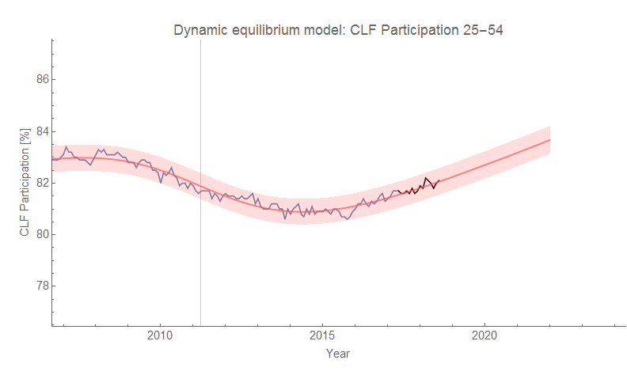
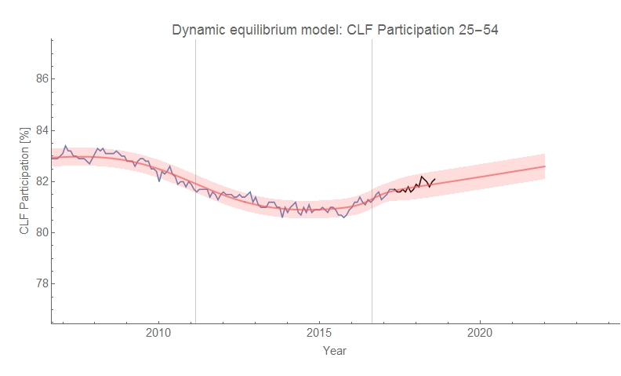
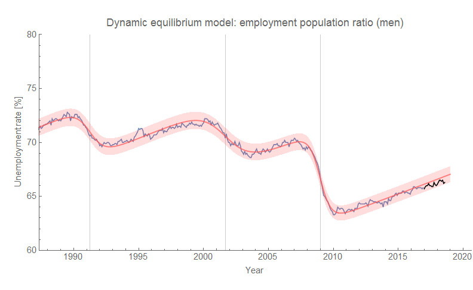
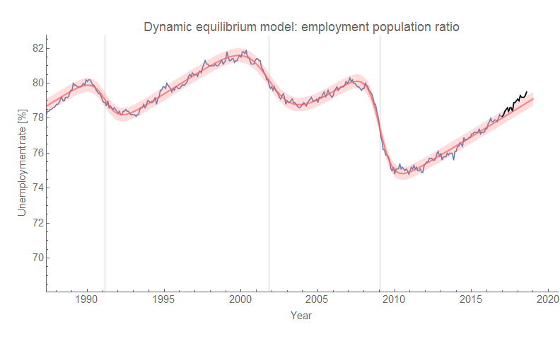
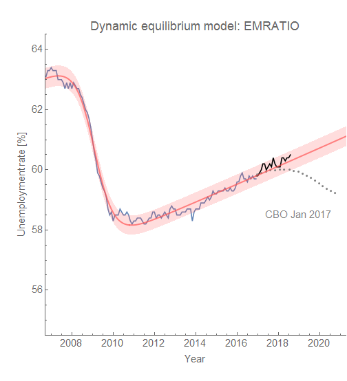
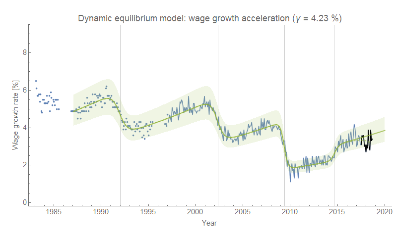

The Atlanta Fed has its latest wage growth data [up on their website](https://www.frbatlanta.org/chcs/wage-growth-tracker?panel=1). The post-forecast data is in black while the [dynamic information equilibrium model](https://informationtransfereconomics.blogspot.com/2018/02/dynamic-equilibrium-in-wage-growth.html) is in green. We could potentially make a case that the "bump" that occurs in 2014 is fading out, but it's within the model error.

**Update**

[this post from a few months ago](https://informationtransfereconomics.blogspot.com/2018/05/labor-force-participation-and-wages.html)

Also, [Ernie Tedeschi posted a fun graph](https://twitter.com/ernietedeschi/status/1029116424839720960) of changing CBO forecasts for the employment population ratio. Unfortunately, I didn't produce a forecast for the exact measure in the graph, but [through the magic of ALFRED](https://alfred.stlouisfed.org/graph/?g=kRkp), I can show what a forecast I would have made back in January 2017 for this measure would have looked like today:

**Update 19 September 2018**

