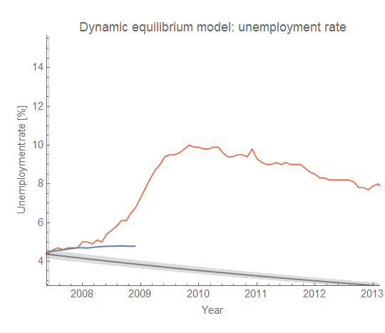
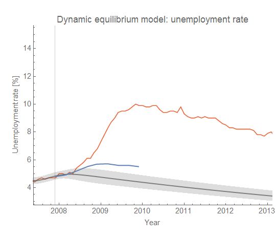
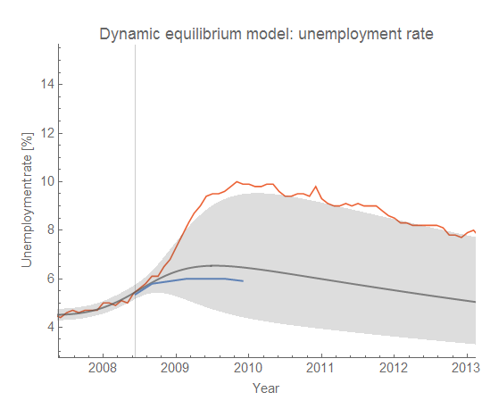
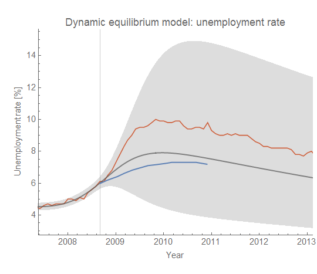
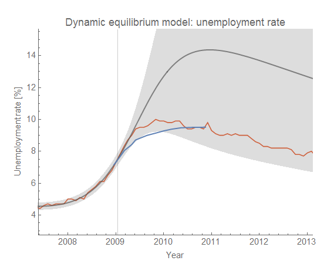
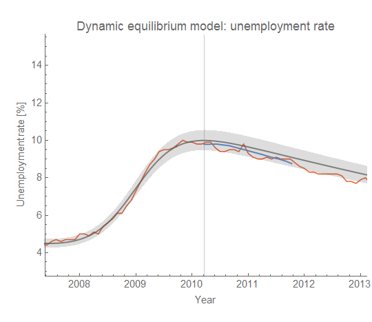

There's a new [white paper from Brookings](https://www.brookings.edu/wp-content/uploads/2018/08/13-Monetary-Policy-Prelim-Disc-Draft-2018.09.11.pdf) \[pdf\] by Donald Kohn and Brian Sack about monetary policy in the Great Recession. In it, they compile the Fed Greenbook forecasts of various vintages and say:

> _The forecast errors on output and employment that were made by the Fed staff, by FOMC participants, and by nearly all economic forecasters in the profession were massive by historical standards._

I asked: What would [the dynamic information equilibrium model](https://papers.ssrn.com/sol3/papers.cfm?abstract_id=3094757) (DIEM) have said during this time? I went back and made forecasts of the same vintages (with data available at the time) as the Greenbook forecasts to compare them. There were six forecasts in their graph. I tried to use the exact same formatting as the original Brookings graph, but it turns out that I needed to zoom out a bit as you'll see below. The vertical lines represent the forecast starting points, the blue line is the Greenbook forecast, the gray line (with 90% confidence bands) is the DIEM, and the red line is the actual data as of today. Click to enlarge any of the graphs.

**August 2007**

The housing bubble was collapsing, but both the Greenbook and the DIEM were forecasting business as usual. The Greenbook forecast said that we were a bit below the natural rate of about 5% and unemployment would rise a bit in the long term. the DIEM business as usual is a continuation of the 8-9% relative decline in the unemployment rate per year (i.e. 4% would decline a little less than 0.4 percentage points). At this point [the JOLTS data](http://informationtransfereconomics.blogspot.com/2017/07/jolts-leading-indicators.html) and even [conceptions (if known at the time)](https://informationtransfereconomics.blogspot.com/2018/03/dynamic-equilibrium-model-fertility-as.html) wouldn't have noticed anything.

**March 2008**

[As I've noted before](https://informationtransfereconomics.blogspot.com/2017/04/determining-recessions-with-algorithm.html), sometime between December 2007 and March 2008, the DIEM would have noticed a shock, but would have underestimated its magnitude resulting in a more optimistic scenario than the Greenbook. However, both underestimate the magnitude of the coming recession.

**August 2008**

By August, the DIEM begins to hint at the possibility of a strong recession. The estimated forecast is roughly similar to the Greenbook (which both underestimate the recession), but the confidence intervals on the DIEM grow.

**October 2008**

By October 2008, we've seen the failure of Lehman and the financial crisis is underway. The presidential candidates even have an unprecedented joint meeting in DC. The DIEM is now saying the recession is likely to be bigger than the Greenbook, and the uncertainty now encompasses the actual path of the data. It shows that a recession with higher unemployment than any recession in the post-war era is possible. 

**March 2009**

By March of 2009, the [ARRA](https://en.wikipedia.org/wiki/American_Recovery_and_Reinvestment_Act_of_2009) had passed and been signed by President Obama. In the UK, the Bank of England began its quantitative easing program, while what would become known as "QE1" was already underway in the US.  The Greenbook still underestimates near tern unemployment, but is generally close. However, the DIEM is now over-estimating the size of the recession, but as the DIEM doesn't account for policy it is possible that this represents an estimate of the size of the recession without the stimulus ([discussed here](https://informationtransfereconomics.blogspot.com/2017/01/an-updated-unemployment-rate-projection.html)).

**June 2010**

By June 2010, we began to see unemployment at least stop getting worse. By this time the Greenbook and DIEM are both roughly correct. The DIEM would go on to be correct until about mid-2014 when a _positive_ shock would hit the unemployment rate.

**Summary**

While the performance of the DIEM forecast center isn't all that much better than the Greenbook forecast, I think the lesson here is mostly about uncertainty and bias. The Greenbook forecast is always biased towards a less severe recession during this period, and I don't think it even estimates  confidence bands (I checked and I couldn't find them). The DIEM on the other hand both underestimates and overestimates the severity, but provides a lot of useful information through wide confidence bands in uncertain times.
