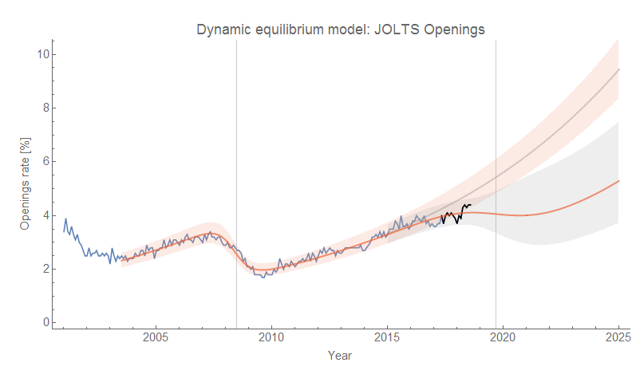
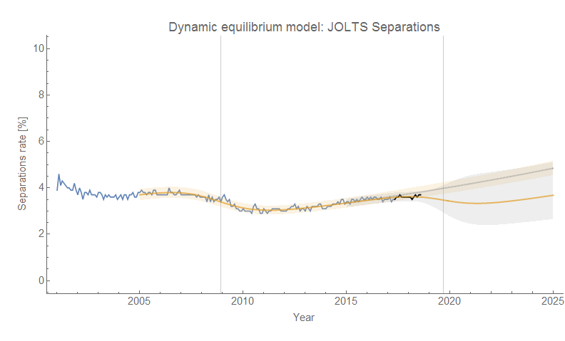
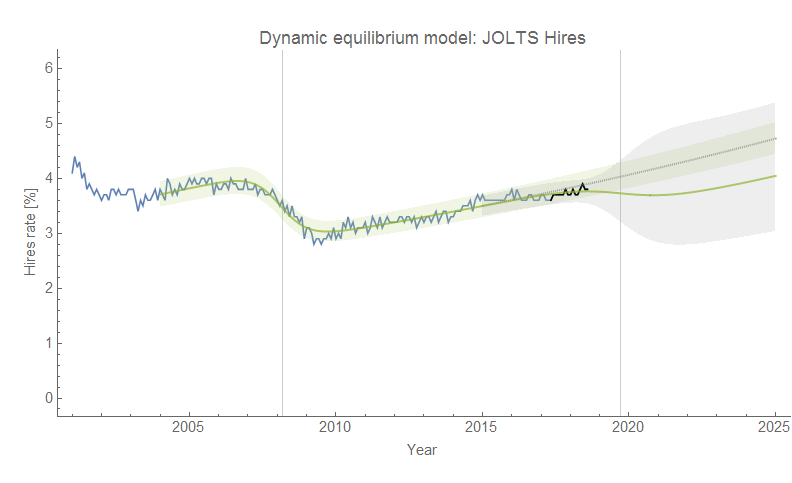
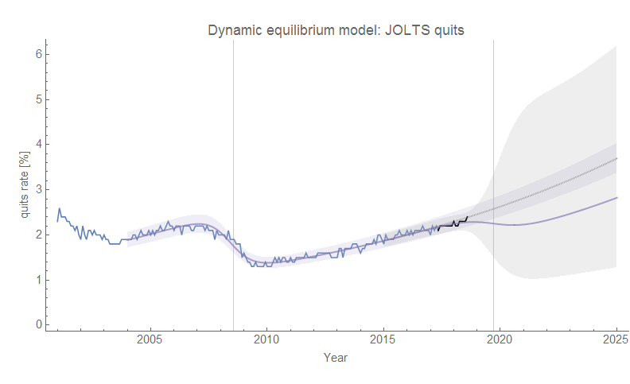
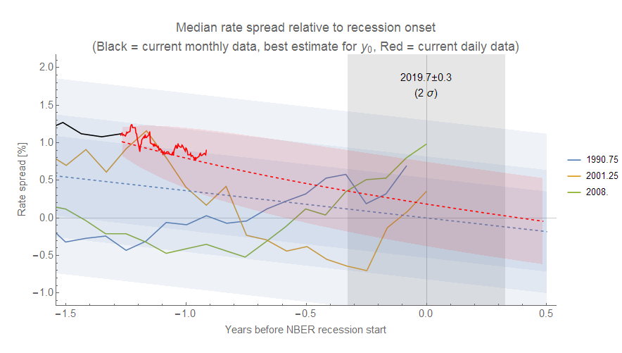

It being September, the [JOLTS data](https://fred.stlouisfed.org/release?rid=192) for July is now available. Aaaaaand ... it's inconclusive — like most of these individual data point updates. Whatever your prior, you can hold onto it. Openings is continuing to show a correlated deviation skirting the 90% confidence interval ([hinting at a possible recession](https://informationtransfereconomics.blogspot.com/2018/06/jolts-data-and-2019-recession.html)). The other measures are showing little deviation (separations showing more, hires and quits showing less). Bring on the graphs (click to enlarge):

[original analysis here](https://informationtransfereconomics.blogspot.com/2018/06/yield-curve-inversion-and-future.html)

Note that this last graph is not related to the information equilibrium approach, but is simply tracking a common indicator — yield curve inversion — that I use to motivate the interpretation of the JOLTS data deviation from the models above as possibly indicating a recession. It's basically a linear fit to the path of interest rate spreads during the previous recessions (blue band) with an AR process (red band). The estimated "date" of the counterfactual recession (2019.7) is used as the counterfactual date of the recession in the JOLTS graphs (second vertical line, gray band).
