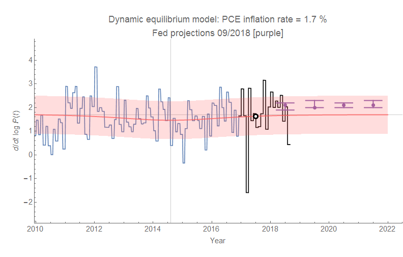
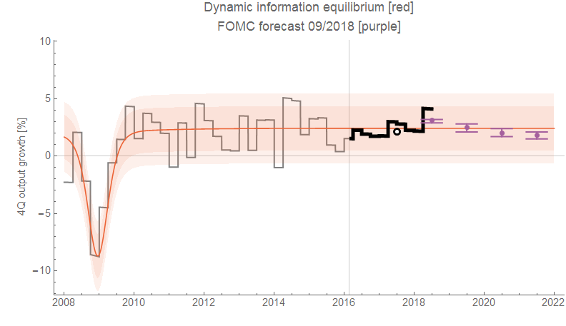
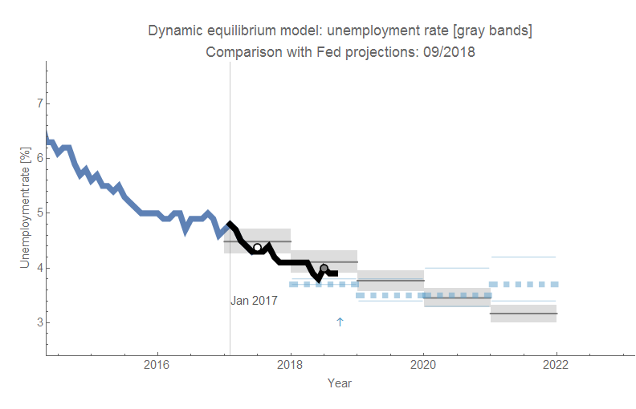
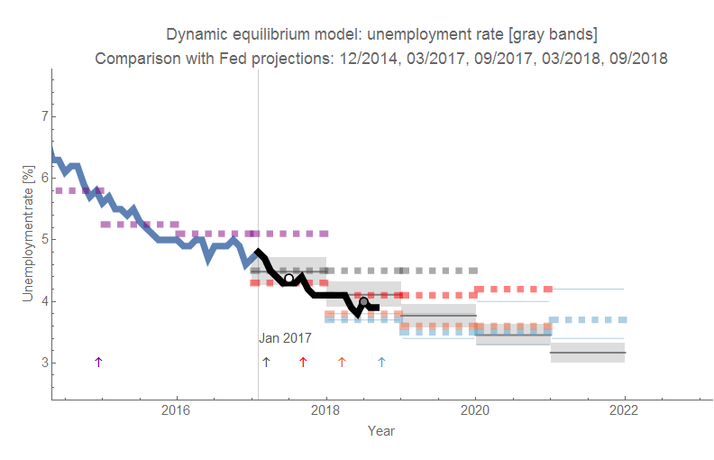
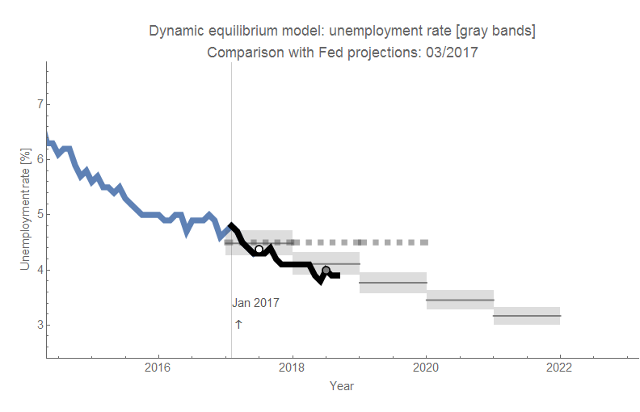
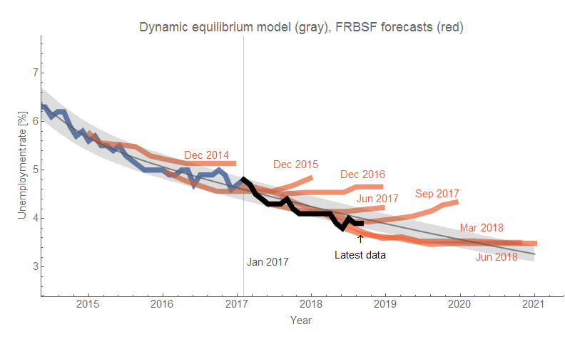

Everyone is talking about the FOMC meeting today (well, actually very few people are) as they've raised interest rates and released a statement that has dropped the word "accommodative". For me, the interesting part [is in the forecasts](https://www.federalreserve.gov/monetarypolicy/files/fomcprojtabl20180926.pdf) \[pdf\] (which show a slowdown in real GDP (RGDP) over the next few years. Let's compare their forecasts with the dynamic information equilibrium model (DIEM) described [in my paper](https://papers.ssrn.com/sol3/papers.cfm?abstract_id=3094757).

First, let's get the dull core PCE inflation forecast out of the way (as always, click to enlarge):

_Note: updated with new core PCE data for August 2018 on 1 October 2018._

The dynamic equilibrium over the post-war period is around 1.7% core PCE inflation; the FOMC sees it's own target of 2% as the forecast. The purple points represent the FOMC median and the range. The data in black is the post-forecast data for the DIEM forecast from 2017 (not just here, but in all the graphs below). The white point with a black outline represents the annual average for 2017.

RGDP is similar, but the FOMC sees an obeservable slowdown (given the range of forecasts — i.e. the median drops by more than the range). The DIEM sees most of the fluctuations as noise. Here's the graph (this time the DIEM is in red-orange because reasons):

_Note: updated with revised RGDP data 27 September 2018. The change is barely visible \[3\]._

The unemployment forecasts are more complex, and the median FOMC forecast sees the unemployment rate continuing to fall just like the DIEM \[1\] through 2020 when the former starts a bit of an up-tick (natural rate kicking in). The range of FOMC forecasts see either no up-tick or a larger one. The FOMC forecasts are in light blue and the DIEM annual averages are shown as gray bands:

But then again, the FOMC has been forecasting this slight fall followed by a flattening out or up-tick in a couple years for some time \[2\]:

Overall, this is a status quo forecast from my perspective. But the continued fall in the unemployment rate is probably puzzling the FOMC — especially given the lack of inflation. I personally couldn't imagine reducing one's unemployment rate forecast almost every meeting since September 2015 and not thinking there's a problem with the model I was using.

**Footnotes:**

\[1\] Note that the FOMC forecast of comparable vintage to the DIEM forecast (early 2017) was wrong:

\[2\] So has the FRBSF:

\[3\] Revised RGDP data became available 27 September 2018; the change is barely visible (RGDP growth was reduced a bit with the revision). The original graph and the updated graph are here for completeness:

