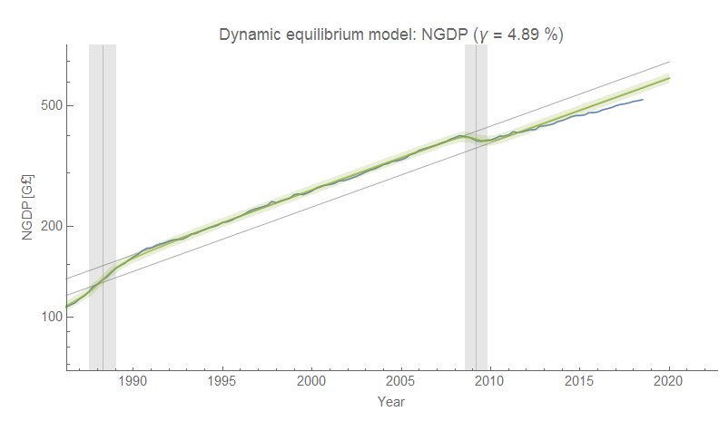
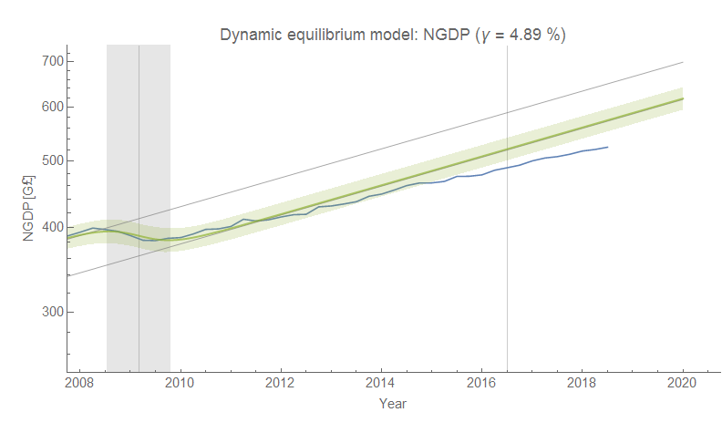
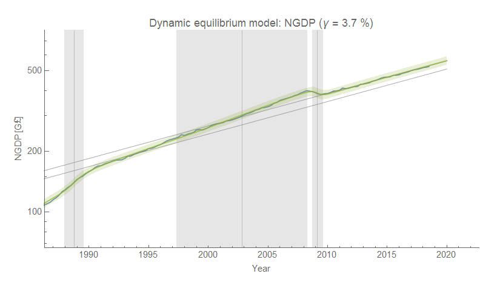
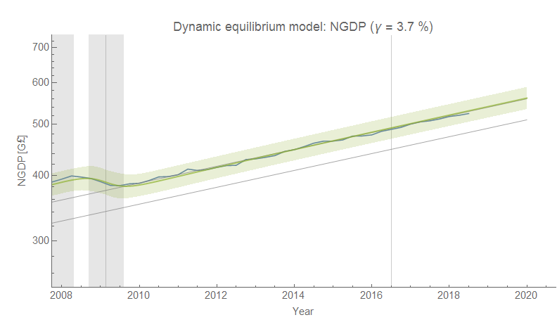
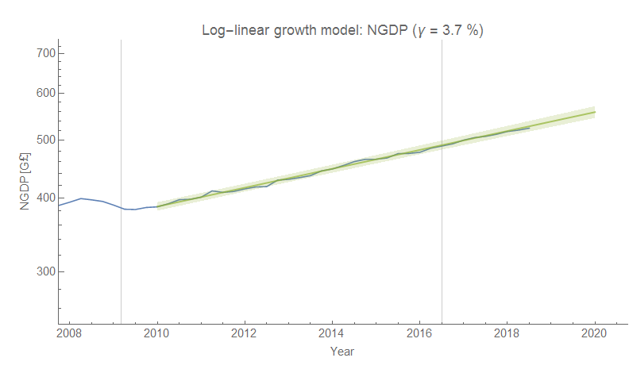
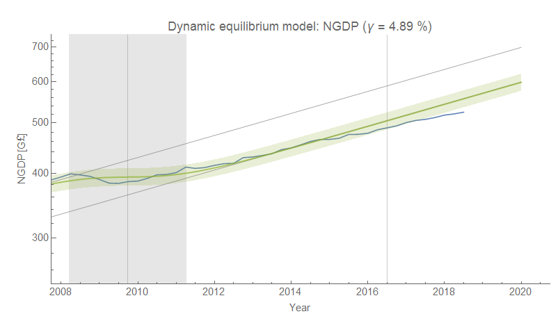

There is an [updated analysis at VoxEU](https://voxeu.org/article/300-million-week-output-cost-brexit-vote) that makes a claim that Brexit will has reduced real GDP growth going forward. I want to take a look at this using the dynamic information equilibrium model (DIEM, [details in my preprint](https://papers.ssrn.com/sol3/papers.cfm?abstract_id=3094757)).

First, let me note that since the [DIEM model of the GDP deflator](https://informationtransfereconomics.blogspot.com/2018/01/24-growth-forever.html) is constant over the period 1990-present for the UK, without loss of generality we can look at nominal GDP. There are two local minima for the dynamic equilibrium growth rate we'll call gamma: one around 4.9% and one around 3.7%. The former essentially sees the era from 1997-2008 as the equilibrium growth rate; the latter sees the post Great Recession growth rate as the equilibrium. I stopped the model parameter estimates in January 2016 (or earlier) in order to get an idea of the counterfactual pre-Brexit.

We'll first look at the former over the longer run (click to enlarge):

The "story" it tells starting in the late 80s is first the brief so-called "Lawson boom", followed by equilibrium growth until the Great Recession. After the recession (and in order to be consistent with it), there's some kind of constant drag that begins in or around 2014 \[1\]. This drag begins too early to be attributed to Brexit (zoomed-in version of the previous graph):

The lower growth rate makes for a more plausible sequence of events that is more consistent with history:

Again, we have the Lawson boom, but this is followed by a long boom in economic growth from roughly 1997-2008 which matches up with the two financial booms in the US in the late 90s (dot-com) and the mid-2000s (housing). With London as a major financial center representing a growing fraction of the UK economy at the time, the interpretation of this accelerated growth shock in terms of a global financial boom is plausible. Post-2008 growth has been roughly as expected:

There might be hints of drag due to Brexit (the data has disproportionately fallen below the model expectation since 2016, while it was more symmetrically distributed before), but it's too early to tell. Future data will shed light on this.

I'd also like to note that the lower growth rate equilibrium is consistent with a naive log-linear model post-2008:

The key to understanding economic growth is understanding not just what trend growth is, but how the various events in the economic time series interact with that trend. If it's hard to square a particular model of the past with the historical events (e.g. thinking of the financial sector boom in London as "normal" growth, or per footnote \[1\] a Great Recession shock with the wrong timing), then it's possible some of the underlying assumptions are wrong. In this case, it's hard to construct a picture where Brexit has a strong effect with the proper timing without changing the effects of the Great Recession or financial boom leading up to it. Seeing as nothing has actually been implemented yet — any effect on GDP would be entirely in terms of plans and expectations — an undetectable effect on GDP is plausible.

This is not to say Brexit won't have an effect if some of the more egregious scenarios come to pass. I imagine a "Brexit In Name Only" (BINO) as the most likely outcome, possibly with an "eternal Brexit" aspect (i.e. negotiations that kick the can down the road for years like the Greek debt crisis). These scenarios would have little effect on economic growth. Effectively, this is what the current administration in the US has done with NAFTA (basically re-named it "USMCA", as announced today). But the "hard Brexit" scenarios would likely impact GDP significantly \[2\] — possibly triggering or looking exactly like a recession.

But in the "hard Brexit" scenario, we'd be looking at more likely a temporally isolated event (like other recessions) rather than a continuous drag on growth which is hard to achieve in the DIEM ([but not impossible](https://informationtransfereconomics.blogspot.com/2016/07/an-ensemble-of-labor-markets.html)). Then again, maybe the DIEM approach is incorrect.

**Footnotes:**

\[1\] In the graph, I cut off the fit in 2013 instead of 2016. If you make the cut-off date January 2016, it distorts the shape of the Great Recession (it's no longer a temporally isolated shock):

In fact, any cut-off date after 2010 extends the length of the Great Recession (and increases the model error), meaning the model parameters aren't stable with respect to new data. This is a sign that the higher dynamic equilibrium growth rate is wrong after the Great Recession. This is evidence in favor of the lower growth equilibrium when combined with all the other evidence.

\[2\] Back of the envelope: half of UK trade is with the EU, and UK exports are roughly 20-30% of GDP. With a 50% efficiency factor (accounting for the fact that imports would drop as well, so that some loss of trade would be a wash \[3\]) we're looking at a hit of 5-7% of nominal GDP — about half the size of the Great Recession.

\[3\] This would be a number between 0 and 100% modifying the loss of all exports to GDP. In the ideal scenario (0%), all the imports and exports would be completely offset (i.e. apples imported from France and blackberries exported from the UK would be mitigated by increased UK apple production taking up the newly created slack in blackberry production due to loss of trade partners). In the worst scenario (100%), the UK loses all of the GDP due to exports. My guess is somewhere in between (50%). But it's just a guess.
