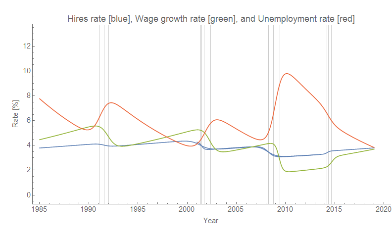
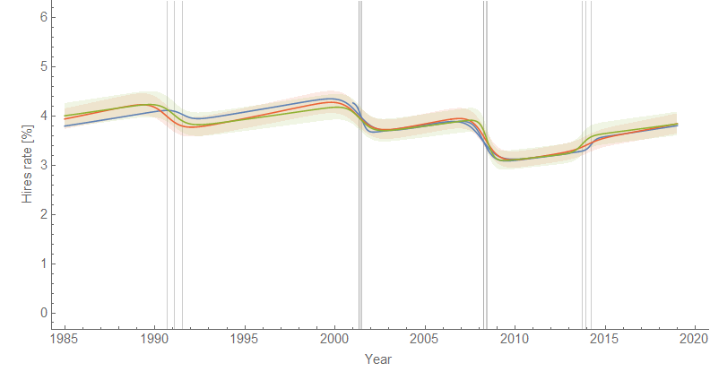

Fabio Ghironi asked me about the dynamic information equilibrium models (DIEMs) as models in the economics sense (causal relationships between variables) rather than the physics sense (mathematical descriptions of data) at [my talk for the workshop he organized](https://informationtransfereconomics.blogspot.com/2018/10/outside-box-workshop.html). Much of the work I have been doing is in the latter sense, but I've also put together a few models in the former sense (e.g. a monetary one and an information equilibrium version of the [3-equation New Keynesian DSGE model](https://informationtransfereconomics.blogspot.com/2016/08/dsge-part-5-summary.html)).

I've been steadily working toward building some models based on the dynamic information equilibrium descriptions of data — I've been collecting useful descriptions of data in "[macroeconomic seismograms](https://informationtransfereconomics.blogspot.com/2018/03/shock-cluster-analysis-and-some-new.html)" as a first step. With [the longer hires series](https://informationtransfereconomics.blogspot.com/2018/10/extended-jolts-hires-series-and-2014.html) and similar shock structure [to wage growth](https://informationtransfereconomics.blogspot.com/2018/10/wage-growth-data-from-atlanta-fed.html), I can show in principle how this kind of model building would progress.

First, one identifies multiple DIEMs with similar shock structure — the one that comes to mind most readily is wage growth, JOLTS hires, and unemployment:

We can perform a log-linear transformation (scaling) along with a temporal translation on each series to map them to each other. I chose to map wage growth and unemployment to the hires DIEM:

This tells us that e.g. the log-amplitude of the shocks to hires are about 0.3 times the size of the log-amplitude shocks to wages and unemployment, but more importantly that hires lead wages by 0.9 year and unemployment by 0.4 year. Basically:

UNRATE(_t_) = _f_(HIRES(_t −_ 0.4))

WAGE(_t_) = _g_(HIRES(_t_ _−_ 0.9))

where _f_(.) and _g_(.) are log-linear transformations of the HIRES data. We could add e.g. Okun's law ([see here](https://informationtransfereconomics.blogspot.com/2018/03/okuns-law-and-labor-force.html)) and labor-driven inflation ([here](https://informationtransfereconomics.blogspot.com/2017/03/the-quantity-theory-of-labor-and.html)) and get a description of RGDP, inflation, wage growth, and unemployment rate based on a single input (JOLTS hires). This model is effectively a "[quantity theory of labor](https://informationtransfereconomics.blogspot.com/2017/03/the-quantity-theory-of-labor-and.html)" model where the economy is driven by hiring.

One thing this model implies that given the hires data that came in last month (data for July), we should expect the unemployment rate to fall for at least another 5 months (from July, so until December) and wage growth to increase for another 11 months (from July, so until June 2019). What's interesting is that this suggests we should start seeing some kind of decline in the hires rate late this year or early next year [if the yield curve inversion estimate is accurate](https://informationtransfereconomics.blogspot.com/2018/06/yield-curve-inversion-and-future.html). Of course, all of these estimates have an error on the order of 1-2 months.
