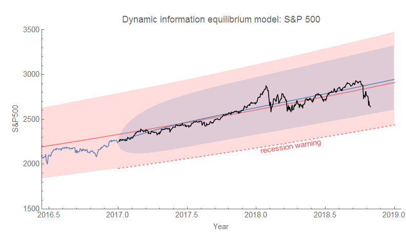
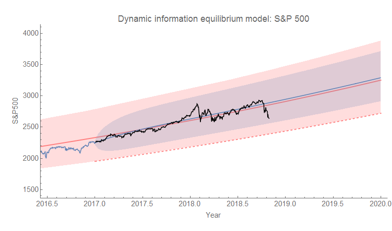
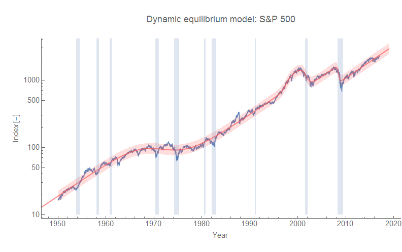
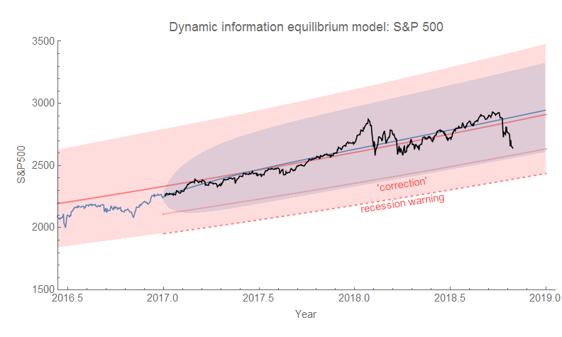

> _Disclaimer/disclosure: It is entirely possible I am a crackpot physicist who has deluded himself (always a 'him', amirite?) into believing he has figured out some structure in the stock market. You most likely do not want to wager the change in your pocket on that, much less your life savings. The model presented is for purely academic curiosity purposes, not stock advice. I have my 401(k) invested in an S&P 500 index fund and own a few shares of Boeing stock._

I've been testing a [dynamic information equilibrium model](https://papers.ssrn.com/sol3/papers.cfm?abstract_id=3094757) (DIEM) forecast of the S&P 500 (a.k.a. hubris) [since January 2017](https://informationtransfereconomics.blogspot.com/2017/01/what-about-s-500.html), and we're now about 2 months from the original end date of December 31, 2018 \[1\]. It has worked remarkably well (click to enlarge):

The model is the red line, the red band are the single prediction errors (90% confidence) over the entire model data set (1950-2017), and the blue band is the 90% ARMA(2,1) forecast from the last data point (December 2017). The black line is the post-forecast data.

The current data is well within the "normal" range of fluctuations. I've added a red dashed line to indicate the "recession warning" level. Should the data exceed this threshold, the model would potentially indicate the presence of a shock (usually associated with recessions) \[1\]. Actually, the S&P 500 seems to have a bit of [multi-scale self-similarity](https://informationtransfereconomics.blogspot.com/2017/07/self-similarity-in-dynamic-equilibrium.html) ([a property of "fractals"](https://en.wikipedia.org/wiki/Self-similarity)), so as you zoom in more and more shocks of ever smaller magnitude and ever shorter duration can be resolved. Whether or not there's a shock associated with a recession depends a bit on the scale of the recession. All that's to say the S&P 500 isn't exactly a good recession indicator on its own (labor market measures are better [and tend to be leading indicators](https://informationtransfereconomics.blogspot.com/2018/02/economic-seismographs-labor-and.html)).

I've heard questions lately in the business news about whether we are experiencing a market "correction" — a fall on the order of 10%. This probably reflects some genuinely useful heuristic. However that metric is too vague (over one week? two weeks? a month? from what level?) to be of value. The DIEM view could make that more explicit as a 10% deviation from the trend (red model line) is roughly at the bottom of the blue band \[3\]. It's reasonably close to the "recession warning" line so as to consider the metric as part of a more general concept that separates normal fluctuations from shocks \[4\]. However, the data has passed the "correction" line several times since 2010 (but not the "recession warning" line).

**Footnotes:**

\[1\] I've extended the forecast another year (assuming no shock, click to enlarge):

\[2\] Here's the longer term overview with recessions (blue) included (click to enlarge):

\[3\] More explicitly — actually a 0.1 log-deviation which is approximately 10% (click to enlarge):

The width of the blue band is based on the short run (i.e. no recession) volatility (2010-2017) rather than the long run volatility (1950-2017) which is represented by the red band.

\[4\] [This on volatility regimes is also relevant](https://informationtransfereconomics.blogspot.com/2018/01/structural-breaks-volatility-regimes.html).
