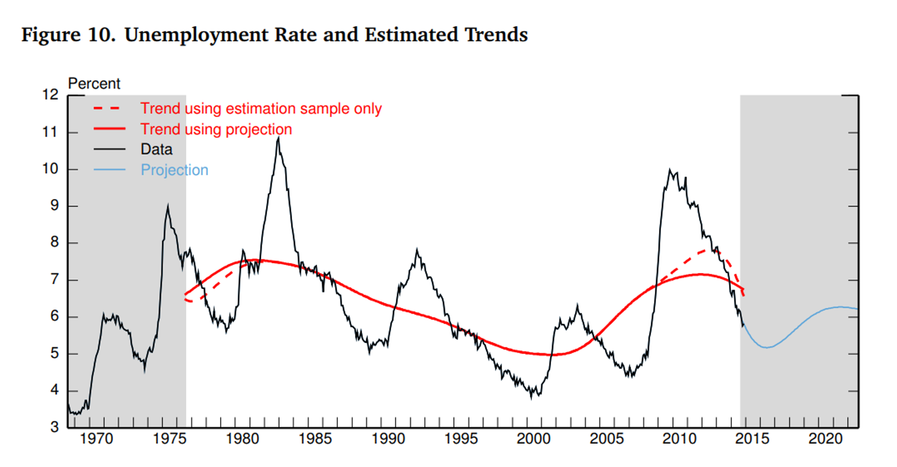
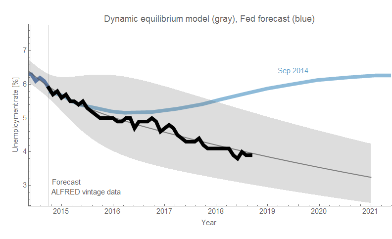
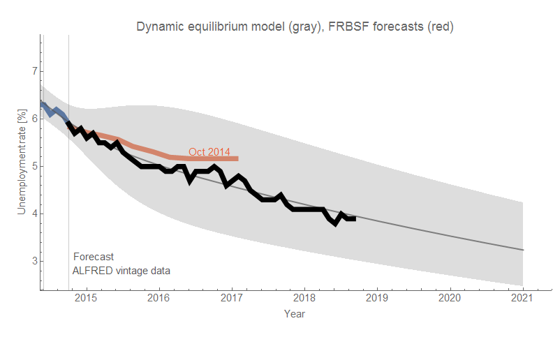
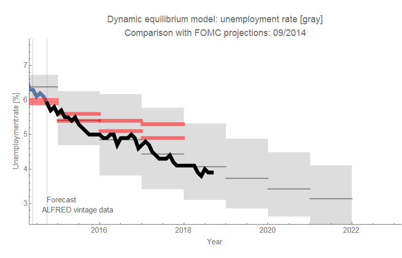

One of the things I enjoy doing is comparing dynamic information equilibrium model (DIEM) forecasts to forecasts by other people or institutions. In part because they're often funny, but in general head-to-head model competition is one of the better ways to get a handle on model usefulness (or flat out reject models). On twitter, I came across (via [here](https://twitter.com/ticketdust/status/1046849917329821696)) this December 2014 [white paper out of the Fed](https://www.federalreserve.gov/econresdata/feds/2014/files/2014109pap.pdf) \[pdf\]. In it they had a fascinating graph of the unemployment rate with the "trend" and a forecast of the data \[1\] from 2014 out to the 2020s:

I downloaded the relevant archival unemployment rate data from [ALFRED](https://alfred.stlouisfed.org/series?seid=UNRATE#0) (the October 2014 vintage since the last point was indicated as September 2014), and ran the DIEM. What's interesting (to me, at least) is that this point in the time series was in the middle of the 2014 (positive) shock to employment. The shock was detectable (i.e. multiple data points had fallen outside the confidence limits of the counterfactual no-shock model), but the parameters hadn't fully converged resulting in some additional uncertainty ([similar to this discussion here](https://informationtransfereconomics.blogspot.com/2018/09/forecasting-great-recession.html)). Comparing the DIEM forecast to the Fed model, it's pretty obvious the latter was off the mark:

While I was at it, I also compared the DIEM forecast to a couple of additional Federal Reserve forecasts available at the time that I have been tracking for the past couple of years: [the FOMC September meeting](https://www.federalreserve.gov/monetarypolicy/files/fomcprojtabl20140917.pdf) \[pdf\], and the [October FRBSF Fed Views forecast](https://www.frbsf.org/economic-research/publications/fedviews/2014/october/october-09-2014/). These forecasts weren't quite as bad, but then only looked at a shorter time scale:

**Footnotes:**

\[1\] In the paragraph below the figure it explicitly says this is a forecast of the data, not a forecast of the "trend":

> _The trend we used for the factor model (the solid red line) is computed from a hybrid series that includes the additional 8 years of history plus the 8 years of simulated future data._
