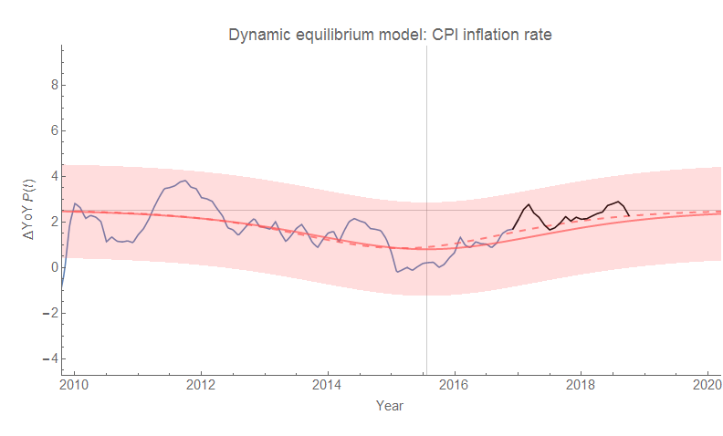
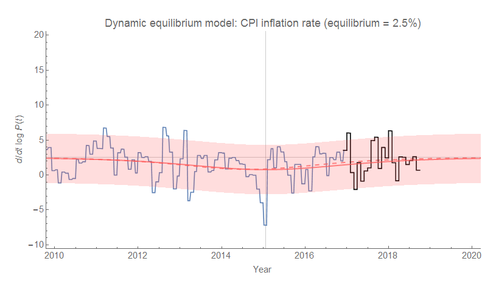
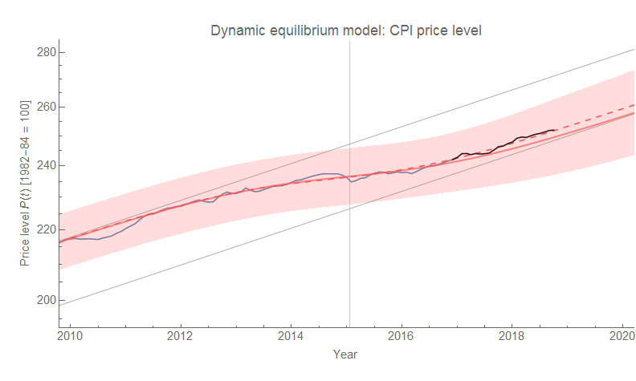

The [latest CPI data](https://fred.stlouisfed.org/series/CPIAUCSL) was released today, and is basically in line with the dynamic information equilibrium forecast of inflation I've been tracking since 2017 (click to enlarge):

The dashed line shows [a later estimate of the 2014 shock parameters](https://informationtransfereconomics.blogspot.com/2018/03/cpi-data-and-end-of-lowflation.html) from March of 2018. It has negligible effect on the rate of inflation, but did impact the price level (i.e. the integrated effect on the rate of inflation):

Basically, the shock was a bit smaller than the estimate from early 2017 (which was made while the shock was still underway).
