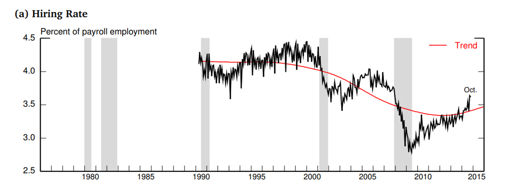
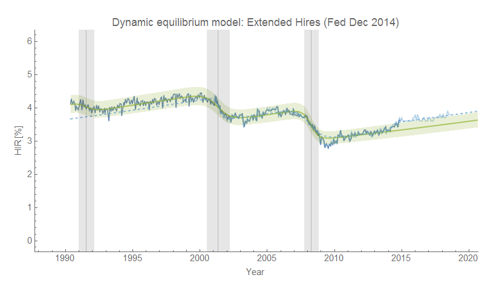
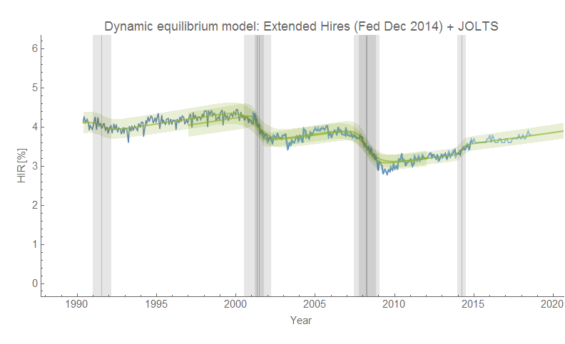
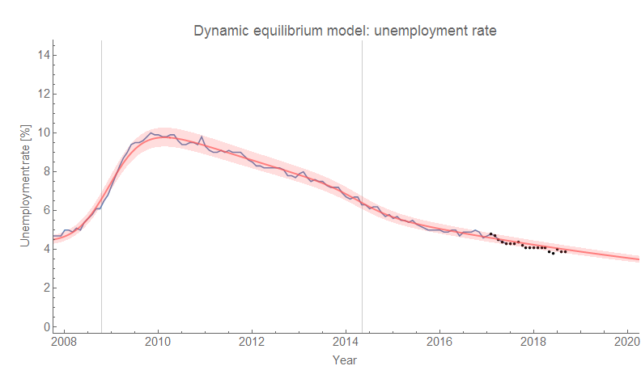

I'm reading [this white paper from the Fed](https://www.federalreserve.gov/econresdata/feds/2014/files/2014109pap.pdf) \[pdf\] from December of 2014 (via [here](https://twitter.com/ticketdust/status/1046849917329821696)), and there are some longer versions of some time series appearing in it. The previous two posts looked at [a forecast](https://informationtransfereconomics.blogspot.com/2018/10/comparing-to-fed-forecasts-from-2014.html) as well as a [different data set](https://informationtransfereconomics.blogspot.com/2018/10/dynamic-equilibrium-flow-from.html) (flows) — this time I'm going to look at one of the extended series. It's the JOLTS hires series with additional data reconstructed from micro data back to the early 90s \[1\]. The additional data recasts some of the recent data in a different (and to me more sensible) light. Here is the graph I digitized the data from (with the silly "trend" that appears to be divorced from any reasonable interpretation of the data):

Fitting the [dynamic information equilibrium model](https://papers.ssrn.com/sol3/papers.cfm?abstract_id=3094757) (DIEM) to this data cuts the dynamic equilibrium value estimated from the post-2000 JOLTS time series in half (from a growth rate of about 3%/y to 1.5%/y), which makes a bump in 2014 visible. The JOLTS data is overlaid in light blue, and a fit to that data using the 1.5% dynamic equilibrium (including the 2014 shock) is shown as the dashed curve. The DIEM fit to the extended data series alone (which ends in October 2014) is in green with a 90% confidence band.

The later JOLTS data is barely on the edge of the 90% confidence band, and it is only the serial correlation that would prompt us to posit the shock's existence. If we show both models with their confidence bands and shocks we can see that they're roughly consistent with each other aside from the new shock in 2014:

The new shock affects how we perceive the post-forecast data I've been looking at [to forecast a future recession](https://informationtransfereconomics.blogspot.com/2018/06/jolts-data-and-2019-recession.html) (post-forecast data in the original forecast in black):

The hires data never showed much of a deviation from the model in the recent data (implying a recession shock), and the lower dynamic equilibrium rate of 1.5% makes that minimal deviation even smaller.

Overall, this bump in hires **_should_** exist. There is a significant fall in the unemployment rate in 2014 (e.g. [here](https://informationtransfereconomics.blogspot.com/2017/11/a-new-beveridge-curve-or-science-is.html) \[2\]), and it would be odd if this didn't show up in _any_ of the JOLTS measures — the jobs weren't filled by magic with no surge in openings or hires, nor fall in quits or separations). It still doesn't appear in the JOLTS openings measure \[3\] (I tried). Fortunately the 2019 recession indicator is based on that measure so it doesn't affect that prediction.

...

**Update 3 October 2018**

For completeness, here's the picture of the 2014 "mini-boom" showing up as a fall in unemployment and long term unemployment:

I should also note that this 2014 "mini-boom" seems to [show up in wage growth](https://informationtransfereconomics.blogspot.com/2018/02/dynamic-equilibrium-in-wage-growth.html) as well:

**Footnotes:**

\[1\] Per the white paper:

> _Data before December 2000 were provided by Davis, Faberman and Haltiwanger (2012), who use unpublished microdata to infer series back to 1990:Q2._

\[2\] It's a 2014 "mini economic boom" [possibly associated with Obamacare going into effect](https://informationtransfereconomics.blogspot.com/2015/06/perfect-storm-or-just-so-story.html).

\[3\] It appears that the rise in [JOLTS openings](https://fred.stlouisfed.org/series/JTSJOR) was preceded by a slight fall (well, a decrease in growth or flattening out) in openings, effectively cancelling each other out. But that could be pareidolia. In any case, if it's there it's not significant.
