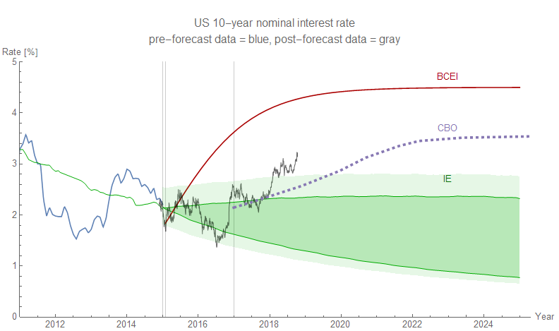
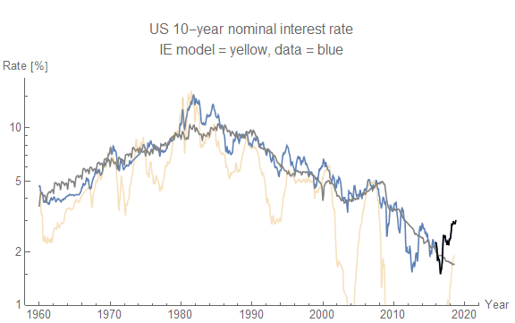
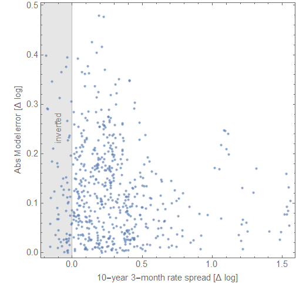
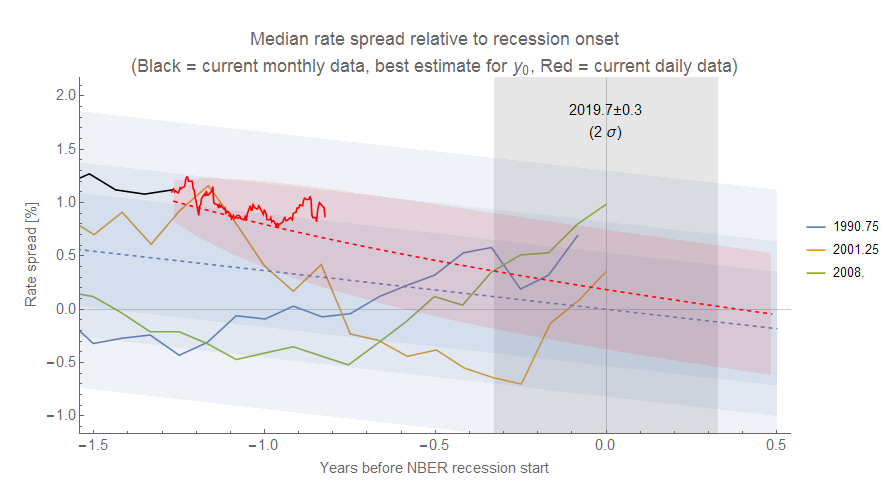
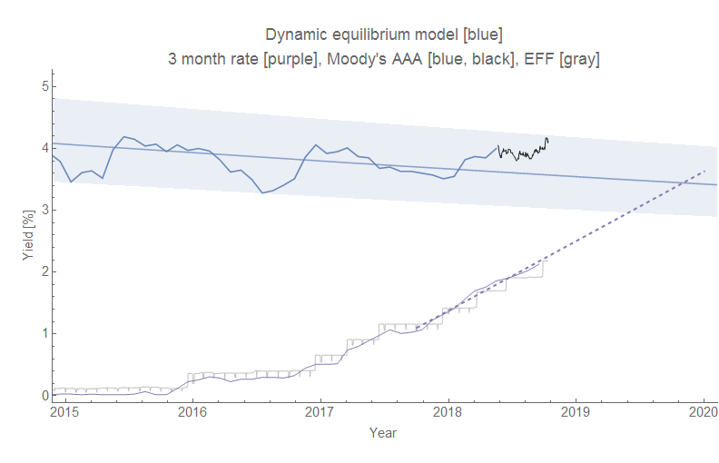

Along with the market slump last week, long term interest rates fell a bit resulting in a smaller spread. However, the data didn't fall even remotely enough to bring it back in line with the monetary information equilibrium interest rate model:

This model _r10y = f(NGDP, M0)_ essentially says long term (10-year) interest rates are related to nominal output (NGDP) and the monetary base (minus reserves), and it's failing fairly badly as the Fed has increased short term rates ([as I've mentioned earlier](https://informationtransfereconomics.blogspot.com/2018/05/three-sigma-deviation-in-10-year-rate.html)). In fact, [most of the monetary models](https://informationtransfereconomics.blogspot.com/2018/01/losing-my-vestigial-monetarism.html) constructed with the information equilibrium framework have not performed very well.

There's a great story here about a naive scientist — trusting the zeitgeist and the public face of academic economics — building models where output, money, and interest rates were strongly connected, but that failed when compared to data.

However, there might be knowledge to glean from how this model is failing (which may be a failure of [scope](https://informationtransfereconomics.blogspot.com/2018/08/tractability-and-scope.html), not of the underlying principles). Don't read this as a defense of a model that isn't working (trust me, I actually relish the idea of more evidence [that money is irrelevant to macroeconomics](https://informationtransfereconomics.blogspot.com/2018/01/money-is-aether-of-macroeconomics.html)), but rather a post-mortem on a model that basically has the scope conditions of a DSGE model, as eloquently described by Keynes:

> _In the long run we are all dead. Economists set themselves too easy, too useless a task, if in tempestuous seasons they can only tell us, that when the storm is long past, the ocean is flat again._

That last bit about the flat ocean is the scope condition: an economy nowhere near a recession. Let me explain ...

I was looking at the model in the first graph above and noticed something in the data. The long rate seems to respond to the short rate — it seems almost repelled by the short rate as it approaches. Where that happens the model error increases. Here's the long rate model (gray) with the long rate data (blue) and short rate data (yellow dashed):

The strongest episodes are the 1970s, the 80s and the 2000s recession. Sure enough, if you plot the model error versus the interest rate spread the error increases as the 10-year rate and the 3-month rate approach each other:

As a spread decline (and eventual yield curve inversion) is indicative of a recession, this makes a pretty good case for limiting the model scope of _r10y = f(NGDP, M0)_ to cases where the 10 year rate is higher than the 3-month rate (_r3m_). When it is out of scope, the model _r10y ~ r3m ~ EFFR_ is a much better model \[1\]. That is to say: long term interest rates are the free market price of "money" unless the Fed is rapidly raising short rates (in which case it's a fixed price set by the Fed). This view makes sense intuitively, but also turns forecasting long term interest rates into an occasional game of "guess what the Fed is going to do" with short term interest rates.

Here are the latest views of the rate spread (estimated recession onset in late 2019 to early 2020) and the dynamic equilibrium model of the interest rate ([using Moody's AAA rate](https://informationtransfereconomics.blogspot.com/2018/06/rethinking-interest-rates.html)). Click to enlarge.

**Footnotes:**

\[1\] In fact, it reduces the error by about 10%.
