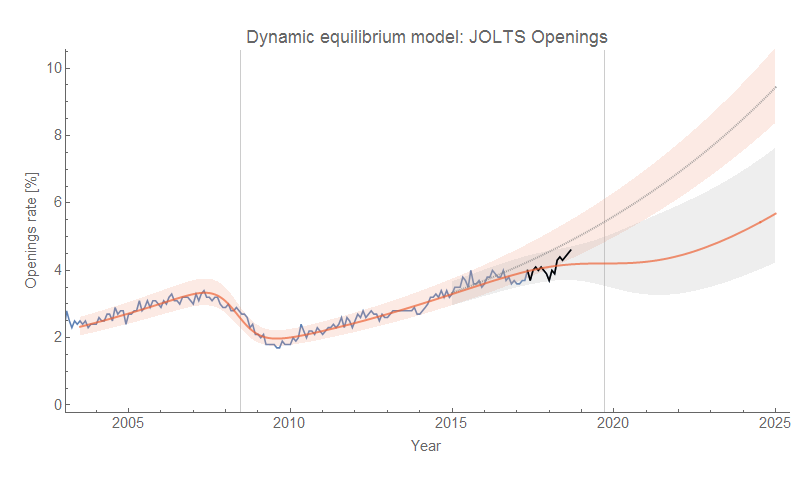
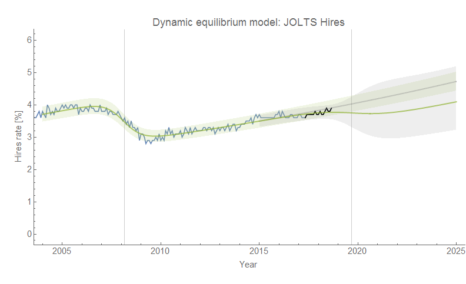
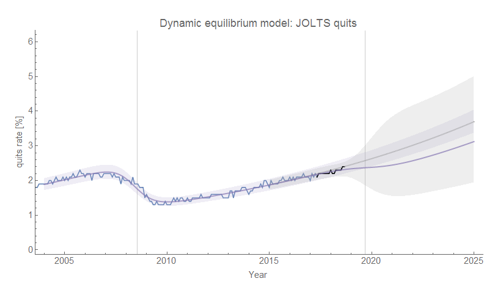
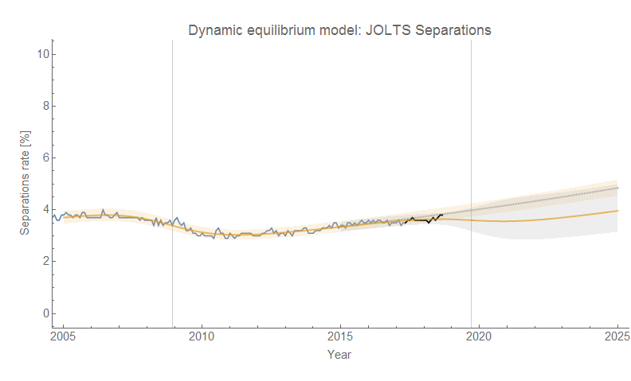
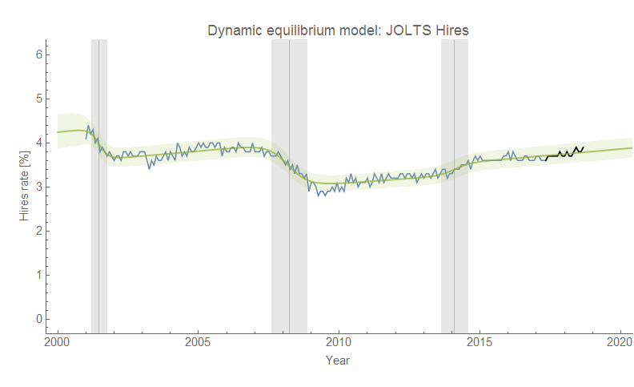

The Job Openings and Labor Turnover Survey (JOLTS) data for August 2018 was released today ([available on FRED](https://fred.stlouisfed.org/release?rid=192)), and there aren't a lot of surprises from the dynamic information equilibrium model viewpoint (DIEM, described in detail [in my working paper](https://papers.ssrn.com/sol3/papers.cfm?abstract_id=3094757)). Even the uptick in JOLTS openings doesn't entirely change the fact that most of the data since 2016 is part of a correlated deviation that could represent the beginnings of [a recession at the end of 2019](https://informationtransfereconomics.blogspot.com/2018/06/jolts-data-and-2019-recession.html) or beginning of 2020. We'd really need to be seeing an openings rate of 4.9% and higher to discount that possibility. Recession counterfactuals shown as gray bands. As always, click to enlarge.

I'll also be monitoring the "alternate" model of hires (with a lower dynamic equilibrium rate and additional positive shock in 2014) based on a longer time series ([discussed here](https://informationtransfereconomics.blogspot.com/2018/10/extended-jolts-hires-series-and-2014.html)).

Regardless of which model you use, the hires data continued the status quo implying ([based on this model of combined DIEMs](https://informationtransfereconomics.blogspot.com/2018/10/building-models.html)) that we should continue to see the unemployment rate fall through January of 2019 (5 months from August 2018) and wage growth continue through July 2019 (11 months from August 2018).
