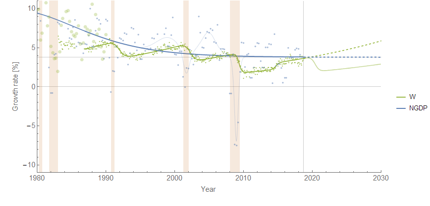
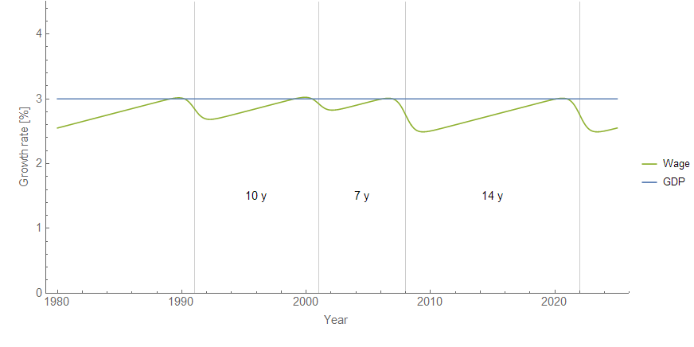
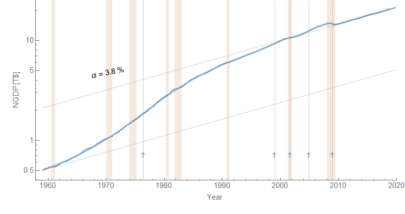
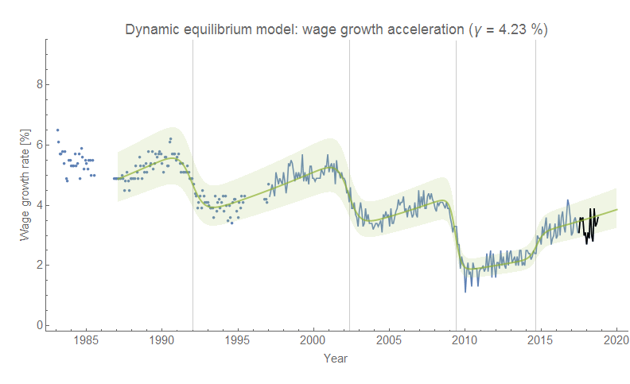

It started off with a simple observation prompted by a [Twitter thread](https://twitter.com/JWMason1/status/1052932849182027776): since wage growth tends to increase between recessions (i.e. wages accelerate) in the [dynamic information equilibrium model](https://papers.ssrn.com/sol3/papers.cfm?abstract_id=3094757) (DIEM) while NGDP growth appears to be roughly constant in the absence of an asset bubble or major demographic shift (and especially in the post-Great Recession period), at some point wage growth would exceed NGDP growth. What happens then?

There are a couple of things that could happen:

1.  Additional consumption by people with higher wages can spur nominal growth (due to wage-led real growth or wage-price spiral)
2.  Investment declines as wages eat into profits (e.g. the Marxist view), prompting a recession

There are other theoretical treatments of this scenario, and all of them seem plausible. My question was more about what the data says. I set about combining the wage growth DIEM (green) and the NGDP DIEM (blue) \[1\] onto a single graph. The result shows that since the 1980s, when wage growth hit NGDP growth, we got a recession. There's even a hint that the same thing happened in the 1980s based on other data ([FRED](https://fred.stlouisfed.org/series/A034RC1A027NBEA), larger green dots). Click to enlarge:

The wage growth data from the Atlanta Fed is in green (small green dots), while the NGDP growth data from the BEA is in blue (blue dots). The [asset bubbles and crashes](https://informationtransfereconomics.blogspot.com/2018/01/24-growth-forever.html) (dot-com, housing) are shown as dotted blue lines, but the main trend of NGDP [during the fading demographic growth surge](https://informationtransfereconomics.blogspot.com/2018/02/women-in-workforce-and-solow-paradox.html) is shown as the thick blue line. The former don't show up very strongly in the labor force, while the latter does — that's why I think the trend is more relevant.

It is possible that rising wages in the 1990s led to the increased NGDP growth (wage-led growth). However, it is also possible that the asset bubble (dot-com) allowed wages to rise a bit more above the NGDP trend than they would have otherwise. What is interesting is that the "housing bust" happens a bit earlier than the 2008 recession — which doesn't actually happen until wage growth reaches NGDP growth.

If we project wage growth and NGDP growth using the models, we find that they cross-over in the 2019-2020 time frame. Actually, the exact cross-over is 2019.8 (October 2019) which not only eerily puts it in October (when a lot of market crashes happen in the US) but also is close to the 2019.7 value estimated for yield curve inversion [based on extrapolating the path of interest rates](https://informationtransfereconomics.blogspot.com/2018/06/yield-curve-inversion-and-future.html). I put in a counterfactual recession in wage growth to show what it might look like.

In any case, this provides a test: will NGDP growth increase (wage-led growth), or will we get a recession due to limits to wage growth? Or will neither of these happen — and the models turn out to be wrong?

One other thing to note: this would be almost completely unobservable without the dynamic information equilibrium model and the low noise [wage growth data from the Atlanta Fed](https://www.frbatlanta.org/chcs/wage-growth-tracker.aspx?panel=1). NGDP growth is extremely noisy, and other measures of wage growth are much more uncertain ([ECI](https://informationtransfereconomics.blogspot.com/2018/06/wage-growth-showing-signs-of-downward.html), or the aforementioned [national income](https://fred.stlouisfed.org/series/A034RC1A027NBEA)). However, extracting the trends of the data using the DIEM allows this pattern to emerge.

...

**Update 31 October 2018**

I got a great question on Twitter from [Richard Clayton](https://twitter.com/Rich_C_3/status/1057633296794800128):

> _Would love to read your take on the "expansions don't die of old age" argument, as presented [here](https://fxdiebold.blogspot.com/2018/10/expansions-dont-die-of-old-age.html) ... Seems to me your [Limits to Wage Growth](https://informationtransfereconomics.blogspot.com/2018/10/limits-to-wage-growth.html) and constant-rate-of-decline in \[unemployment\] make for a counter\[argument\]_ 

(Some slight editing and adding links because it was from Twitter.)

The original paper from [Diebold is from 1992](https://www.sas.upenn.edu/~fdiebold/papers/paper87/DieboldRudebusch1992.pdf) \[pdf\]. It finds that you can't reject the hypothesis that expansions don't die of old age (if I've read it correctly). The post above finds an interesting coincidence that recessions typically happen around the time that wage growth rises to be comparable to NGDP growth. I speculated that this might be a causal factor — e.g. wages start to eat into profits, causing companies to cut back on investment. But that also seems to raise the question of how that can be consistent with no particular evidence for expansions "dying of old age". That is to say, if wage growth steadily rises toward NGDP growth, then the risk of a recession should increase with time.

If you look at the methodology of the 1992 paper, you can see that it looks at expansion duration only. In the speculation in the post above, the risk of recession would rise with duration, but the likelihood would decrease depending on the size of the previous recession. If we assume a simple GDP growth model (constant growth), then you can see in the diagram that recessions of different magnitudes increase or decrease the expansion duration:

The further wages are driven down after a recession, the longer the expansion duration, _ceteris paribus_. If you add in the slowly decreasing rate of NGDP growth, bubbles like the dot-com bubble (which may have extended the duration of the 90s expansion), as well as positive shocks to wage growth (in 2015), you get a much more complicated picture which would make it impossible to derive the hazard function from expansion duration alone.

This does not mean the limits to wage growth hypothesis is correct — to test that hypothesis, we'll have to see the path of wage growth and NGDP growth through the next recession. This hypothesis predicts a recession in the next couple years (roughly 2020). There does not appear to be a bubble affecting NGDP growth, so the possible factor affecting the 2001 recession timing will not apply. If there is no recession and wage growth rises above NGDP growth, then we can probably reject it ([on the basis of usefulness](https://informationtransfereconomics.blogspot.com/2016/07/ceteris-paribus-and-method-of-nascent.html) in understanding the economy, not statistical rejection which is a higher bar to clear).

**Footnotes:**

\[1\] Here are the wage growth and NGDP DIEMs compared to data:

