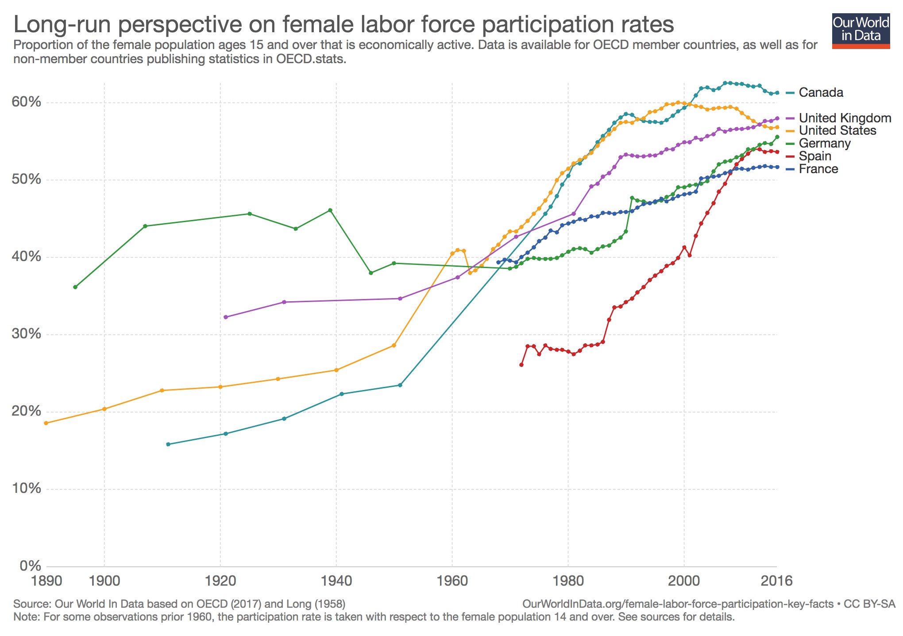

Paul Volcker [has an article on Bloomberg](https://www.bloomberg.com/opinion/articles/2018-10-24/what-s-wrong-with-the-2-percent-inflation-target) about the 2% inflation target. Now I don't have any particular problem with arguing that central banks should focus on more than a numerical inflation target (the main idea of the rest of the article), but Volcker tells a brief story that is part of the whole "central banks controlling inflation" narrative that doesn't appear to be well-supported by the data.

Here's Volcker:

> _I think I know the origin \[of the 2% inflation target\]. It’s not a matter of theory or of deep empirical studies. Just a very practical decision in a far-away place._ 

> _New Zealand is a small country, known among other things for excellent trout fishing. So, as I left the Federal Reserve in 1987, I happily accepted an invitation to visit. It turns out I was there, in one respect, under false pretenses. Getting off the plane in Auckland, I learned the fishing season was closed. I could have left my fly rods at home._ 

> _In other respects, the visit was fascinating. New Zealand economic policy was undergoing radical change. Years of high inflation, slow growth, and increasing foreign debt culminated in a sharp swing toward support for free markets and a strong attack on inflation led by the traditionally left-wing Labour Party._ 

> _The changes included narrowing the central bank’s focus to a single goal: bringing the inflation rate down to a predetermined target. The new government set an annual inflation rate of zero to 2 percent as the central bank’s key objective. The simplicity of the target was seen as part of its appeal — no excuses, no hedging about, one policy, one instrument. Within a year or so the inflation rate fell to about 2 percent._

The issue is that — using the [dynamic information equilibrium model](https://papers.ssrn.com/sol3/papers.cfm?abstract_id=3094757) \[DIEM\] — inflation was already headed in that direction and it and the price level could have been forecast through 2018 (!) reasonably well back in 1983 (!) using only data available at the time (click to enlarge):

The forecast was made using data before 1983. The dashed red line is the post-1983 model and the green is the post-1983 data. That conference Volcker attended was in 1987, and the inflation target wasn't adopted until 1989.

The main feature of the data is the large shock centered at 1978.7, much like similar shocks in the UK and the US (which by the way didn't adopt inflation targets, and which also saw their inflation rate fall to some approximately constant level by the 1990s). The source of these shocks lasting from the 1960s to the 1990s seems to be demographic ([women entering the workforce](https://informationtransfereconomics.blogspot.com/2018/02/women-in-workforce-and-solow-paradox.html)) in most Anglophone countries \[1\], so I wouldn't be surprised if it was demographic in New Zealand as well (unfortunately little good data going back far enough exists).

So Volcker's story is a bit like the fire brigade showing up after almost everyone has left the building and congratulating themselves for their good job saving lives. This is similar to [the problematic causality around the 1980s recessions](https://informationtransfereconomics.blogspot.com/2018/03/its-80s.html) — often associated with the Volcker Fed. I'm not saying he's nefariously claiming credit for things — the interpretation is not completely implausible, and in fact most economists ([even recent Nobel prize winners](https://informationtransfereconomics.blogspot.com/2016/09/paul-romer-on-volcker-disinflation.html)) subscribe to it. It's just difficult to square with the data. If you could forecast inflation today from 1983, it's difficult (but not impossible) to conclude events in 1987 had little impact.

**Update 29 October 2018**

Nick Rowe in comments [here](https://informationtransfereconomics.blogspot.com/2018/10/lets-not-assume-that.html?showComment=1540597934773#c6702216064635955553) mentions Canada's target:

> _How to test the effect of money on inflation? One example: in 1992(?) \[ed. [1991](https://www.bankofcanada.ca/rates/indicators/key-variables/inflation-control-target/)\] the Bank of Canada said it was going to use monetary policy to bring inflation down to 2%, and keep it there. And that is (roughly) what happened. Either the Bank of Canada got very lucky, or else monetary policy worked in (roughly) the way the Bank of Canada thought it worked._

We can actually play the same game as we played above to show that a forecast from **_1985_** gets the present day price level (CPI) to within about 1.4% (102.7 predicted versus 104.1 actual) over the course of 33 years (click to enlarge):

Nick says that unless the model is accurate, the Bank of Canada must have been "very lucky" to get "about 2%" right. But there are two issues: 1) what is "about 2%" (the actual dynamic equilibrium appears closer to 1.7% with 1.6% estimated from pre-1985 data so "about 2%" can mean up to a 50 basis point error), and 2) [the data before the 70s surge in inflation was "about 2%"](https://fred.stlouisfed.org/graph/?g=lNxu). I don't have access to the Bank of Canada deliberations, but it seems unlikely that the choice of the 2% target was made without any consideration of this data before 1970. In fact, that's exactly the data the dynamic information equilibrium model keys in on to obtain the 1.6% estimate.

Since you can then forecast **_2018's CPI_** using data from _**before 1985**_, it is hard to argue that setting the target in 1991 must have had an effect.

...

**Footnotes:**

\[1\] Data for several countries, with the US, Canada and UK showing the demographic shift (click to enlarge):

