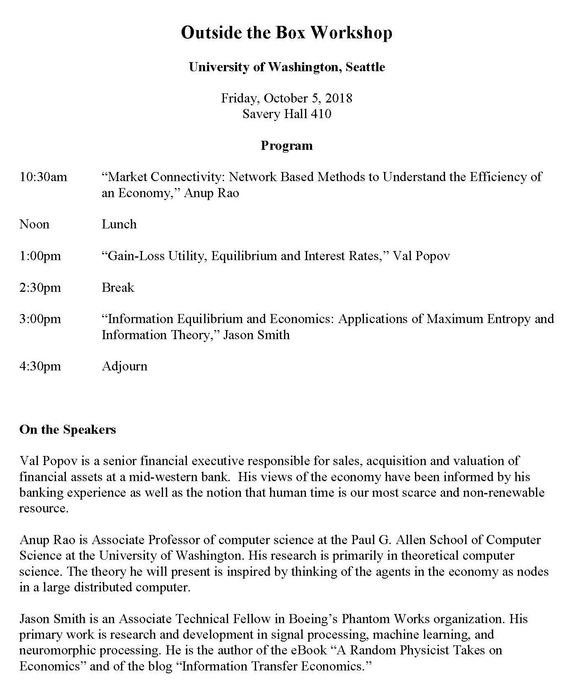

Yesterday, I participated in the "Outside the Box" Workshop at the University of Washington Economics department organized by Fabio Ghironi \[meeting agenda below\]. I had a great time, and there was a lot of enthusiastic engagement from the audience throughout the day. Thank you to Fabio for organizing this — I was grateful for the opportunity.

Here are some links to my talk (let me know if my Google Drive settings are incorrect):

-   \[[download pdf](https://drive.google.com/file/d/1EidnlruyMBbXjJ00WMnzNC__pzdW2TeH/view?usp=sharing)\]
-   \[[download pptx](https://drive.google.com/file/d/1MgB8qQ4cDzN83MFOHEwD20gOWt-MA3qX/view?usp=sharing)\]
-   \["[Twitter talk](https://twitter.com/infotranecon/status/1076572663261188096)"\]

They're both 67 slides (plus a few back-ups) for a 90 minute presentation \[1\]. The main difference is that the PowerPoint version has animations that function on slides 21, 22, and 56.

There were a couple questions that have been addressed in blog posts in the past (I talked about Christopher Sims' work \[[here](https://informationtransfereconomics.blogspot.com/2016/09/channel-capacity-and-rate-distortion-in.html)\], I've constructed the [three equation NK DSGE model](https://informationtransfereconomics.blogspot.com/2016/08/dsge-part-5-summary.html) using information equilibrium as well as [the IS-LM model](https://informationtransfereconomics.blogspot.com/2017/01/the-islm-model-reference-post.html), and the direction of information flow can actually go either way because of the mathematical properties of information equilibrium \[[here](https://informationtransfereconomics.blogspot.com/2015/05/the-mathematical-properties-of.html), [here](https://informationtransfereconomics.blogspot.com/2016/10/invariance-under-inversion.html)\]) which allow you to write _A_ ⇄ _B_ with IT index _k_ instead as _B_ ⇄ _A_ with IT index 1/_k_.

However, the big question that I don't think I answered in a completely satisfactory manner was about where the dynamic equilibrium — the constant (logarithmic) rate of decline of the unemployment rate — came from in terms of the real world. My explanation in terms of the matching function \[[here](https://informationtransfereconomics.blogspot.com/2017/01/matching-theory-and-employment-in.html), [here](https://informationtransfereconomics.blogspot.com/2017/09/search-and-matching-ii-theory.html)\] was (in my view) incomplete. But it did seem that the idea that the unemployment rate naturally falls until it is pushed up by recessions was new perspective to the audience. I am planning on writing a more extensive blog post about it in the future \[[now available](https://informationtransfereconomics.blogspot.com/2018/10/unemployment-continues-to-decline-why.html)\].

I don't have the slides for the other talks, but they are based on papers from [Anup Rao](https://arxiv.org/abs/1702.03290) \[arXiv\], and [Val Popov](https://papers.ssrn.com/sol3/papers.cfm?abstract_id=3227833) \[SSRN\]. My talk was based on [my recent paper](https://papers.ssrn.com/sol3/papers.cfm?abstract_id=3094757) \[SSRN\].

**Footnotes:**

\[1\] This may seem like a lot, but a sizable fraction of the slides are actually "build" slides where just a couple lines or pictures change. While there are animations that can be implemented to accomplish this on a single slide, those animations often don't translate to different formats (e.g. pdf). This makes the presentations a bit more portable. As a general rule, I try to aim for 2 minutes per slide with leaving about 10 minutes for questions.
