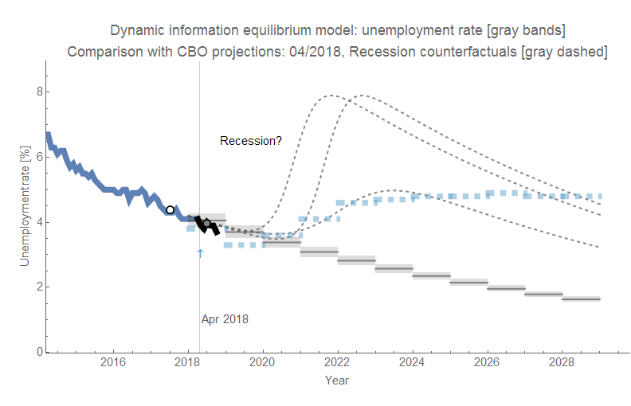

The Congressional Budget Office (CBO) forecast the unemployment rate over the next ten years [back in April 2018](https://www.cbo.gov/publication/53651). Their model (blue dashed line segments) is a pretty standard "natural rate"-like (equilibrium rate) model where unemployment has some non-zero equilibrium level (here, about 4.8%) it would eventually reach (shown in the graph above). However, nothing analogous to the path they propose nor the equilibrium level it sustains has ever been observed in [US unemployment data](https://fred.stlouisfed.org/series/UNRATE) over any 10-year period.

Of course, the path from the dynamic information equilibrium model (DIEM, gray bands) over the same period (conditional on no recession) has also never been observed — at least for that length of time. It has been observed over e.g. the past 10 years, but the additional 10 years would make it a twenty year continuous decline in unemployment. This seems unlikely, but then [Australia has done it with only a few blips](https://fred.stlouisfed.org/series/LRHUTTTTAUM156S) — all much smaller than US recessions (unemployment rose about 1.5 percentage points during the Global Financial Crisis).

However, that unbroken decline would also make it a 20-year period without a recession, only seen in a couple countries (like the aforementioned Australia). Therefore I added a few possible counterfactual recession scenarios (gray dashed lines) to compare to the CBO forecast. Two of the scenarios have a height (severity) and width (measuring the steepness of the unemployment increase) taken from the average of the post-war recessions (7.9%, and rising over ~ 4 months, respectively). These two have different onsets: the first turns around during 2019 just like the CBO forecast, and the second takes off when the CBO forecast rises above the DIEM forecast. A third counterfactual matches the rise of the unemployment rate in the CBO forecast along with the height. This third counterfactual is effectively the recession that the CBO is forecasting from the standpoint of the DIEM.

One benefit of the DIEM is that it forecasts paths of unemployment that have observational precedent. A drawback to this is that if unemployment begins to exhibit behavior that has never been seen (like remaining constant for almost 8 years), it is unlikely the DIEM will be able to follow along. This makes the DIEM falsifiable, unlike the equilibrium rate models. Equilibrium rate models only have to claim that a recession intervened, and that unemployment will reach its equilibrium in another 10 years. But then, what's the use of an equilibrium rate that is never observed?

...

PS I'm not impugning the work of the CBO, which is tasked to forecast based on traditional understanding of the macroeconomy. However, most economists seem to only forecast a few quarters into the future (understandable) and the oddity of the traditional understanding (especially its lack of precedent in empirical data) only comes out over longer horizons. The Fed typically puts this as a vague "longer run" column in their [projection materials](https://www.federalreserve.gov/monetarypolicy/files/fomcprojtabl20180926.pdf) \[pdf\]. The CBO forecast is one of the few to show what this looks like explicitly — in a sense, it's more honest.
