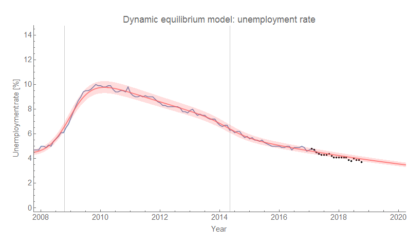
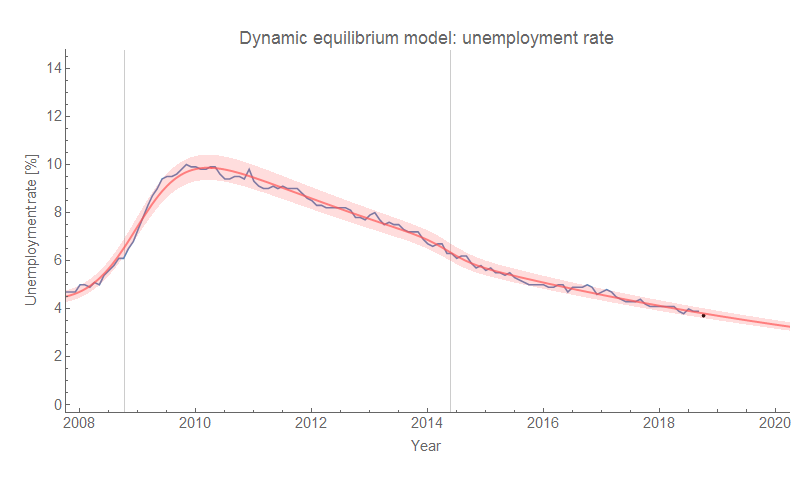

The unemployment data came out the morning of the [workshop at the UW economics department](https://informationtransfereconomics.blogspot.com/2018/10/outside-box-workshop.html) I participated in, so my plot of the unemployment rate in my presentation was out of date by a month's worth of data. Here's the updated plot — the 3.7% unemployment rate falls a bit below the forecast (and there appears to be a general positive bias to the model \[1\]):

Some of the questions I got at my talk were about the process behind the observation of the constant negative (logarithmic) slope of the unemployment rate outside of a recession. Overall, this seemed to be the empirical observation that contrasted most with the typical view in economics (either some equilibrium rate or something like a natural rate). I knew that it was, and it was part of the reason I chose the labor market as the primary focus of my talk \[2\]. My answer was some vague hand-waving about the matching function. However, I'll try to answer it a bit more coherently here.

[information equilibrium Cobb-Douglas matching function](https://informationtransfereconomics.blogspot.com/2017/01/matching-theory-and-employment-in.html)

where $H$ is JOLTS hires, $V$ is JOLTS vacancies (openings), and $U$ is the level of unemployment (number of unemployed people). Taking the logarithm, we obtain:

Now let's subtract $(a+b) \log L$ (the size of the labor force) from both sides. After some re-arranging, we get:

The right hand side is the unemployment rate $u$ (ratio of unemployed to the labor force). Taking the time derivative, we get:

The right hand side is the empirically observed to be a constant rate of decline of the unemployment rate (outside a recession). Since the terms on the left hand side \[3\] are all positive (increasing total number of job openings, increasing population, increasing total number of hires), we can see that the reason the slope is negative is because of labor force growth and job openings growth — and labor force growth is fairly tightly correlated with economic growth. As I put it in the talk, economic growth and the matching function eat away at the stock of unemployed people over time.

Now $\alpha$ being negative is **_not_** a foregone conclusion — the parameters of the matching function and the rate of population growth could be such that the unemployment rate increases (or stays flat) over time. So overall, the  slope of the unemployment rate outside of recessions is a measure of matching efficiency (high (absolute value) slope = efficient, low slope = not efficient).

Interestingly, a look at the data for the [unemployment rate by education level](https://informationtransfereconomics.blogspot.com/2017/02/heterogeneous-labor-supply-shocks.html) finds that the efficiency is highest (and about equal) for people with college degrees or higher as well as high school degrees. It is lower for people with "less than high school", but is lowest for people with "some college". One way to interpret this is that having completed college or high school improves matching (completion serves as an indicator), while not finishing high school or not finishing college makes job matching more difficult (e.g. harder to evaluate than someone who is a high school graduate or a college graduate).

Additionally, matching efficiency by race is actually [comparable for black and white people](https://informationtransfereconomics.blogspot.com/2017/07/racial-disparities-in-unemployment-rate.html). This does **_not_** mean discrimination doesn't exist — just like how companies can heuristically evaluate college graduates with the same "efficiency" as high school graduates doesn't mean high school graduates are paid the same or treated with the same respect in the workforce as college graduates. It'd be better interpreted as companies having a better idea how to match high school graduates with high school graduate jobs — and, in the case of race, black people with "black" jobs. By efficiency, we don't mean an objective "good"; making prejudiced choices is likely faster and cheaper than striving to be unbiased despite being wrong. Higher "efficiency" could mean _more_ discrimination.

...

**Update 13 May 2019**

I had forgotten I had put together [a model of this a few years ago](https://informationtransfereconomics.blogspot.com/2015/03/entropy-and-unemployment.html). The first cell is unemployment, and the others are (four) other jobs. Here, the lowest unemployment rate is about 20% (i.e. 1/5 of the jobs with an equilibrium uniform distribution). In the limit of lots of other jobs, the "unemployment sector" becomes a vanishingly small and we could say that _u_ ~ 0% in the long run (as it is in the dynamic equilibrium model since _d/dt_ log _u_ ~ constant). Random transitions from different sectors results in the most likely distribution — a uniform one.

**Footnotes:**

\[1\] This is likely due to beginning the forecast not just soon after a shock, but also at a point when the data was undergoing a positive fluctuation. Re-fitting the parameters, makes everything fit a bit better — but the recent data is still a bit low:

\[2\] Not only was this the most empirically successful aspect, but also one that showed a significant contrast with the traditional approaches.

\[3\] Also, if we assume the matching function has constant returns to scale (i.e. $a + b = 1$, as is empirically plausible per Petrongolo and Pissarides (2001)), we can simplify a bit (where $h$ is the hires rate, and $v$ is the vacancy rate):
