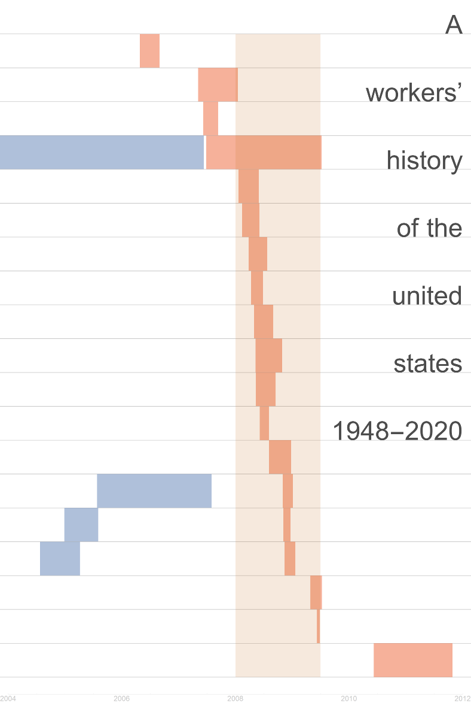

On my book blog, [I'm starting up the next book](http://www.arandomphysicist.com/2018/11/a-workers-history-of-united-states-1948.html) tentatively titled _A workers' history of the United States 1948-2020_ based on some of the [dynamic information equilibrium model](https://papers.ssrn.com/sol3/papers.cfm?abstract_id=3094757) results and [macroeconomic seismograms](https://informationtransfereconomics.blogspot.com/2018/02/economic-seismographs-labor-and.html). Take a look ...

