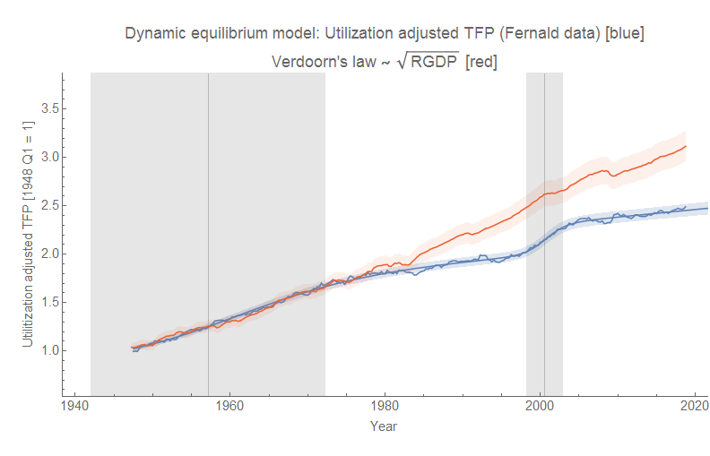
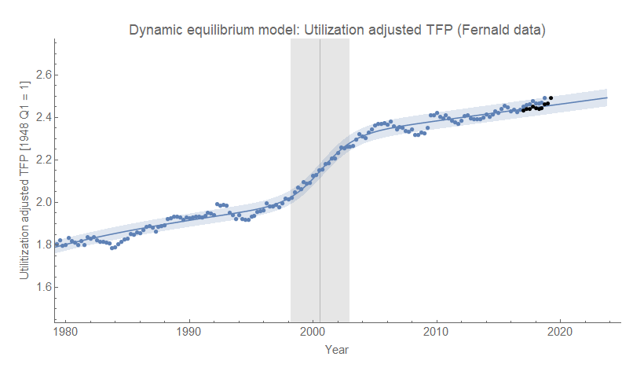
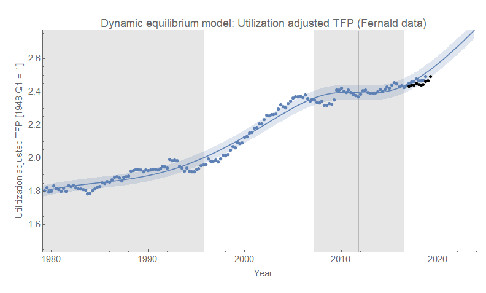

Productivity [came up on Twitter yesterday](https://twitter.com/infotranecon/status/1067943189913382912), and I put together a quick [dynamic information equilibrium model](https://papers.ssrn.com/sol3/papers.cfm?abstract_id=3094757) (DIEM) of the utilization-adjusted Total Factor Productivity (TFP) [data curated by John Fernald at the FRBSF](https://www.frbsf.org/economic-research/indicators-data/total-factor-productivity-tfp/). First, let me note that I generally think of TFP as [phlogiston](https://noahpinionblog.blogspot.com/2012/08/the-perils-of-phlogistonomics.html). However, this case is a good example of potential ambiguity in finding the dynamic equilibrium.

The TFP data is actually pretty well described by the DIEM, but its possible to effectively exchange the regions of the data that are "shocks" and the regions of the data that are "equilibrium". In this first graph, equilibrium is from the start of the data series until the 70s and 80s (a negative shock) and then in equilibrium again until the 2000s, followed by another negative shock after the Great Recession.

[Verdoorn's law](https://en.wikipedia.org/wiki/Verdoorn%27s_law)_d/dt__P_ _d/dt__RGDP_[AIC](https://en.wikipedia.org/wiki/Akaike_information_criterion)**_positive_**

Of course, there are other reasons to prefer the second fit — e.g. it [matches better with the UK data](https://informationtransfereconomics.blogspot.com/2018/05/uk-productivity-and-data-interpretation.html), it has recognizable events (post-war growth, the financial bubbles). But the best way to show which one is right will be data. The first fit predicts a return to increased productivity growth soon. If higher growth doesn't return soon, it means each new data point requires re-estimating the fit parameters for events in the past — a sign your model is wrong. The second predicts continued productivity growth at the lower rate with any major deviations implying a new shock (not re-estimating parameters for old shocks).

But still, the math on its own is ambiguous. The difference in AIC isn't enough to definitively select one mode over another. Circumstantial evidence can help, but what's really needed is more time for data to accrue.

...

**Update 16 May 2019**

Not quite enough data has accrued yet ... but the data revisions are more consistent with the fit with shocks in the 60s and 2000s:

...

**Update 15 November 2019**

Still looking more like the "positive 2000s shock" than the "negative 2010s shock":

**Update 24 February 2021**

I'm declaring the 2000s positive shock the winner:

