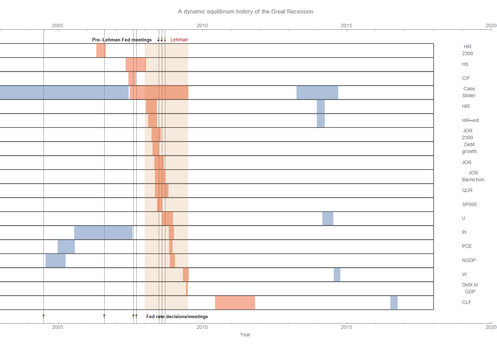
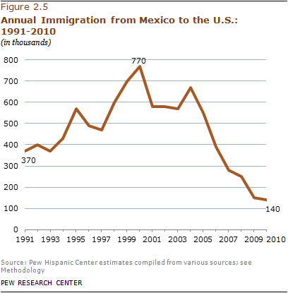

I mentioned at the beginning of this year [on my book website](http://www.arandomphysicist.com/2018/01/hows-this-book-thing-going.html) that I was thinking about writing another book about the macro history of the US as told through [dynamic information equilibrium](https://papers.ssrn.com/sol3/papers.cfm?abstract_id=3094757) and the resulting [economic seismograms](https://informationtransfereconomics.blogspot.com/2018/02/economic-seismographs-labor-and.html). I've been collecting the various models on this blog to put them together into graphics that tell at least one version of history. Previously, I've given evidence that [women entering the workforce leads](https://informationtransfereconomics.blogspot.com/2018/02/women-in-workforce-and-solow-paradox.html) nearly every other measure of growth and inflation in the 70s and 80s. Lately, I've been working on the Great Recession. Here's the seismogram (click to enlarge):

Red-orange indicates negative (i.e. bad) shocks, while blue indicates positive (i.e. good) shocks (rising unemployment is "bad", but rising income is "good"). The labels are identified in footnote \[1\].

While much of the focus of commentary about the recession was on the Lehman collapse and [the Fed meetings immediately preceding it](https://uneasymoney.com/2014/02/28/exposed-irrational-inflation-phobia-at-the-fed-caused-the-panic-of-2008/) (along with the fall in the stock markets as measured by the S&P 500), these actually come in the middle of the recession process . The first thing that happens **_by far_** is the drop in hires in construction (labeled "HIR 2300" based on the JOLTS code) in mid-2006. Around that time, [Paul Krugman (e.g.)](https://www.nytimes.com/2006/08/07/opinion/07krugman.html) was talking about a housing bubble deflating (he had been [forecasting it earlier](https://www.nytimes.com/2005/08/08/opinion/that-hissing-sound.html) in mid-2005) \[2\]. The shock to housing starts (HS) doesn't come until later (though the shock to starts occurs over a longer period, [you can see that hires begin to decline just before housing starts begin to decline](https://fred.stlouisfed.org/graph/?g=lRds)).  The drop in construction hires also comes right before the halt in the [Fed rate increases that had started in 2004](https://fred.stlouisfed.org/series/DFEDTAR).

Before the NBER-defined recession gets underway, there's a drop in conceptions ([per this NBER working paper](https://www.nber.org/papers/w24355)) that's roughly coincident with (but genuinely followed by) [two Fed conference calls in 2007](https://www.federalreserve.gov/monetarypolicy/fomchistorical2007.htm) about the financial markets reeling in the collapsing housing bubble (the negative shock to the Case Shiller index) as well as the first Fed rate cut. The rest of the stuff that is associated with a recession in the media (stock market drops, GDP declining, unemployment rate rising) all come much later during the NBER-defined recession.

Personal income (PI) continues to climb ahead of its typical pace through most of 2007, and [wage growth continues to increase](https://www.frbatlanta.org/chcs/wage-growth-tracker.aspx?panel=1) (i.e. accelerate) almost until the NBER recession end.

While I've heard many stories about excessive debt being a cause behind the Great Recession, most of the negative shocks to debt measures come later (i.e. debt became a problem _because_ of the recession). Although not shown in this graph, [consumer credit](https://fred.stlouisfed.org/graph/?g=lRJi) takes a hit only as the NBER recession is ending. This is not to say that debt levels didn't contribute to the _size_ of the recession (i.e. making it worse), but rather that they didn't contribute to its _timing_ (i.e causality).

Any causality analysis would put construction hires at the beginning of the story, but oddly the shock to construction _job openings_ comes along with the rest recession — barely leading the shock to job openings of all kinds. In fact, [there's a surge in openings](https://fred.stlouisfed.org/series/JTS2300JOR) around the same time. It's the largest difference in timing for all the JOLTS sectors. That is to say jobs were still being advertised in 2006 (until 2008), just fewer were being hired. This doesn't indicate a pessimism about the housing market (which seems like it would show a fall in openings), but rather a labor shortage of some kind. Were employers unwilling to raise wages? [Unemployment](https://fred.stlouisfed.org/series/UNRATE) had reached its lowest level since before the 2001 recession, so maybe there was a genuine shortage of workers.

### Was it xenophobia?

I am going to offer a speculative answer that I do not think I have ever seen offered as a possible reason for the Great Recession: xenophobia. [There were a series of protests](https://en.wikipedia.org/wiki/2006_United_States_immigration_reform_protests) from March of 2006 to against anti-immigrant legislation being introduced ([some of which passed](https://en.wikipedia.org/wiki/Secure_Fence_Act_of_2006), and in various jurisdictions [E-verify was mandated](https://en.wikipedia.org/wiki/E-Verify) in 2006 to prevent employers from hiring undocumented workers). The shock to construction hires begins right around the same time as those March protests, and every year since 2004 saw [a decrease in immigration from Mexico](http://www.pewhispanic.org/2012/04/23/ii-migration-between-the-u-s-and-mexico/):

The linked article doesn't get this causality right:

> _Immigration from Mexico dropped after the U.S. housing market (and construction employment) collapsed in 2006. By 2007, gross inflows from Mexico dipped to 280,000; they continued to fall to 150,000 in 2009 and were even lower in 2010._

According to their data, immigration started dropping _before_ 2006 (the peak is in 2004), but given noise in the data and the annual temporal resolution the best we can say is that construction employment and immigration from Mexico dropped approximately concurrently.

[I have written before](https://informationtransfereconomics.blogspot.com/2018/01/immigration-is-major-source-of-growth.html) on how much of an effect a drop of 2 million people in the labor force due to immigration restrictions would cause — about 1 trillion dollars in NGDP. Assuming a linear trend past 2007 in the increase in just undocumented immigrants ([using Pew data](http://www.pewresearch.org/fact-tank/2017/04/27/5-facts-about-illegal-immigration-in-the-u-s/)), by 2009 there were 1.8 million fewer undocumented immigrants (11.3 million) than would be expected by the trend (13.1 million). While there would need to be more detail added (accounting for the decline in documented immigration as well as fraction of those two populations in the labor force), this gives us an order of magnitude that is not trivial compared to the size of the Great Recession.

Again, this is speculative. However it is not implausible that the anti-immigrant sentiment of the mid-2000s ended the "housing bubble". Employers continued to look for workers in construction, but suddenly were unable to hire as many starting in 2006 due to declining immigration. The worst hit states in the housing crash were California, Arizona, Nevada, and Florida — the first three being major destinations for documented and undocumented immigrants from Mexico. Since even undocumented immigrants spend money at the same grocery stores you do, sales decline. Declining construction hires is followed by fewer housing starts, and when a new family can't find a bigger house with more rooms they'll not only delay having children but opt to hold off on that house. Housing prices decline from their peak, but by now the general economic outlook is mediocre enough that the Fed starts to lower interest rates in 2007. Pessimism sets in along with the rest of the recession and a financial crisis that goes global. 

...

**Update 6 November 2018**

A correspondent sent me a link to [some work by Kevin Erdmann](https://www.idiosyncraticwhisk.com/p/a-slide-deck-on-bubble-and-crisis.html) about how there was actually an under-supply of housing going into the 2008 recession. Now Erdmann is writing for Mercatus which generally means there is a possibility of an ideological slant or at least a particular view of how economies work. Here, that reasoning is an attempt to say there was no housing bubble because there was a "fundamental" reason (short supply). But then, there was a limited supply of [tulip bulbs](https://en.wikipedia.org/wiki/Tulip_mania) as well. If there was no housing bubble, then it's arguable that the Fed had unnecessarily tight monetary policy (i.e. the desired conclusion in this case). Seeing as monetary policy tends to lag other measures, it's probably not the cause (but may e.g. contribute to the broader conditions and the depth of the recession).

I also want to emphasize that it is almost entirely unlikely the shock to construction hires was the only causal factor. I see it more as a trigger or a straw that broke the camel's back — in an environment of higher interest rates and general pressure from policymakers to cool the housing market, a sudden shock to labor supply makes that "cooling" suddenly look worse in a way that could change one's outlook. In the information equilibrium approach, [it's sudden coordinated action](https://informationtransfereconomics.blogspot.com/2014/10/coordination-costs-money-causes.html) (e.g. panicking) causing agents to cluster in the state space that causes recessions. Sometimes that coordinating signal is the Fed, but it could easily be shock to labor supply due to an unwarranted immigration freak out.

...

**Footnotes:**

\[1\] The labels are:

**HIR 2300:** JOLTS hires, construction ([JTS2300HIR](https://fred.stlouisfed.org/series/JTS2300HIR))
**HS:** Housing Starts (HOUST)
**C/F:** [Conceptions/fertility](https://informationtransfereconomics.blogspot.com/2018/03/dynamic-equilibrium-model-fertility-as.html)
**Case Shiller:** [Case Shiller housing price index](http://www.econ.yale.edu/~shiller/data.htm) (also [here](https://fred.stlouisfed.org/series/CSUSHPINSA))
**HIR:** JOLTS [hires](https://fred.stlouisfed.org/series/JTSHIR)
**HIR-ext:** [Extended JOLTS hires data](https://informationtransfereconomics.blogspot.com/2018/10/extended-jolts-hires-series-and-2014.html)
**JOR 2300:** JOLTS job openings, construction ([JTS2300JOR](https://fred.stlouisfed.org/series/JTS2300JOR))
**Debt growth:** Growth of [debt](https://fred.stlouisfed.org/series/TCMDO) (All Sectors; Debt Securities and Loans; Liability, Level)
**JOR:** JOLTS [Job opening rate](https://fred.stlouisfed.org/series/JTSJOR)
**JOR Barnichon:** Job openings in data from [Barnichon (2010)](http://www.crei.cat/wp-content/uploads/users/pages/Barnichon_EconLet[1].pdf) \[pdf\]
**QUR:** JOLTS [quits](https://fred.stlouisfed.org/series/JTSQUR)
**SP500:** [S&P 500](https://fred.stlouisfed.org/series/SP500)
**U:** [U3](https://fred.stlouisfed.org/series/UNRATE) unemployment rate
**PI:** [Personal income](https://fred.stlouisfed.org/series/PI)
**PCE:** [Personal consumption expenditures](https://fred.stlouisfed.org/series/PCE)
**NGDP:** [Nominal Gross Domestic Product](https://fred.stlouisfed.org/series/GDP)
**W:** [Wage growth](https://informationtransfereconomics.blogspot.com/2018/02/dynamic-equilibrium-in-wage-growth.html) (Atlanta Fed)
**Debt to GDP:** Ratio of previous debt measure to NGDP
**CLF:** Civilian labor force ([CLF16OV](https://fred.stlouisfed.org/series/CLF16OV))

The arrows on the top of the diagram indicate [the two Fed meetings](https://www.theatlantic.com/business/archive/2014/02/how-the-fed-let-the-world-blow-up-in-2008/284054/) (black arrows) prior to the Lehman collapse (red arrow). The arrows on the bottom of the diagram show the first Fed rate increase since the 2001 recession, the beginning of the period of steady rates (mid-2006 to mid-2007) as well as the first rate cut going into the 2008 recession.

\[2\] I'm not tying to make any point here about "who saw the crisis coming" — only citing some news that I remembered from the time for context.
