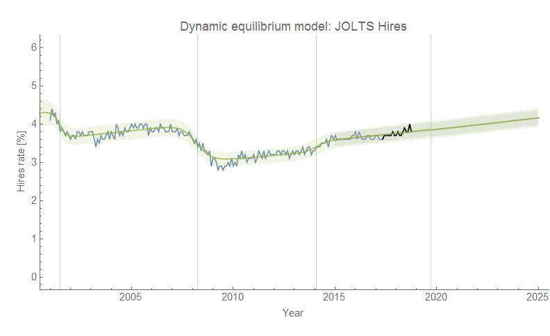
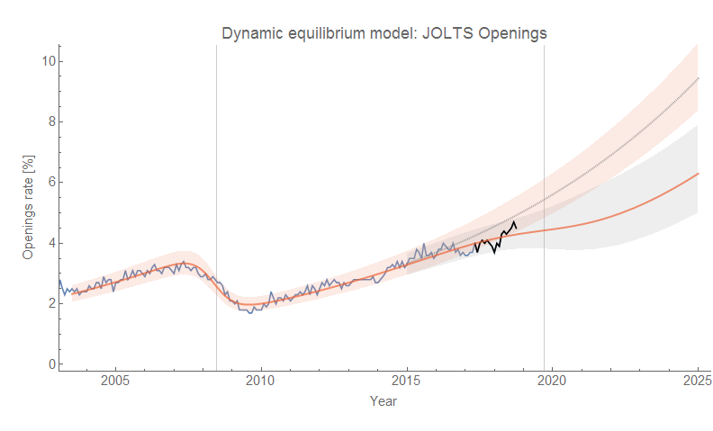
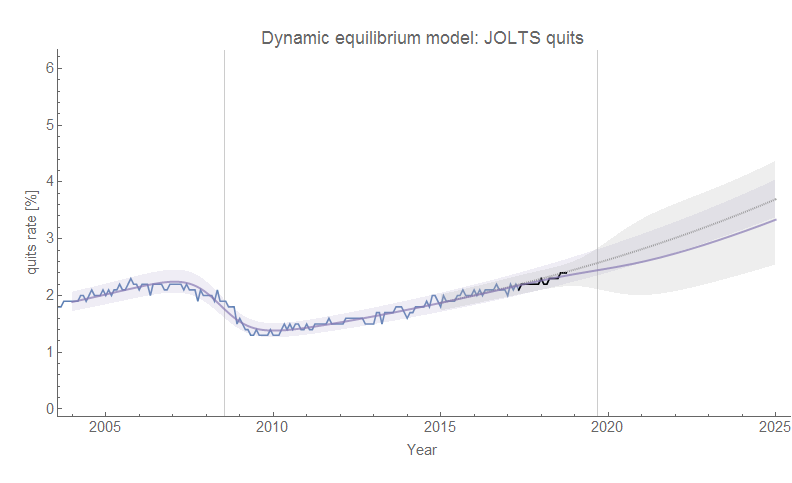
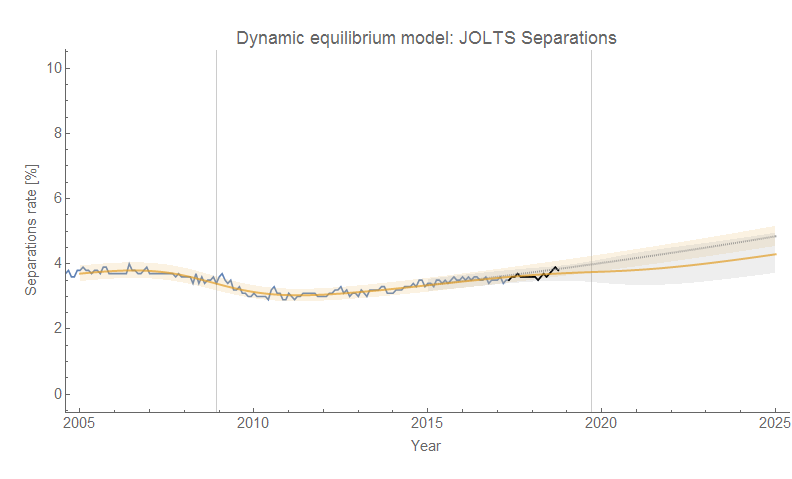
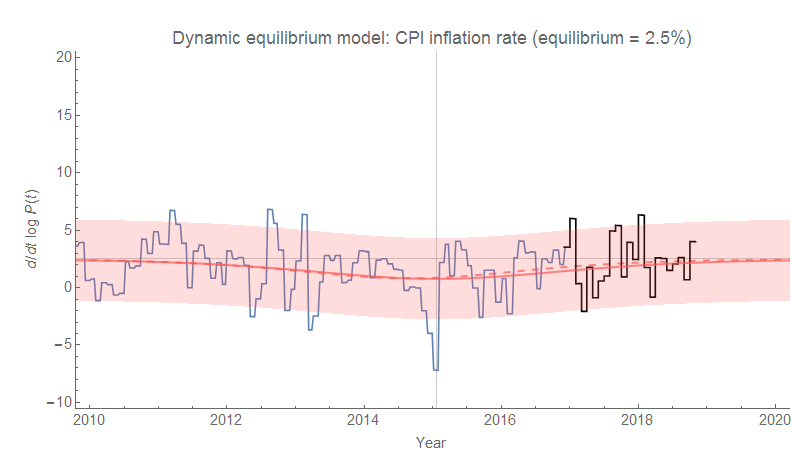
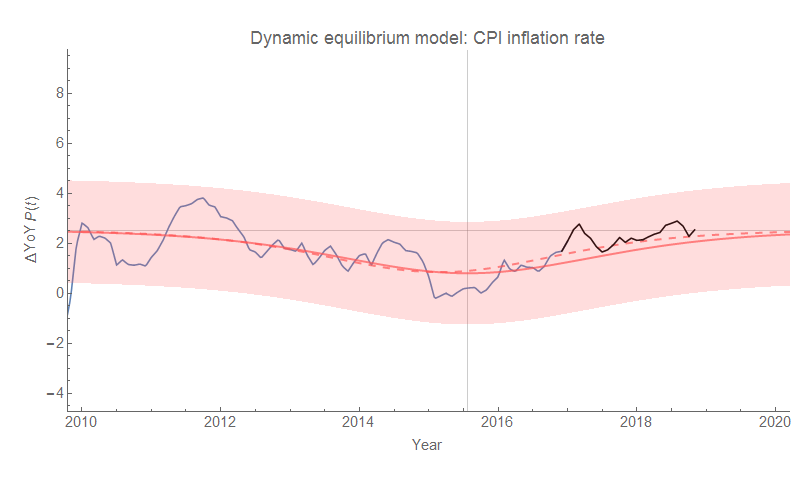
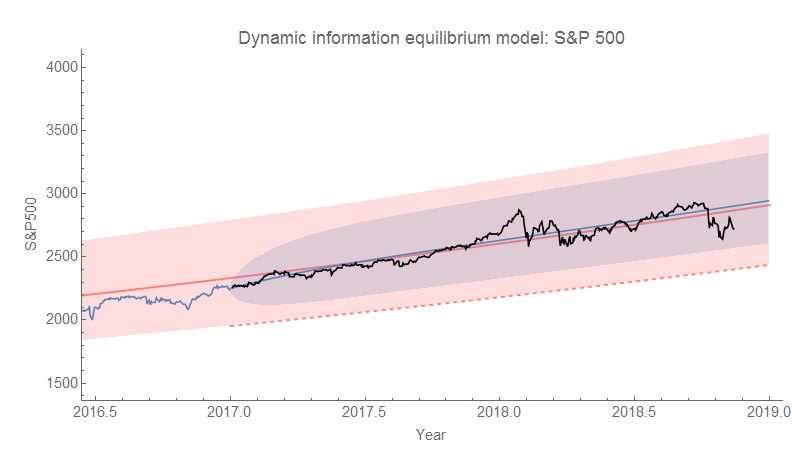
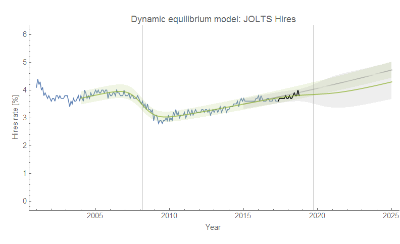

Checking in on the [dynamic information equilibrium model](https://papers.ssrn.com/sol3/papers.cfm?abstract_id=3094757) forecasts, and everything is pretty much status quo. The JOLTS hires data \[1\] is showing even fewer signs of a recession than before, but job openings is still on a biased deviation. [Based on this model](https://informationtransfereconomics.blogspot.com/2018/10/building-models.html) which puts hires as a leading indicator, we should continue to see the unemployment rate fall through February of 2019 (5 months from September 2018), at which point it will be 3.8 ± 0.2 % (90% CL) \[2\]. Additionally, CPI inflation is well within expected values. And finally, [the S&P 500 forecast](https://informationtransfereconomics.blogspot.com/2018/10/comparing-my-s-500-forecast-to.html) is still on a negative deviation, but within the norms of market fluctuations. As always, click to enlarge.

**JOLTS**

**CPI inflation (all items)**

**S&P 500**

**Footnotes:**

\[1\] The old hires without the [2014 mini-boom](https://informationtransfereconomics.blogspot.com/2018/10/extended-jolts-hires-series-and-2014.html) is here:

\[2\] October's 3.7% was on the low end of the CL — it was expected to be 3.9 ± 0.2 % (90% CL), so there might be a bit of mean reversion between now and March (when the February numbers come out).
