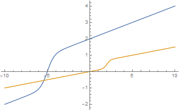
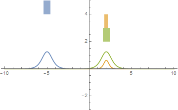
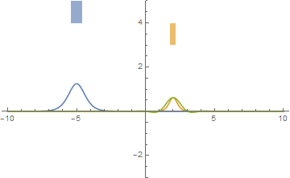
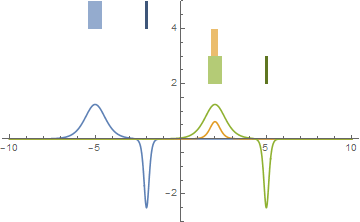
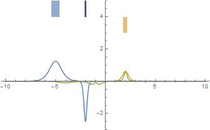
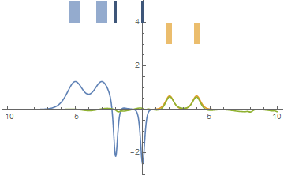
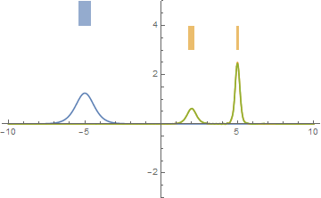

In my travels through the econoblogosphere and econ Twitter, I've come across mentions of Granger causality from time to time. I do not trust it as a method for determining causality between time series.

If you need to know what it is, [the wikipedia article on it is terrible](https://en.wikipedia.org/wiki/Granger_causality), and basically you should just refer to either Toda and Yamamoto (1995) or [Dave Giles excellent description](https://davegiles.blogspot.com/2011/04/testing-for-granger-causality.html) of what the process actually involves whenever you have co-integrated series which is pretty much all the time in macro.

However, Granger causality was developed before the idea of [cointegration](https://en.wikipedia.org/wiki/Cointegration). From [Granger's Nobel lecture](https://www.nobelprize.org/uploads/2018/06/granger-lecture.pdf) \[pdf\]:

> _When the idea of cointegration was developed, over a decade later, it became clear immediately that if a pair of series was cointegrated then at least one of them must cause the other._ 

Or as Dave Giles put it:

> _Both of these ... time-series have a unit root, and are cointegrated ..., we know that there must be Granger causality in one direction or the other (or both) between these two variables._

Since almost every macro time series is cointegrated, you can always find Granger causality one way or another (or both). Since almost every macro time series is cointegrated, you really have to work (basically follow the entire process Giles describes). There are lots of interim results that are needed to judge whether or not you can trust the results from determining cointegration to the number of lags to the results of the test in both directions.

Even then, there are things that will pass Granger causality tests that represent logical fallacies or bend our notion of what we mean by causality. I give some examples, using the dynamic information equilibrium approach — which turns out to provide a much better metric for causality.

Let's say we have two ideal cointegrated series where the noise is much much smaller than the measurement. The only thing adding noise does is make the _p_\-values worse.

The way these two series are set up, only the first (blue) could potentially Granger-cause the second (yellow) because the second is effectively constant (after first differences or subtracting out the linear trend to remove the cointegration) for all times t < 0. Therefore, by construction, we'd only have to test that yellow depends on a possible linear combination of its own lagged values and the lagged values of the blue series since blue cannot depend on lagged values of yellow (they're all approximately constants after first differences or zero after subtracting the linear trend). And depending on the temporal resolution, the yellow curve does not strongly depend on lagged values of itself. This sets up a scenario where Granger causality is effectively satisfied if we can represent the yellow curve in terms of lagged values of the blue curve.

Here are the derivatives after subtracting the linear trend; the green curve is the blue curve shifted to the center of the yellow (it's still a bit wider). A representation in terms of an "[economic seismogram](https://informationtransfereconomics.blogspot.com/2018/03/shock-cluster-analysis-and-some-new.html)" appears above the curves.

Except in cases where there is too much noise, too little temporal resolution or the blue shock is much wider than the yellow one, the yellow shock can nearly always be reconstructed  in terms of a linear combination of the lagged values of the blue curve (the logistic shocks have approximately Gaussian derivatives, which are used in linear combination in e.g. [smooth kernel estimation](https://en.wikipedia.org/wiki/Kernel_density_estimation)). E.g. for integer lags (_p_ < 0.01 for lag 7) (green curve is the linear combination of the lagged blue curve):

This is great, because it means that — except in extreme cases — an economic seismogram where shocks precede each other is sufficient to satisfy Granger causality. But this is also problematic for Granger causality for exactly the same reason I wouldn't use a single shock preceding another as the sole basis for causality because of the _[post hoc ergo propter hoc](https://en.wikipedia.org/wiki/Post_hoc_ergo_propter_hoc)_ fallacy. Granger causality is effectively a test of whether changes in one series precede changes in another, and calling it "causality" is problematic for me. A better wording for a successful test in my opinion would be "Granger comes before" rather than "Granger causes". However, a failure of the test (i.e. the yellow curve does not 'Granger cause' the blue one) is a more robust causality result because it is based on physical causality — it is literally impossible for an event outside another event's past light cone to have caused that event. As Dave Giles puts it, it's a better test of Granger non-causality: affirming that the yellow curve did not cause the blue one more than affirming the blue one caused the yellow one.

But it gets weirder if we give the earlier shock a different shape than the later one (the darker bands are negative in the economic seismogram, green is simply the shifted version of the blue function again \[_update: replaced with correct figure_\]):

It is actually possible to fit the lagged blue function to the yellow one well enough to achieve _p_ < 0.01 for the coefficients:

You can do even better at higher temporal resolution (which also allows more lags):

This different-shaped shock also satisfies Granger causality (the blue series Granger-causes the yellow series), but I would say that we should definitely have less confidence in the causality here — it really is more of a case that the blue shock just "Granger comes before" the yellow one. I would have more confidence if there e.g. two shocks in this case:

What is also strange is that you can also have a single shock Granger cause a pair of later shocks:

Again, I'd really just say that the blue shock "Granger comes before" the yellow ones (despite the green fit being almost perfect).

Anyway, those are some of the reasons why I don't really trust Granger causality as a method especially when there are limited numbers of events (common in macro) — unless it's Granger non-causality, which is fine! 

If I was up on my real analysis, I'd probably try to prove a theorem that says the economic seismograms satisfy Granger causality and under which conditions. The temporal resolution needs to be high enough, noise needs to be low enough, and the earlier shocks need to be sufficiently narrow but I don't have specific relationships. The last one is actually temporal resolution dependent (i.e. increasing the number of samples and the number of lags eventually allows a wide shock to Granger cause a narrow one). But I think a good take away here is that reasoning with these diagrams using multiple shocks is actually better than Granger causality.
