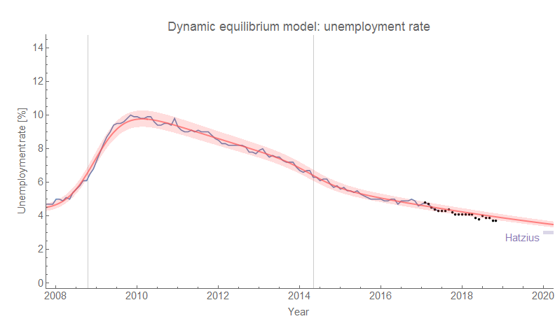
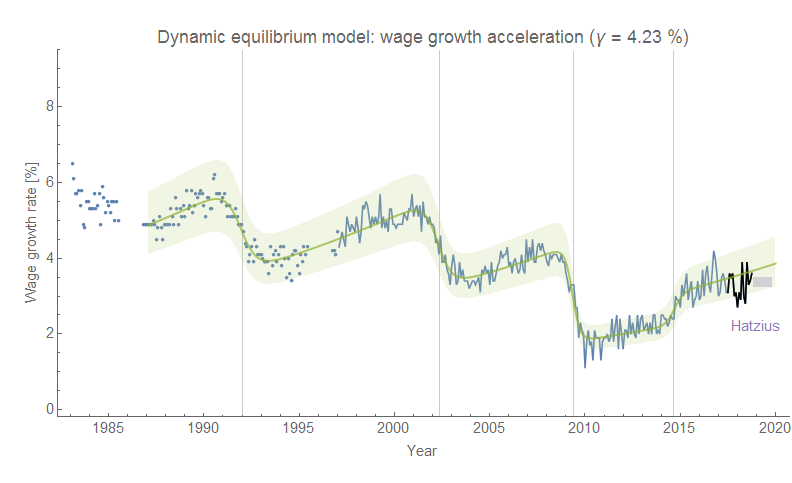
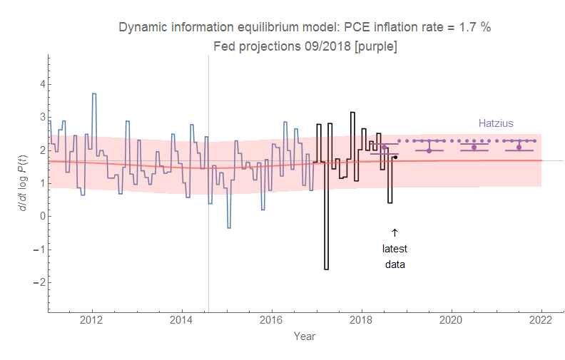

Jan Hatzius [made some macro projections](https://finance.yahoo.com/news/goldman-says-fed-needs-avoid-dangerous-overheating-154158689.html) about wages, unemployment, and inflation:

> _Goldman’s Jan Hatzius wrote Sunday that unemployment should continue to decline to 3% by early 2020, noting the labor market also has room to accommodate more wage growth. Hatzius predicted that average hourly earnings would likely grow in the 3.25% to 3.50% range over the next year. ... For now, Goldman has a baseline forecast of 2.3% for core PCE ..._

Well, these are all roughly consistent with Dynamic Information Equilibrium Model (DIEM) forecasts from almost two years ago (early 2017, except for the wage growth which is [from the beginning of this year](https://informationtransfereconomics.blogspot.com/2018/02/dynamic-equilibrium-in-wage-growth.html)). Hatzius' unemployment forecast is a bit lower (I'm currently guessing there will be a recession that will begin the raise unemployment in the 2020 time frame [based on JOLTS data](https://informationtransfereconomics.blogspot.com/2018/06/jolts-data-and-2019-recession.html) making both of these forecasts effectively "counterfactuals"). His wage forecast is consistent but biased low compared to the DIEM, while his inflation forecast is consistent but biased high compared to the DIEM. 

Of course, there's a hedge:

> _Hatzius said that the economic outlook is still subject to change from a number of geopolitical factors, such as the U.S. midterm elections on Tuesday \[today\] ..._

The DIEM forecasts will generally only change if there is a recession, but as we haven't seen any real impact on JOLTS hires ([see here](https://informationtransfereconomics.blogspot.com/2018/10/building-models.html)) we should [continue to see](https://informationtransfereconomics.blogspot.com/2018/10/jolts-day-october-2018.html) the unemployment rate fall through January of 2019 (5 months from August 2018) and wage growth increasing through July 2019 (11 months from August 2018).

Here are the graphs — click to enlarge:

