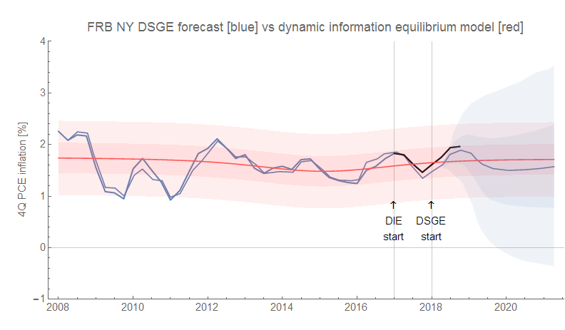
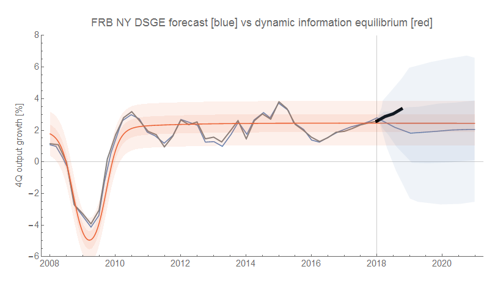
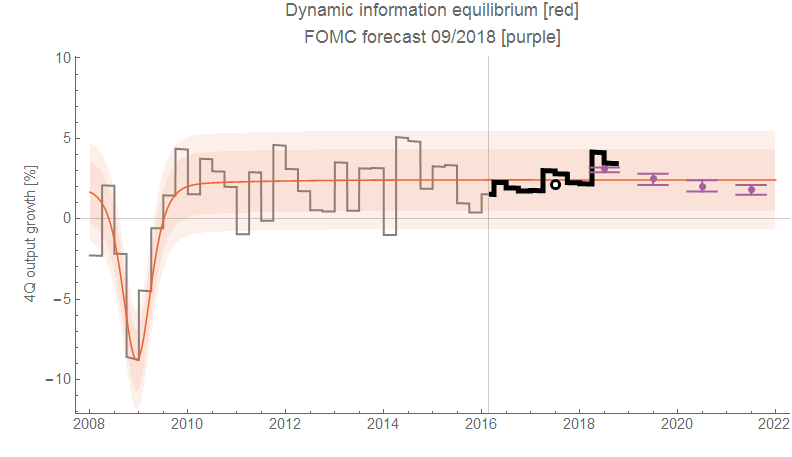

No lunch break today, so I'm late with these updates. The Q3 GDP numbers and related metrics are out. No surprises, but here are the various forecasts and head-to-heads I'm tracking.

First, here's RGDP growth and inflation from the FRBNY DSGE model and the dynamic information equilibrium model (DIEM) (click to enlarge):

The post-FRBNY forecast data is in black there. Here's RGDP growth over the entire DIEM forecast period (black is post-DIEM forecast data) alongside the FOMC forecast (annual averages):

