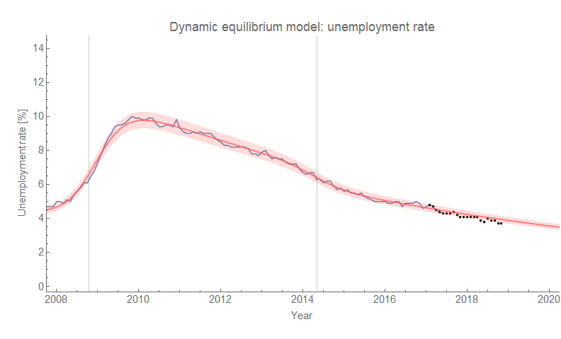
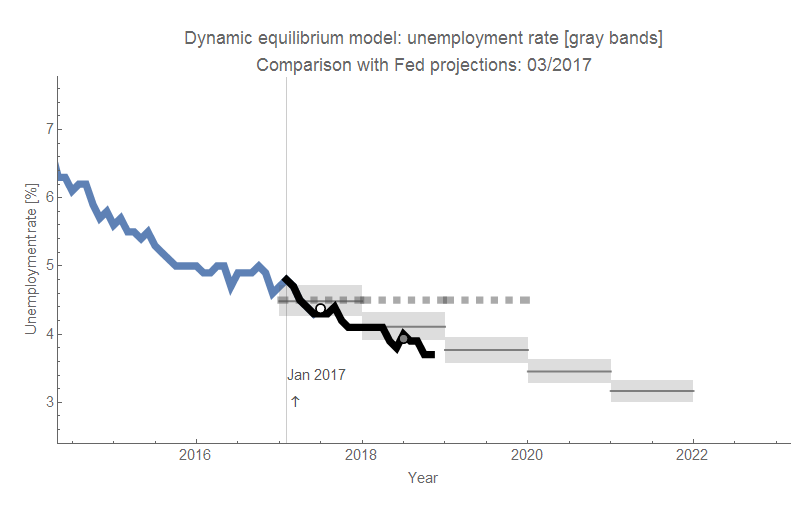
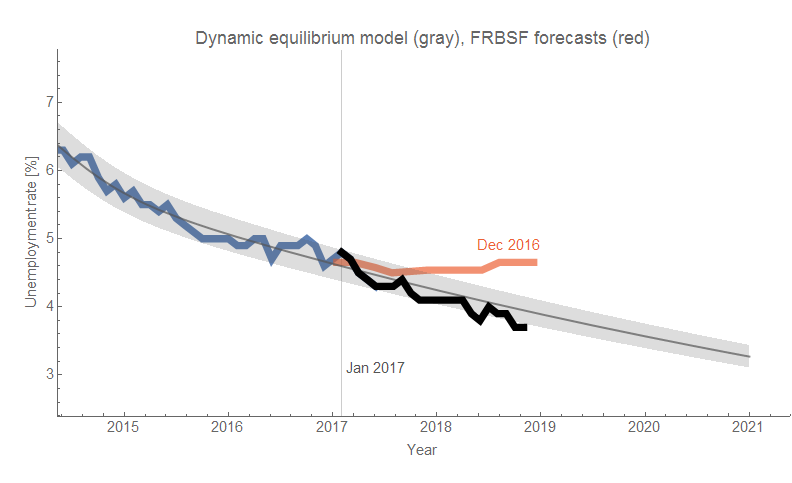
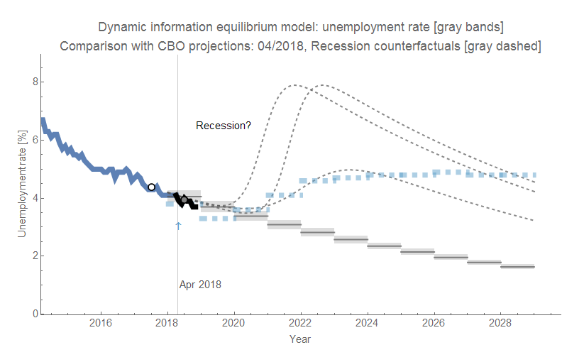
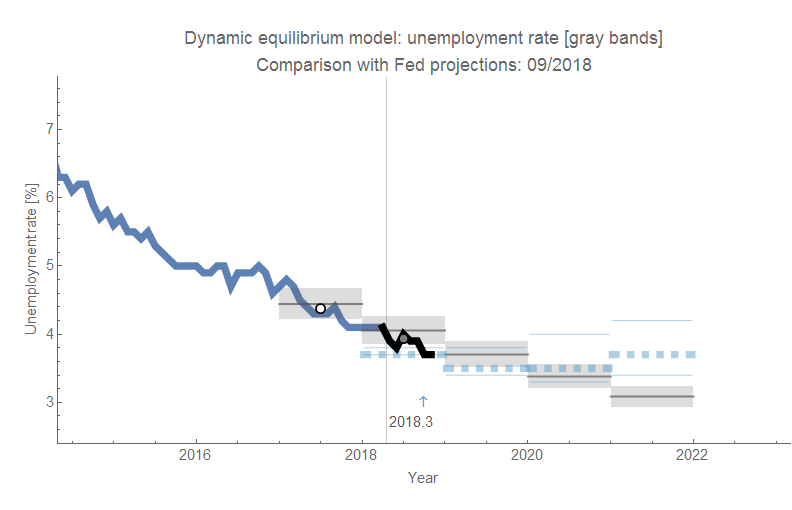
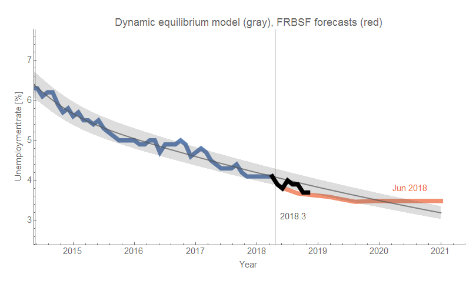
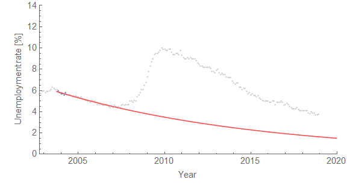

It looks even better compared to the competition. The FOMC and FRBSF forecasts of the same vintage definitely didn't capture the decline, with the latter being off by about a full percentage point (click to enlarge):

### New fair forecast comparisons

I also put together some new (fair) comparisons with projections from the CBO, FRBSF, and FOMC starting in 2018. Note that I actually expect the path of unemployment to follow something like one of the "recession" curves in the CBO forecast graph because of what look like leading signs of a recession [in the JOLTS data](https://informationtransfereconomics.blogspot.com/2018/10/jolts-day-october-2018.html) ([which lead unemployment by several months](https://informationtransfereconomics.blogspot.com/2017/07/jolts-leading-indicators.html)). In the meantime, all we can do is project what the model shows and wait for the signal to appear in unemployment data \[1\].

**Footnotes:**

[See this post](https://informationtransfereconomics.blogspot.com/2017/04/determining-recessions-with-algorithm.html)

