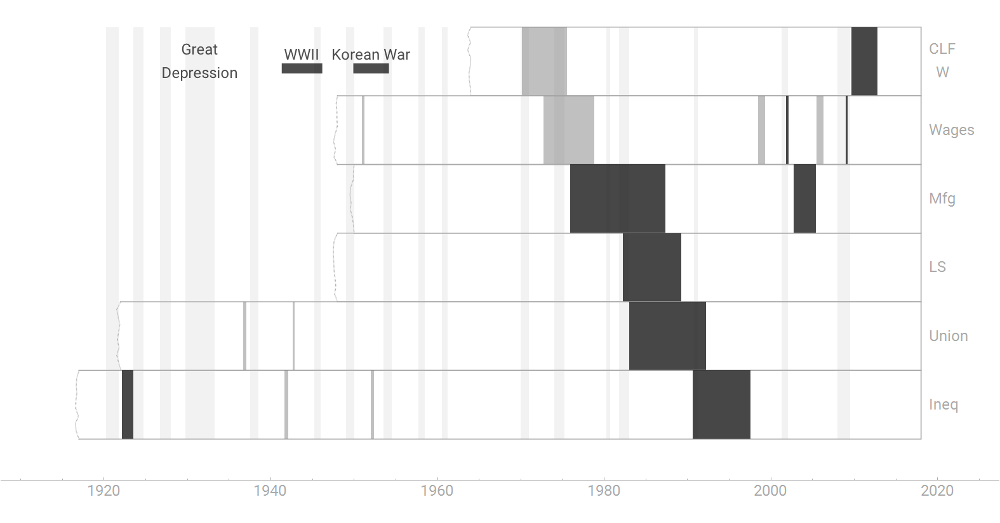
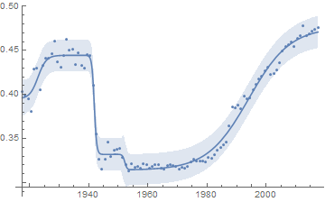
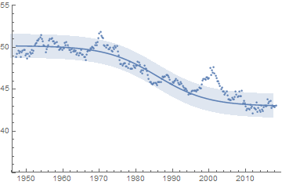

I've started writing the first draft of [my next book](http://www.arandomphysicist.com/2018/11/a-workers-history-of-united-states-1948.html), so I've been trying to gather up all the [dynamic information equilibrium model](https://papers.ssrn.com/sol3/papers.cfm?abstract_id=3094757) results into [economic seismograms](https://informationtransfereconomics.blogspot.com/2018/03/shock-cluster-analysis-and-some-new.html) \[1\] to try to provide a complete picture. In the gathering, there have been some unexpected insights — this time about unions and their effect on inequality. Here's the seismogram in the new style that can be displayed on a Kindle \[2\] (click to enlarge):

This shows the civilian labor force (women), wages, manufacturing employment (as a fraction of total employment), the labor share of output (nominal wages/NGDP), unionization, and income inequality (using Emmanuel Saez's data).

One of the interesting things I noticed was that unionization and inequality show almost exactly the same pattern: each bump up in unionization sees a bump down in inequality a few years later, and the decline of unionization in the 80s is followed by rising inequality in the 90s.

What's also interesting is that the decline in the labor share of output starts happening before unionization declines — i.e. a decline in unions wasn't the predominant way labor lost its share of output. I've talked about my hypothesis for a more likely causal factor before: labor share declined as women entered the workforce [because the US pays women less than men](https://informationtransfereconomics.blogspot.com/2018/06/women-in-workforce-and-labor-share.html). A rough order of magnitude calculation where capital just pockets the extra 30 cents on the dollar they save by hiring a woman gets the expected decline in labor share about right.

...

**Update:**

The unionization model [is discussed here](https://informationtransfereconomics.blogspot.com/2018/09/labor-day-and-declining-union-membership.html):

And here are the models of inequality and labor share (also [here](https://informationtransfereconomics.blogspot.com/2018/06/women-in-workforce-and-labor-share.html) for the latter):

**Footnotes**

\[1\] One of the other things I realized in the process was that it's not seismo**_graph_**, which is the machine, but [seismo**_gram_**](https://en.wikipedia.org/wiki/Seismogram). I went back on the blog and corrected all the references in the posts.

\[2\] Comments are welcome, but be sure to click to see the higher resolution version. Dark bands are negative shocks (or "bad" shocks), while the lighter bands are positive (or "good" shocks).
