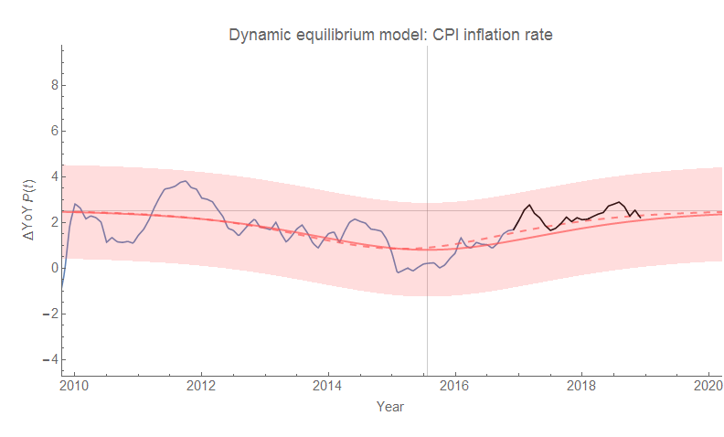
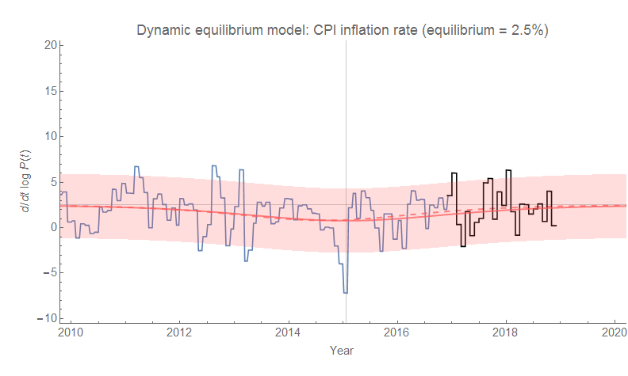
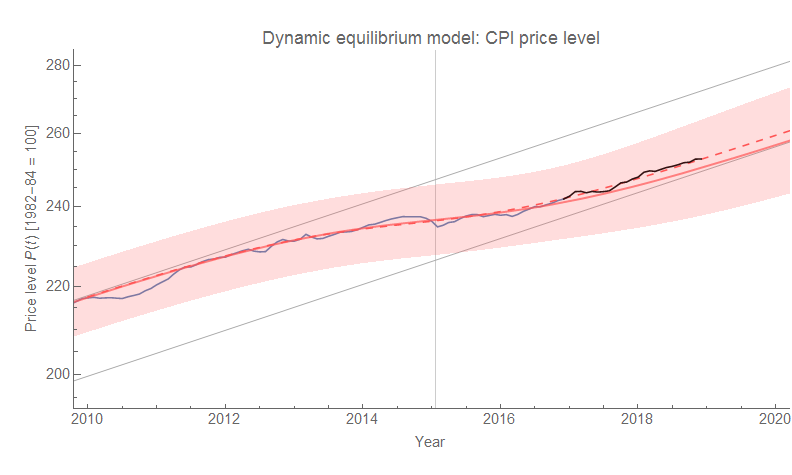

Unlike [these forecasts](https://informationtransfereconomics.blogspot.com/2016/02/thought-experiment.html), this one of US CPI inflation has been doing well (both year over year and continuously compounded, click to enlarge):

[Here are the details](https://informationtransfereconomics.blogspot.com/2018/03/cpi-data-and-end-of-lowflation.html) about the re-estimate of the size of the post-2008 recession demographic shock (shown as the dashed line in the graphs).
