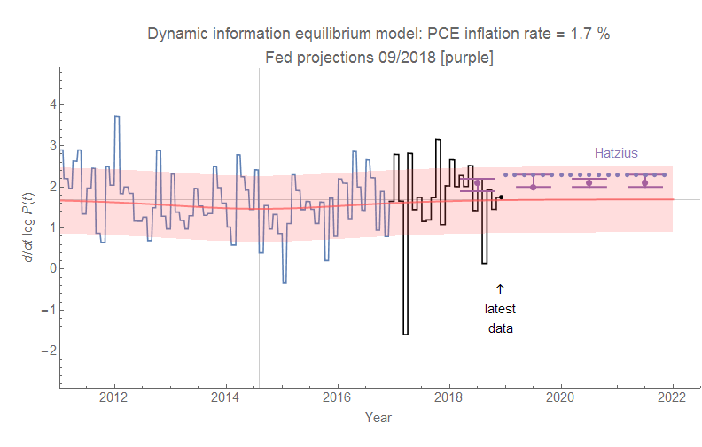

This is another dynamic information equilibrium model forecast that [has been ongoing for almost two years](https://informationtransfereconomics.blogspot.com/2017/03/the-quantity-theory-of-labor-and.html) — core PCE inflation:

Part of the reason for this model is to lend credence to the idea that inflation is about the size of the labor force. We should expect 1.7% core PCE inflation (or [2.5% CPI inflation, all items](https://informationtransfereconomics.blogspot.com/2018/12/cpi-forecast-performance-over-past-two.html)) unless there are dramatic shifts in the size of the labor force like women entering the workforce in the 70s or men and women leaving the labor force in the aftermath of the Great Recession. The latter is the reason for that slight deviation in 2014 and [the "lowflation" which has largely dissipated](https://informationtransfereconomics.blogspot.com/2018/01/is-low-inflation-ending.html). Note that the relative sizes of the effects (surging or flagging inflation) agree with the relative size of the causes (labor force changes).
